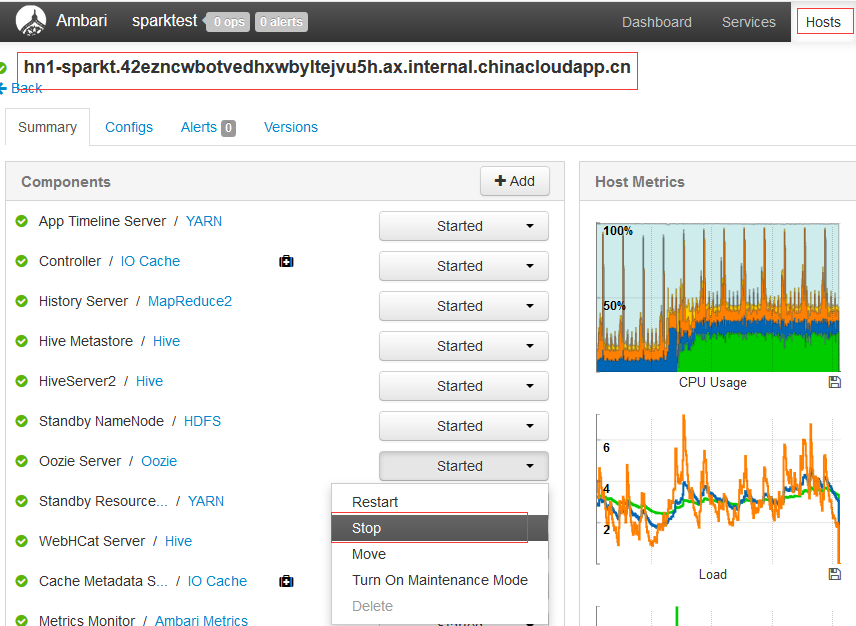

# 如何解决头节点一直处于心跳丢失的状态

## 问题描述

客户集群中一台头节点一直处于心跳丢失状态，该节点能够 ssh 远程登录，`free -g` 后发现内存耗尽。

## 原因分析

由于客户的头结点选用的是 2 个 core，性能级别相对较低，内存只有 7G，在我们的集群头结点上默认会启动一些服务，这些服务加起来占用内存差不多 6G，我们创建一个集群（头结点 2 个 core），ssh 登录集群运行 `free –m`，结果如下：

我们可以看到可用的内存已经很少了，如果客户再运行自己的程序所以很容易会出现内存耗尽的问题。

## 解决方案

1. 因为我们的集群其实也是运行在虚拟机上的，去修改正在运行的节点的核数目前是做不到的，我们可以去尝试停止在头结点上我们不用的服务来争取更多的内存，如图：

    

2. 采用 YARN-Cluster 模式提交，因为采用 YARN-Cluster 模式提交 Driver 会在 worknode 上，这样也能减轻头结点的负载但是从根本上还是建议您在建集群的时候把头结点核数尽量的设置大一点。