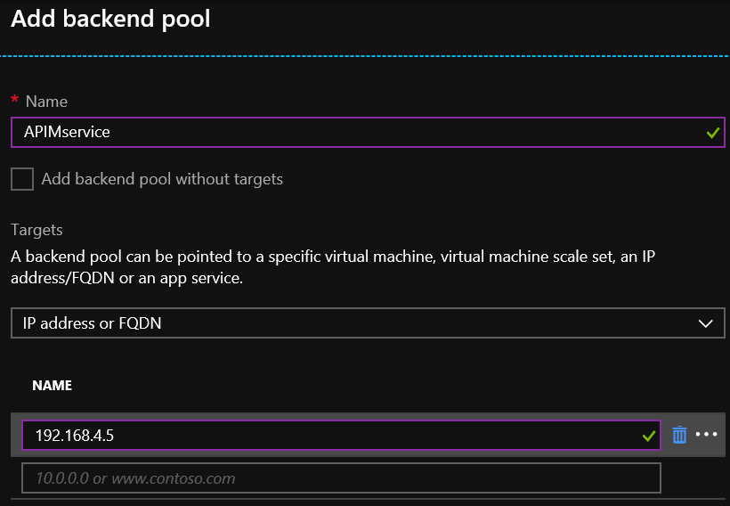
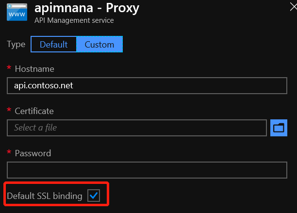
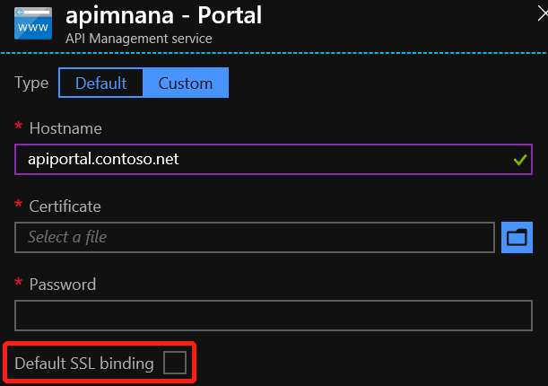
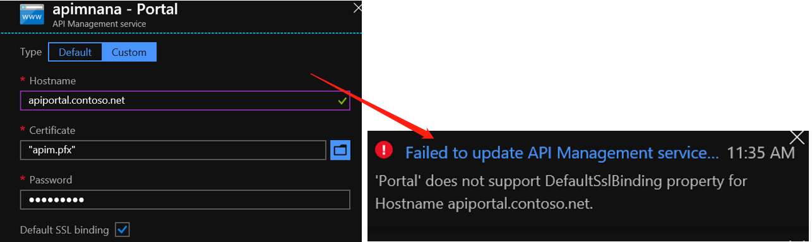
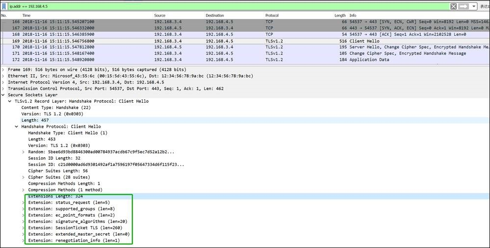

# 应用程序网关与 API 管理集成注意事项

Azure 应用程序网关是一种 PaaS 服务，提供第 7 层负载均衡器。它充当反向代理服务，并提供 Web 应用程序防火墙 (WAF) 及其他产品/服务，应用程序网关后端池可以添加虚机网卡， Web 应用服务， FQDN ，或者是 API 管理服务等。可以将内部虚拟网络中预配的 API 管理与应用程序网关前端相结合来实现从内部访问 API 管理服务，达到保护后端的目的。

## 场景介绍

应用程序网关与 API 管理服务集成的具体配置步骤请参考[在包含应用程序网关的内部 VNET 中集成 API 管理](https://docs.azure.cn/api-management/api-management-howto-integrate-internal-vnet-appgateway)。

API 管理服务有两种模式，Proxy 和 Portal 两种，在实际场景中有的客户会先配置一个 Proxy 的域名，再配置一个 Portal 的域名，并对不同的域名生成不同的 https 证书，依次创建 httpsetting 并上传 .cer 证书到应用程序网关上， 但会发现只有 Proxy 的域名处于健康状态， Portal 的域名一直处于非健康状态，当把 Portal 的 .cer 证书更换成 Proxy 的域名对应的 .cer 证书后， 就可以正常通信了。这是因为：

当 API 管理服务集成在虚拟网络内部时，会为 API 管理服务分配一个私网地址，而该地址是配置应用程序网关时使用的后端池地址， 如下图：

而当应用程序网关后端池使用 IP 地址而不是 FQDN 域名时，向后端发送的 TLS/SSL handshake 消息不会带有 Server Name Indication (SNI) 的信息，因而会选择后端服务器（API 管理）的默认 SSL 证书进行验证，而 API 管理默认是使用 Proxy 绑定的证书。所以需要为 Proxy 和 Portal 都配置 Proxy 的 .cer 证书，这样鉴权才会通过。

打开 API 管理服务界面， 进入“自定义域名”目录下， 点击 Proxy 和 Portal 的终结点名称， 可以看到对应 Proxy 的自定义域名下有 “Default SSL binding” 的勾选， 代表 API 管理服务对外进行 SSL handshake 的证书使用的是 Proxy 域名对应的证书。

而 Portal 自定义域名下没有该项的勾选。

并且当手动将 Portal 域名的该项进行勾选时，保存时会报错，提示 Portal 对应的域名不支持 “Default SSL binding” , 这是 API 管理服务的一个特性。

## 抓包验证

对此我们在应用程序网关实例上进行了抓包验证，发现在于后端 API 管理服务进行 SSL handshake 时， 发送的 client hello 消息中确实没有 SNI 这个扩展属性， 所以会去找到后端池默认绑定的 SSL 证书进行验证：

