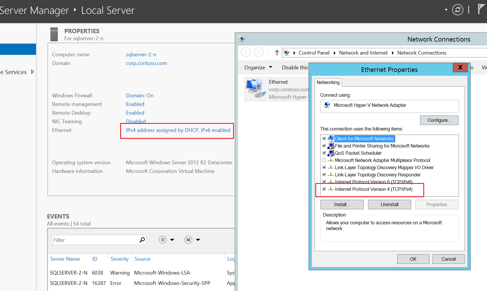
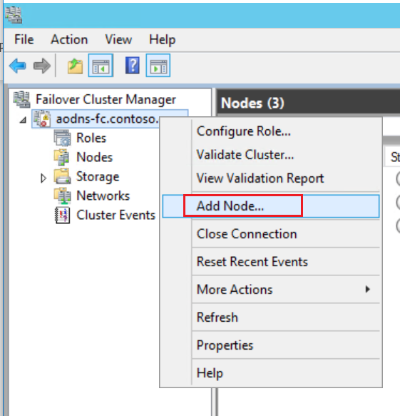

# 如何将新的节点添加到 Azure 虚拟机的 Windows 故障转移群集

本文详述了如何把一个新的节点添加到 Azure 虚拟机的 Windows 故障转移群集下。

## Azure 门户上创建一个新的节点

在 Azure 门户上创建一个虚拟机作为新节点，虚机的可用性集，虚拟网络和子网需要和你已有的群集中的主副本一样。

1. 在 Azure 门户上创建新的 SQL Server 虚拟机作为新的节点 *sql-server-2*，选择 SQL Server 2012 SP2 Enterprise on Windows Server 2008 R2 级别以上的虚拟机，否则开启不了可用性组。

    

2. 可以在已有的群集的主副本的资源组下面查看可用性集，虚拟网络和子网这些信息：

    

    

## 将新节点所在的虚拟机加入到域中

1. 登录到新创建的节点之后，打开“服务器管理器 (Server Manager)”，点击左窗格中的“本地服务器 (Local Server)”。

2. 选择“由 DHCP 分配的启用 IPv6 的 IPv4 地址 (IPv4 address assigned by DHCP, IPv6 enabled)”。

3. 在“网络连接”窗口中，选择网络图标“以太网 (Ethernet)”。

4. 在命令行中，单击“更改此连接的设置 (Change settings of this connection)”。

5. 选择 “Internet 协议版本 4(TCP/IPv4) (Internet Protocol Version 4 (TCP/IPv4))”，然后点击“属性 (Properties)”。

    

6. 选择“使用以下 DNS 服务器地址 (Use the following DNS server addresses)”，并在“首选 DNS 服务器 (Preferred DNS server)”中指定主域控制器的地址(如果不知道主域控制器的地址，可以在命令行中键入 `nslookup ad-primary-dc`)。

    

7. 依次单击“确定”和“关闭”。

    > [!NOTE]
    >设置 DNS 后，虚拟机的远程连接可能会断开，若发生此情况，可在 Azure 预览门户中重启虚拟机。

8. 重新登录这个新创建的节点的虚拟机，打开“服务器管理器 (Server Manager) ”，在“本地服务器 (Local Server) ”窗口中，单击“工作组 (WORKGROUP) ”。

9. 在“计算机名 (Computer Name) ”部分，单击“更改 (Change...) ”。

10. 选中“域 (Domain) ”复选框，并在文本框中键入 *corp.contoso.com*，单击“确定”。

11. 在“ Windows 安全性 (Windows Security) ”弹框中，输入默认域管理员账户 (CORP\xupzhou) 和密码 (******)。

12. 在看到“欢迎使用 corp.contoso.com 域 xxx(Welcome to the xxx domain) ”消息时，请单击“确定”。

    

13. 单击“关闭”，然后单击弹出对话框中的“立即重新启动 (Restart Now)”。

## 在新创建节点的虚拟机中授予 CORP\Install 管理权限

1. 连接到新创建节点所在的虚拟机。

2. 在“服务器管理器 (Server Manager) ”中，选择“工具 (Tools)”，然后单击“计算机管理 (Computer Management)”。

    

3. 在“计算机管理 (Computer Management) ”窗口，展开“本地用户和组 (Local Users and Groups) ”，然后选择“组 (Groups) ”。

4. 双击“管理员 (Administrators) ”。

5. 在“管理员属性 (Administrators Properties) ”对话框中，单击“添加”。

6. 输入用户 CORP\Install，然后单击“确定 (OK) ”，当系统提示输入凭据时，使用 DC 的 admin 账号 xupzhou 账户和密码进行登录。

    

7. 单击“确定”，关闭“管理员属性”对话框。

## 在新的节点上安装故障转移群集

1. 在“服务器管理器 (Server Manager) ”的“仪表板 (Dashboard) ”中，单击“添加角色和功能 (Add roles and features)”。

    

2. 在“添加角色和功能向导 (Add Roles and Features Wizard) ”中，单击“下一步 (Next) ”，直到出现“功能 (Features) ”页。

3. 选择“故障转移群集 (Failover Clustering) ”，出现提示时，添加任何其他相关功能。

    

4. 单击“下一步 (Next) ”，然后单击“确认 (Confirmation) ”页上的“安装”。

5. “故障转移群集 (Failover Clustering) ”功能安装完成后，单击“关闭”。

    

## 在主节点所在的 Azure 虚拟机中的 Failover Cluster Manager 中添加新节点

1. 以域名 \Admin (例如 corp\install )登陆主节点所在的虚拟机。

2. 在 Tool 中找到 Failover Cluster Manager 打开。

    

3. 在浏览器树中，右键单击群集，并单击“添加节点”。

    

4. 在“添加节点向导”中，单击“下一步”。 在“选择服务器”页中添加新的节点( SQL Server )。 在“输入服务器名称”中键入 SQL Server 名称，并单击“添加”。 完成后，单击“下一步”。

    

5. 在“验证警告”页上，单击“否”（在生产方案中，应执行验证测试）。 然后单击“下一步”。

    

6. 如果正在使用存储空间，则在“确认”页上不勾选为 “Add all eligible storage to the cluster” 的复选框。

    

    如果正在使用存储空间，且选中了 “Add all eligible storage to the cluster”，Windows 会在群集进程中分离虚拟磁盘。这样一来，这些虚拟磁盘将不会出现在磁盘管理器或资源管理器之中，除非从群集中删除存储空间，并使用 PowerShell 将其重新附加。 存储空间将多个磁盘集合到存储池中。 有关详细信息，请参阅存储空间。

7. “下一步”。

8. 单击“完成”。

    “故障转移群集管理器”显示群集具有一个新的节点，并将该节点在“节点”容器中列出。

9. 从远程桌面会话注销。

    

    