# 将新的辅助副本加入 Azure 虚拟机的可用性组中

本文详述了如何将新的辅助副本加入搭建在 Azure 虚拟机上的可用性组中。本文的前提是已经将新创建的副本节点加入到 Azure 虚拟机的 Windows 故障转移集群中。

## 将 CORP\Install 作为 sysadmin 角色加入新节点的 SQL Server 实例

1. 使用新节点所在虚拟机的 admin 账号 BUILTIN\xupzhou 登入虚拟机。

2. 启动 SQL Server Management Studio，单击“连接( connect )”，将 CORP\Install 作为 sysadmin 角色添加到新节点的 SQL Server 实例。在“对象资源管理器”中，右键单击“登录名”，然后单击“新建登录名”。

3. 在“登录名”中，键入 CORP\Install。

    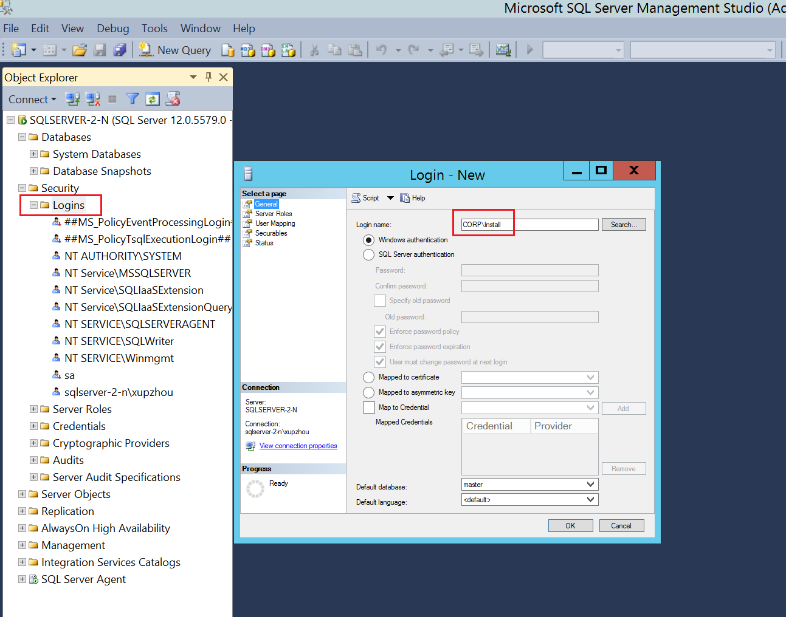

4. 在“服务器角色”页上，选择 “sysadmin”，然后单击“确定”。创建登录名后，可通过在“对象资源管理器”中展开“登录名”来查看该登录名。

    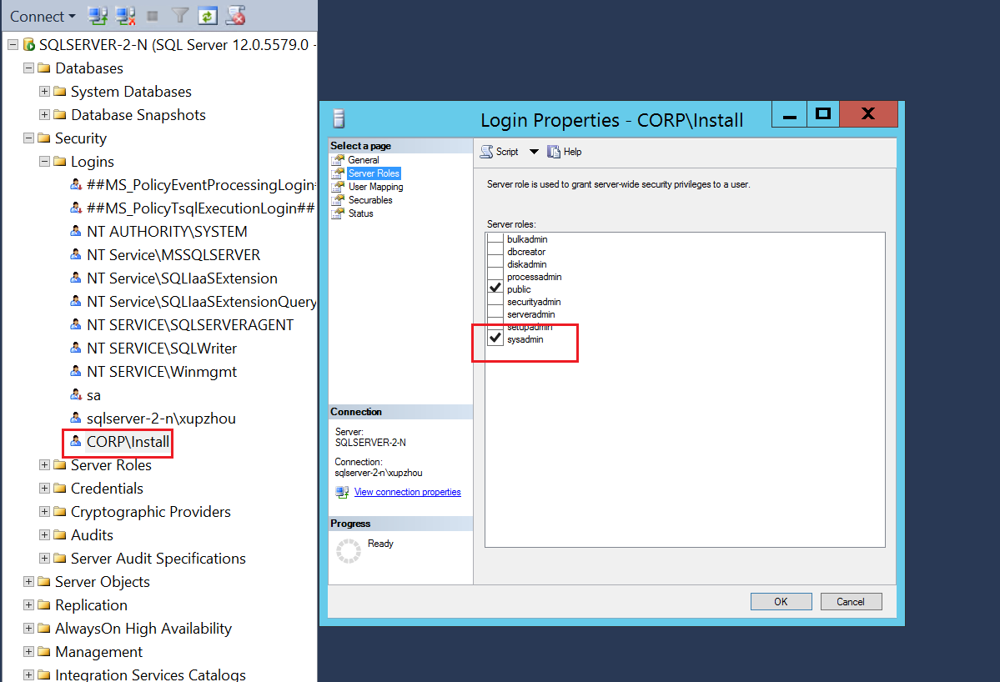

5. 配置系统帐户权限：

    若要创建系统帐户并授予相应的权限，请在每个 SQL Server 实例上完成以下步骤：

    在 SQL Server 实例上为 [NT AUTHORITY\SYSTEM] 创建一个帐户。 以下脚本将创建此帐户：

    ```bash
    USE [master]
    GO
    CREATE LOGIN [NT AUTHORITY\SYSTEM] FROM WINDOWS WITH DEFAULT_DATABASE=[master]
    GO
    ```

    在 SQL Server 实例上向 [NT AUTHORITY\SYSTEM] 授予 ALTER ANY AVAILABILITY GROUP, CONNECT SQL, VIEW SERVER STATE 权限：

    以下脚本将授予这些权限：

    ```bash
    GRANT ALTER ANY AVAILABILITY GROUP TO [NT AUTHORITY\SYSTEM]
    GO
    GRANT CONNECT SQL TO [NT AUTHORITY\SYSTEM]
    GO
    GRANT VIEW SERVER STATE TO [NT AUTHORITY\SYSTEM]
    GO
    ```

    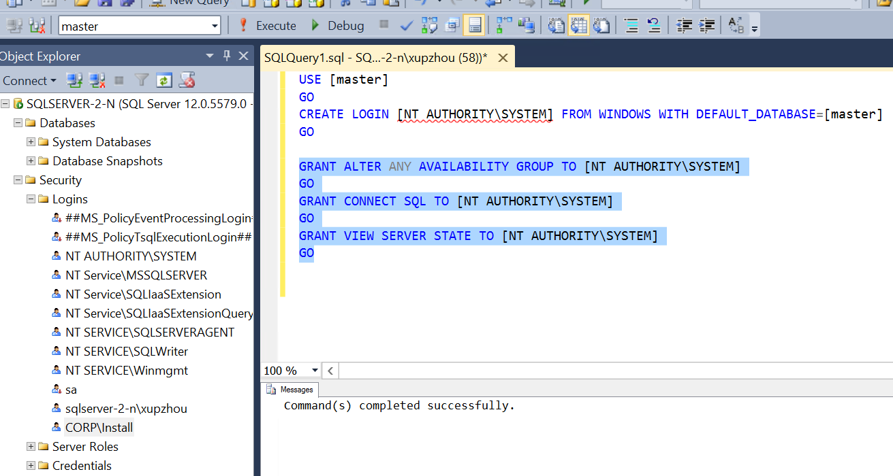

## 在域控制器所在的机器中添加账号 CORP\SQLSvc3

1. 连接到 ad-primary-dc 计算机，在“服务器管理器”中，选择“工具( Tools )”，单击 “Active Directory 管理中心( Active Directory Administrative Center )”。

    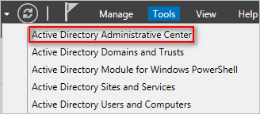

2. 在 “Active Directory 管理中心( Active Directory Administrative Center )”的左窗格，选择 “corp (本地)”。

3. 在右侧的“任务”窗格中，选择“新建”，单击“用户”。

4. 在“名字( Full name )”中填写 CORP\SQLSvc3。

    在“用户 SamAccountName(User SamAccountName )”中填写 SQLSvc3，在“密码( Password )”“确认密码( Confirm password )”中填写密码，在“密码选项( Password options )”中选中“其他密码选项( Other password options )”，选中“密码永不过期( Password never expires)”。

5. 单击“确定”以创建名为 SQLSvc3 的用户，此账户将用于配置可用性组。

    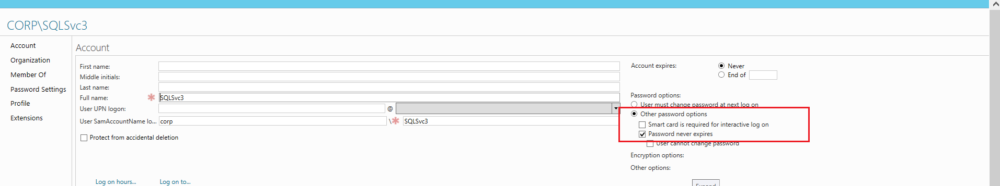

## 启用可用性组功能

1. 从“开始”菜单启动 SQL Server 配置管理器。

2. 在浏览器树中，单击 “SQL Server 服务”，右键单击 “SQL Server (MSSQLSERVER)” 服务，然后单击“属性”

    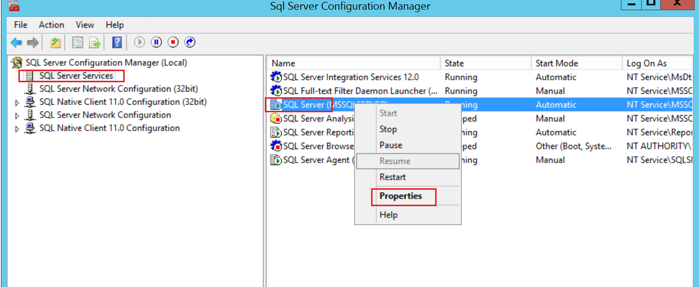

3. 单击 “AlwaysOn 高可用性组”选项卡，选择“启用 AlwaysOn 可用性组”，然后单击“应用”。在弹出对话框中，单击“确定”，但不要关闭属性窗口。在更改服务帐户后，将重新启动 SQL Server 服务。

4. 接下来，更改 SQL Server 服务帐户。单击“登录”选项卡，在“帐户名”中键入 CORP\SQLSvc3，填入并确认密码，然后单击“确定”。

    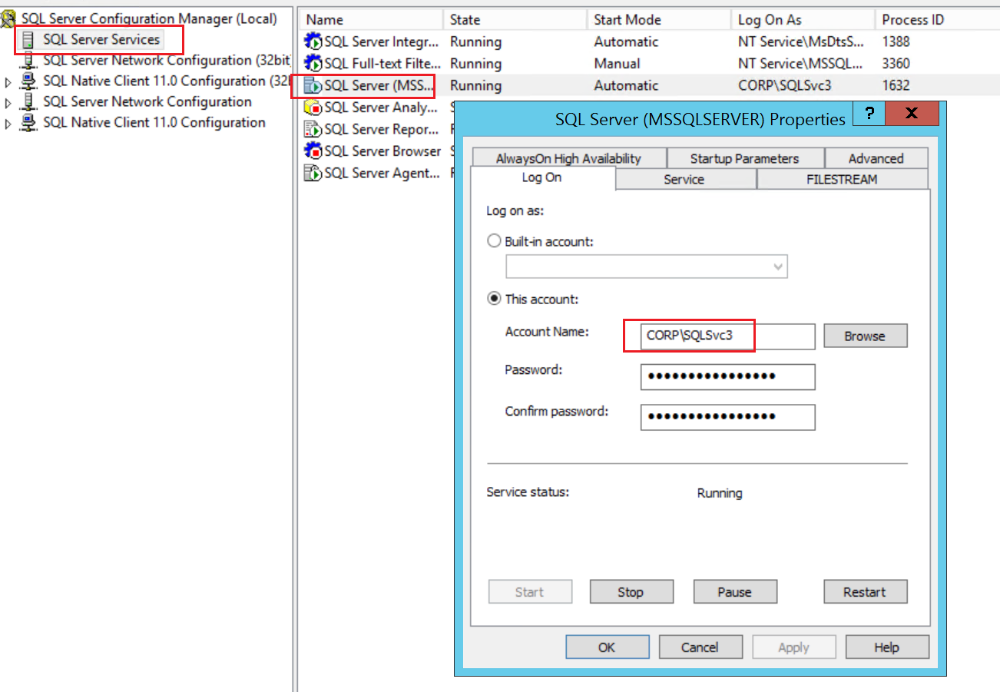

5. 在弹出窗口中，单击“是”重新启动该 SQL Server 服务。重新启动 SQL Server 服务后，在属性窗口中所做的更改即生效。

## 配置入站规则（端口）

1. 从“开始( Start )”屏幕启动“高级安全 Windows 防火墙( Windows Firewall with Advanced Security)”。

2. 在左窗格中，选择“入站规则( Inbound Rules )”。在右窗格上，单击“新建规则( New Rule...)”。

3. 在“规则类型( Rule Type )”页上，选择“端口( Port )”，然后单击“下一步”。

4. 在“协议和端口( Protocol and Ports )”页上，选择 TCP，并键入端口 1433, 5022 和 59999。然后，单击“下一步”。

    * 1433为SQL数据库使用的端口

    * 5022为可用性组将使用的数据库镜像终结点指定的端口

    * 59999为侦听端口

5. 在“操作( Action )”页面中，保持选中“允许连接( Allow the connection )”，然后单击“下一步”。

6. 在“配置文件( Profile )”页面中，接受默认设置并单击“下一步”。

7. 在“名称( Name )”页上，在“名称”文本框中指定一个规则名称，如 Azure LB Probe，然后单击“完成”。

    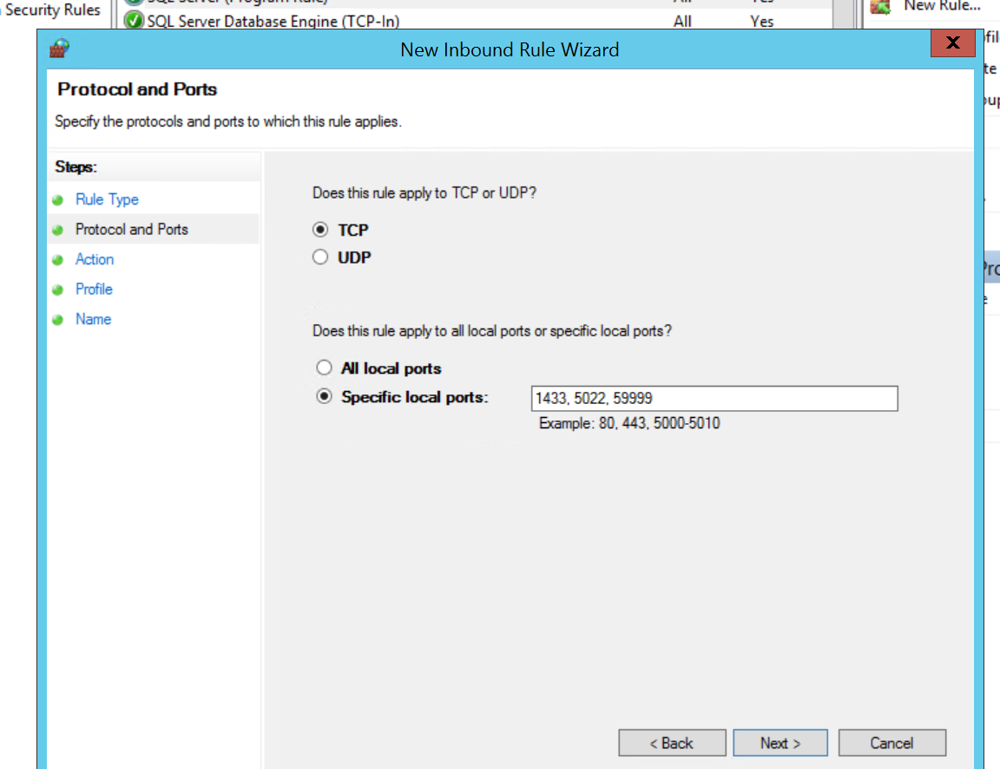

## 将节点加入可用性组

1. 找到之前搭建 Always on 的时候选择的 backup 数据库的文件夹，右键单击 backup 文件夹，单击“共享( share with )”，然后单击“特定用户( Specific people...)”。

2. 添加 CORP\SQLSvc3 (既新节点 Log On 的 account name )并授予其读/写权限然后单击“共享( Share )”。文件共享过程完成后，单击“完成”。

    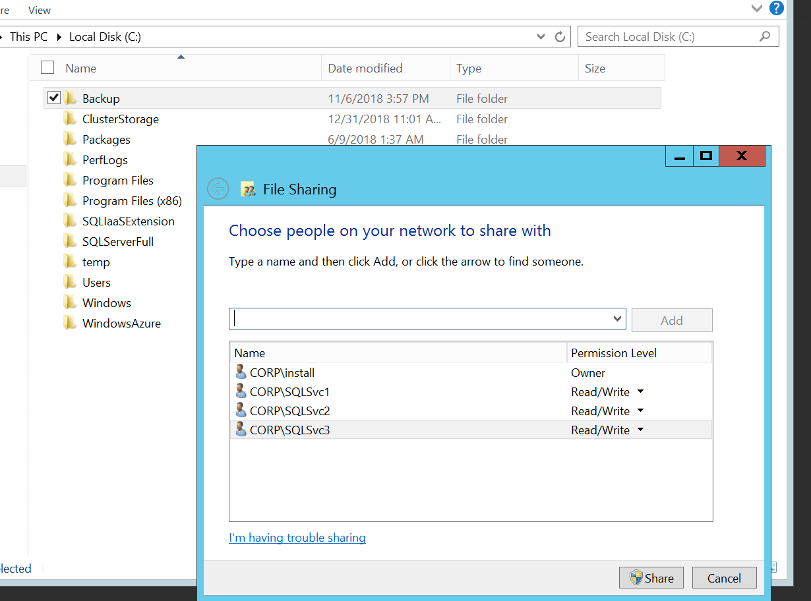

3. 如果之前有配置见证服务器，需要连接上主副本所在的虚拟机，在 Failover Cluster Manager 中重新配置一下见证服务器。

    * 在“故障转移群集管理器”中，右键单击群集，点到“更多操作”，并单击“配置群集仲裁设置...”。

        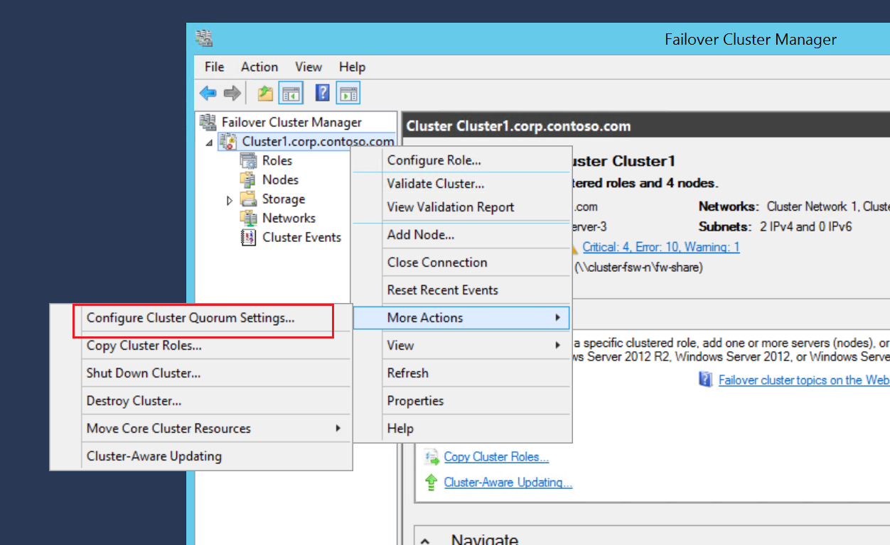

    * 在“配置群集仲裁向导”中单击“下一步”。

    * 在“选择仲裁配置选项”中，选中“选择仲裁见证”，并单击“下一步”。

    * 在“选择仲裁见证”上，选择“配置文件共享见证”。

    * 在“配置文件共享见证”上键入所创建的共享的路径。 单击“下一步”。

    * 在“确认”上核对设置。 单击“下一步”。

    * 单击“完成”。

4. 从“开始”菜单启动 SQL Server Management Studio，然后单击“连接”连接到主副本的 SQL Server 实例。

5. 右键 “Availability Group” 选择 “Add Replica” 来添加新的 Replica 节点。

    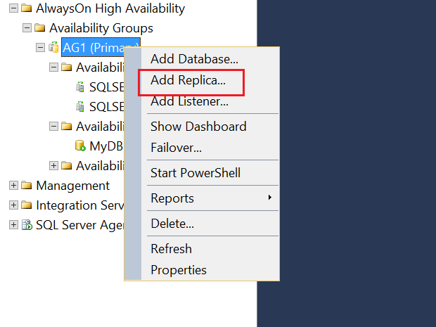

6. 点击 “Connect All” 连接上之前已经加入可用性集的节点。

    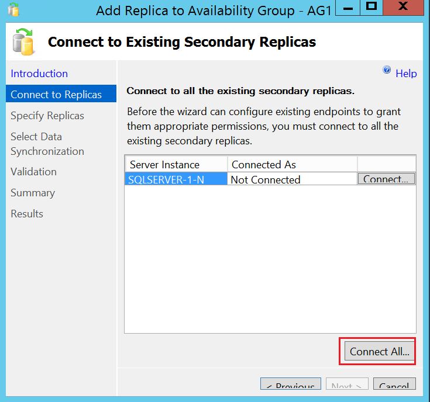

7. 通过点击 “Add Replica” 可以将新的 Replica 节点加入。

    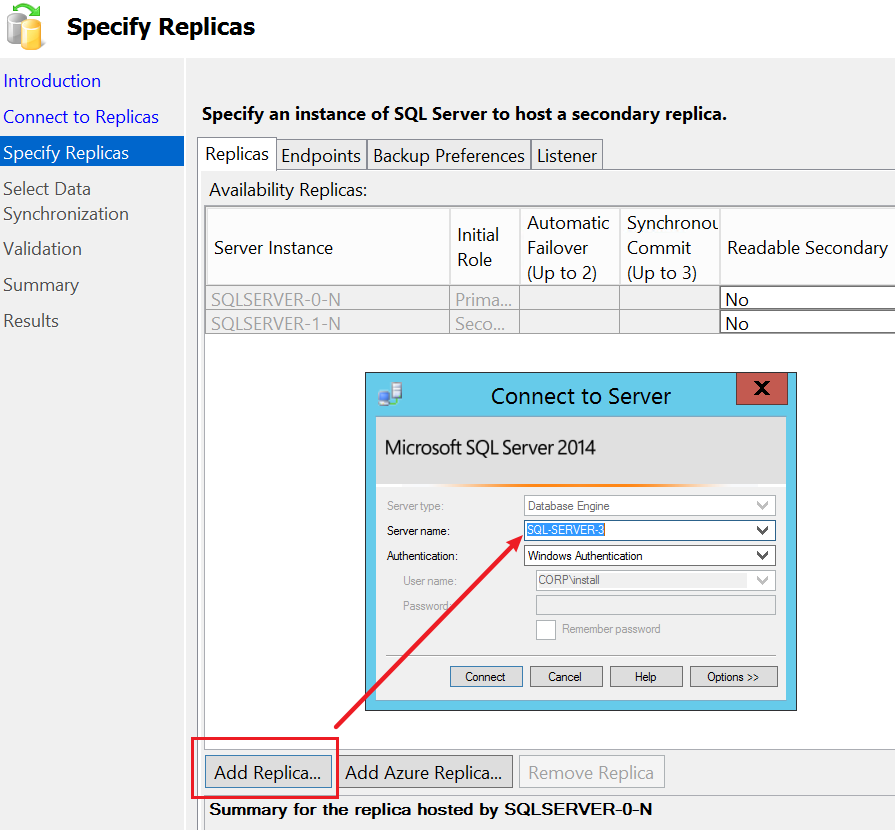

8. 数据同步的路径还是和之前搭建 Always on 的时候选择的路径相同。

    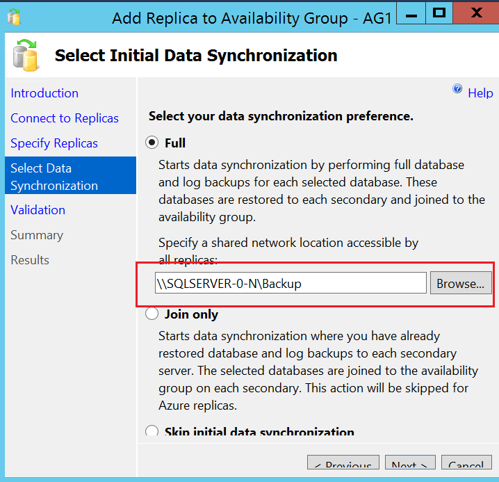

9. 通过 Validation 以后就可以成功的将一个新的 Replica 加入到可用性组中了。

    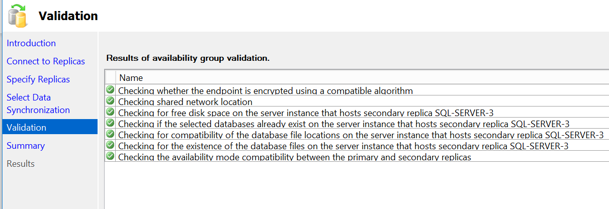

    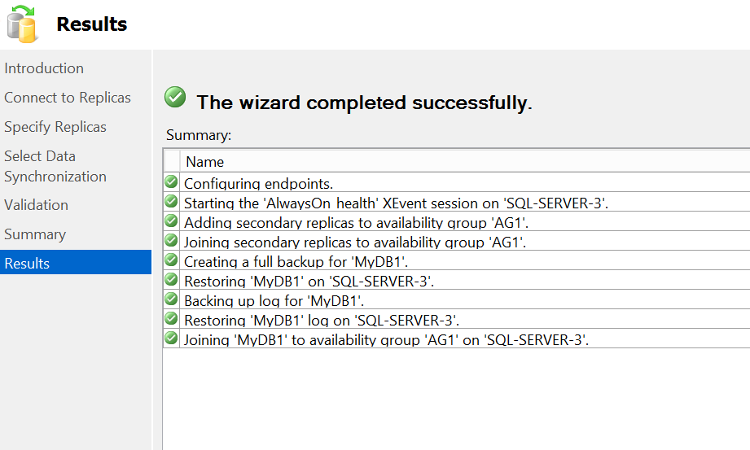

    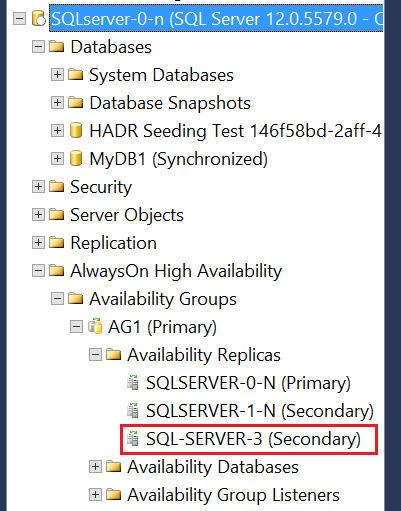
