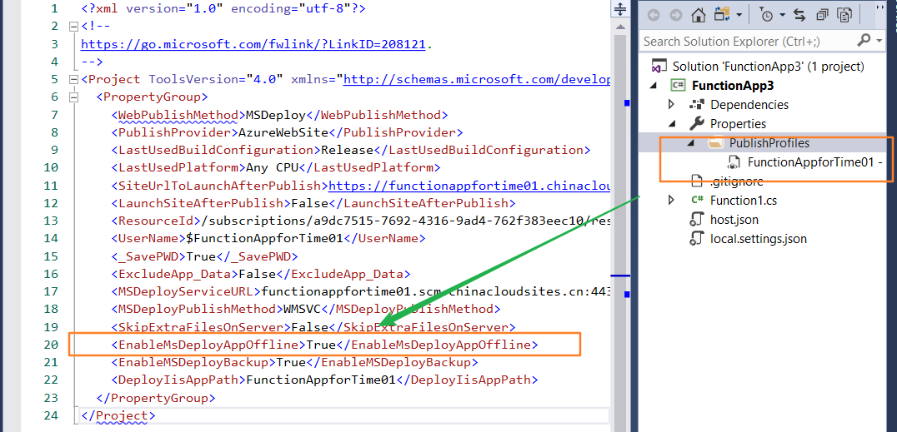
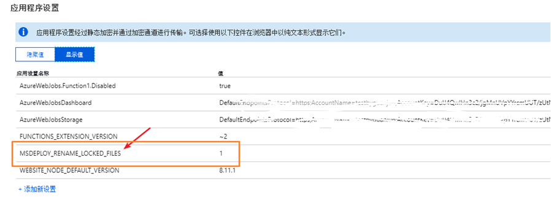

# 如何避免在发布时出现文件被占用的问题

重新发布应用服务或者 Azure Function 时，有时会遇见发布失败的消息，具体的错误信息为： 文件被占用 (ERROR_FILE_IN_USE) 或者是操作 DLL 文件被拒绝 (Access to the path 'XXXXX.dll' is denied)，在排除是发布账号的权限不足的情况下，这些情况的发生是目标文件正在被使用而无法被替换致使发布失败。

根据不同的发布场景，我们可以通过以下的方式来解决该问题：

1. 使用 Visual Studio 发布时候，在 PublishProfiles 文件中，修改 **EnableMsDeployAppOffline** 属性值为 **True**

    

    关于 EnableMsDeployAppOffline 参数说明，可参考：[ERROR_FILE_IN_USE](https://docs.microsoft.com/en-us/iis/publish/troubleshooting-web-deploy/web-deploy-error-codes#ERROR_FILE_IN_USE)。

2. 使用 PowerShell 自动化脚本，调用 `New-AzureRmResourceGroupDeployment` 命令发布，可以在应用服务或 Azure Function 中添加应用程序设置参数 **MSDEPLOY_RENAME_LOCKED_FILES=1**：

    

    关于 MSDEPLOY_RENAME_LOCKED_FILES 参数说明，可参考：[Dealing with locked files during deployment](https://github.com/projectkudu/kudu/wiki/Dealing-with-locked-files-during-deployment)。  

3. 对于 .jar 包或其他格式文件被占用的情况，以上两种可能不适用，但都可以通过停止/重启当前应用服务或 Azure Function 来解决。
