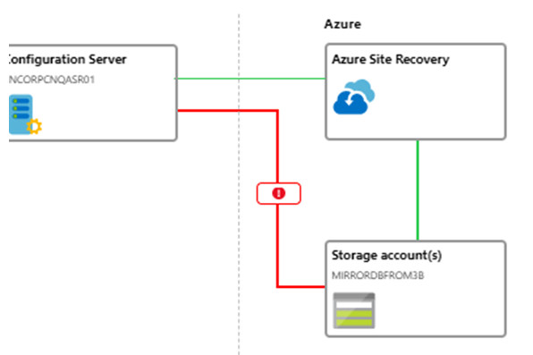
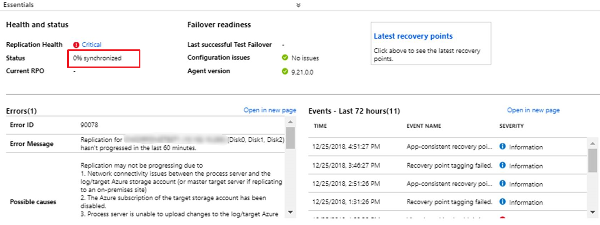
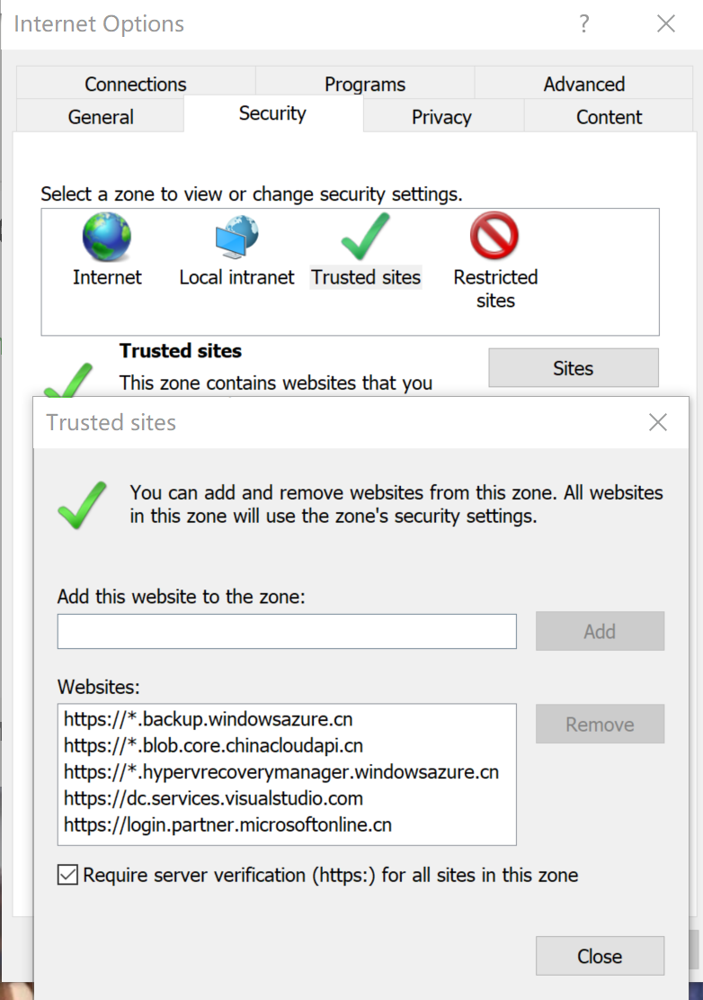

# Azure Site Recovery 中进程服务器使用代理服务器时的推荐网络配置方法

## 问题描述

有些用户由于本地服务器的网络环境限制，在配置 Azure Site Recovery 时，进程服务器必须通过代理服务器才可以访问公网。若本地进程服务器和代理服务器的防火墙配置不当，会在 Azure 恢复保管库管理界面中看到进程服务器和存储账户间的网络连接呈红色，以及初始复制进度总是显示为 0 % 的问题。





我们建议您参考如下方法配置进程服务器的网络连接设置。

## 解决方法

1. 检查进程服务器和代理服务器是否配置了合适的防火墙访问规则，相关请参考[验证进程服务器](https://docs.azure.cn/zh-cn/site-recovery/vmware-azure-troubleshoot-replication#verify-the-process-server)。

2. 配置进程服务器系统账户的代理设置，这将用于任何传出的 HTTP / HTTPS 流量，相关可以参考[配置传出网络连接](https://docs.azure.cn/zh-cn/backup/backup-azure-arm-vms-prepare#step-1-configure-outgoing-network-connections)。

    具体操作方法为：

    在进程服务器上下载 [PsExec](https://docs.microsoft.com/en-us/sysinternals/downloads/psexec)，并以管理员权限打开命令行窗口运行如下命令：

    ```bash
    psexec -i -s "c:\Program Files\Internet Explorer\iexplore.exe"
    ```

    该命令会打开一个 Internet Explorer 窗口，请检查如下配置：

    * 在工具 -> Internet选项 -> 连接 -> 局域网设置 路径中，检查是否填写了正确的代理服务器配置。

    * 在工具 -> 安全 -> 受信任的站点 -> 站点 路径下将步骤 1 中 **“检查进程服务器上基于 URL 的防火墙是否未阻止访问”** 相关的 URL 添加到信任站点中。

    
