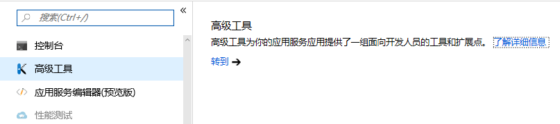
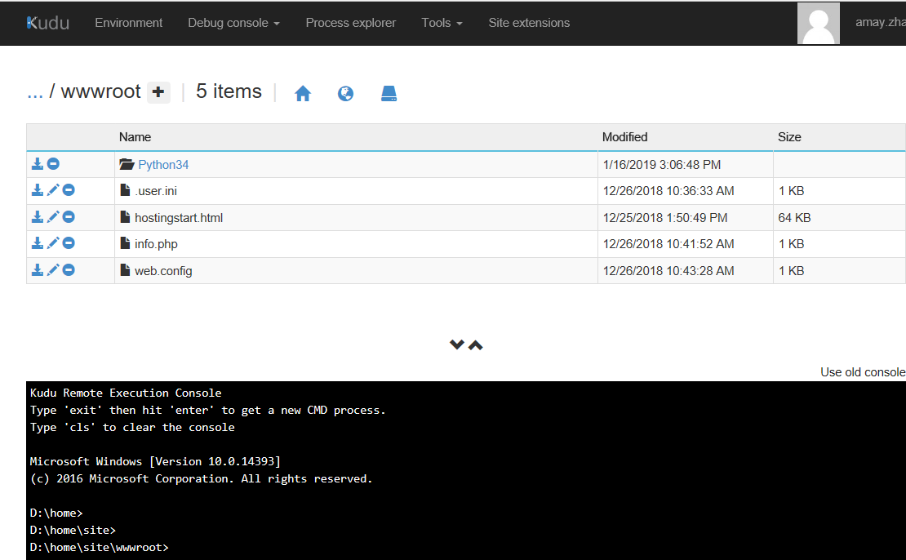
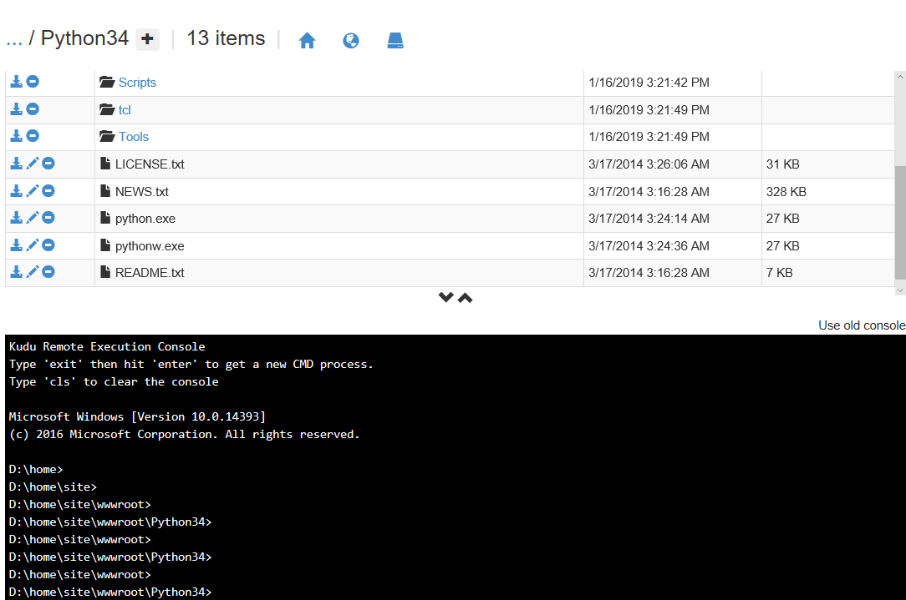

# Web 应用如何自定义 Python 环境

## 问题描述

当发现 Web 应用环节没有自己想要运行的 Python 的版本时，我们采取自定义方式。以下以 Python3.4 版本为例。

## 解决方法

1. 下载 [Python 安装包](https://www.python.org/ftp/python/3.4.0/python-3.4.0.msi)。

2. 安装到 D 盘：

    启动 cmd，cd 到 D 盘，运行：`msiexec /a python-3.4.0.msi TARGETDIR=d:\python34`。

3. 等待安装完成后，进入到目录 D:\Python34，将所有文件打包成一个 zip 文件。

4. 登录到 Azure 的门户界面，打开网站的 **【高级工具】**。

    

5. 然后进入 **【Debug Console】**， 显示文件夹。切换到路径：D:\home\site\wwwroot\，创建一个文件夹，命名为：Python34。

    

6. 将第 3 步打包好的 zip 文件拖拽到高级工具的 Python34 文件夹里，如果是拖动该 zip 文件到文件列表的最右边，会自动解压，如果没有自动解压，在命令行上使用 `unzip` 解压。

    解压后会在 Python34 文件夹下看到相应的文件。如下图：

    

7. 进入到目录路径 D:\home\site\wwwroot\，编辑 web.config 文件，使用如下内容替换：

    ```xml
    <configuration>
      <appSettings>
        <add key="pythonpath" value="%SystemDrive%\home\site\wwwroot" />
        <add key="WSGI_HANDLER" value="hostingstart-python.application" />
      </appSettings>
      <system.webServer>
         <handlers>
              <remove name="Python34_via_FastCGI"/>
              <add name="Python34_via_FastCGI" path="*" verb="*" modules="FastCgiModule" scriptProcessor="d:\home\site\wwwroot\Python34\Python.exe|%SystemDrive%\Python34\Scripts\wfastcgi.py" resourceType="Either" />
         </handlers>
    </system.webServer>
    </configuration>
    ```

8. 进入到目录路径：D:\home\site，创建一个新文件：applicationHost.xdt， 并使用如下内容，保存：

    ```xml
    <?xml version="1.0"?>
    <configuration xmlns:xdt="http://schemas.microsoft.com/XML-Document-Transform">
      <system.webServer>
        <fastCgi>
          <application fullPath="d:\home\site\wwwroot\Python34\python.exe" xdt:Locator="Match(fullPath)" xdt:Transform="Remove" />
          <application fullPath="d:\home\site\wwwroot\Python34\python.exe" arguments="D:\Python34\Scripts\wfastcgi.py"  maxInstances="0" xdt:Transform="Insert"/>
        </fastCgi>
      </system.webServer>
    </configuration>

9. 配置完以上步骤以后保存，然后在门户上重启站点进行验证。
