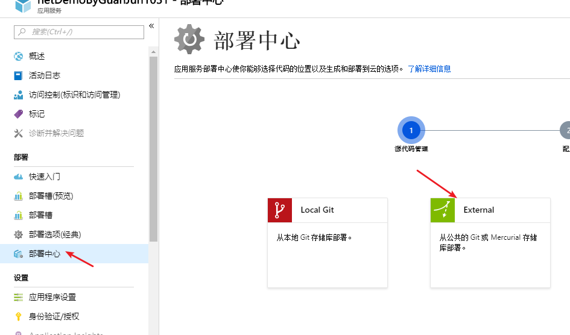
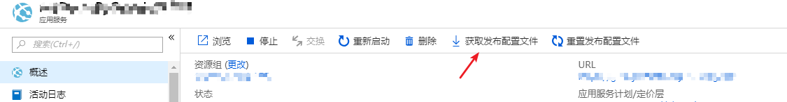
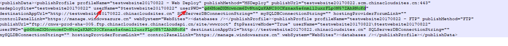
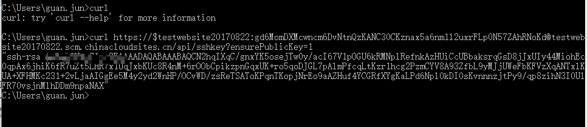
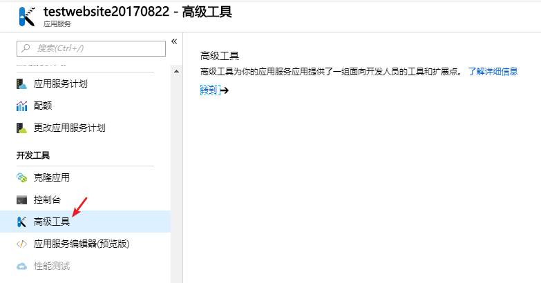
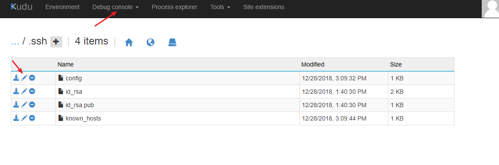

# 如何通过 GitLab 进行持续部署

## 解决方法

1. 首先在您的网站的部署中心选择 **External**，如下图：

    

2. 接着将存储库的地址和您要读取的分支填好，选择 *git*，点击继续。

3. 在概述中点击 **获取发布配置文件** 按钮：

    

4. 记下文件中的 *username* 和 *password*，如下图：

    

5. 执行 curl 命令：`curl https://<username>:<password>@<网站名称>.scm.chinacloudsites.cn/api/sshkey?ensurePublicKey=1`，执行完后会得到如下的 ssh-rsa key，记下此 key：

    

6. 进入网站的 Kudu 页面，点击的 **DebugConsole**，会看到如下的文件，进入 **.ssh** 文件夹，找到 *config* 文件，点击笔头按钮进行修改，如下图：

    

    

    将 *config* 修改成：

    ```xml
    HOST *
    StrictHostKeyChecking no
    HostkeyAlgorithms +ssh-dss
    ```

7. 登陆您的 GitLab，点击 **settings**，选择 **intergrations**，加入 webhook，url 为 `https://<username>:<password>@<网站名称>.scm.chinacloudsites.cn/deploy`

    Secret token 为第 5 步中记下的 key，点击保存，之后点击 test 看是否可以部署。

需要注意的是您的 GitLab 存储库需要开放您对仓库的访问和修改权限。