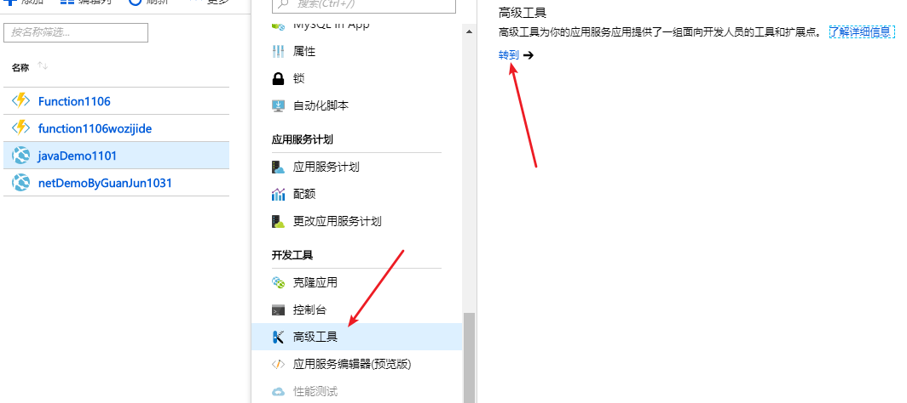
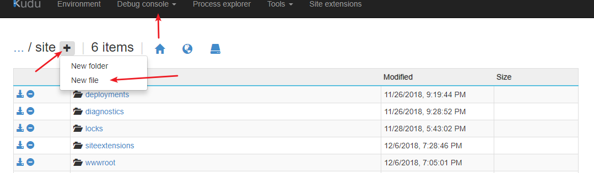
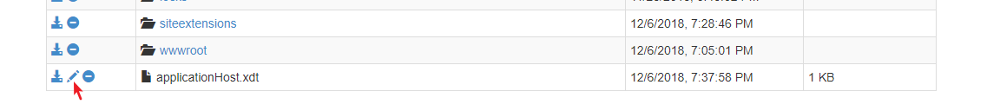
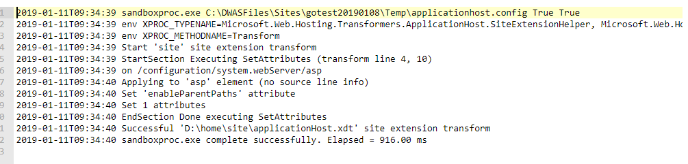

# Web 应用如何修改 IIS 配置

## 问题分析

如果我们在服务器上部署一个使用 IIS 服务器来托管的应用，可以直接在 IIS 管理器的界面中做一些配置，但是在Azure Web 应用服务中，并没有这样的方式让我们去配置一些例如开启父路径，限制队列长度的设置。

这篇文档就是要解决如何在 Azure 上配置这些设置的问题，我们先以如何开启父路径为例，具体的别的设置的修改方式可以在 [IIS 配置](https://github.com/projectkudu/kudu/wiki/Xdt-transform-samples#adding-an-asp-classic-attribute)中查找模板，配置的方式都是一样的。

## 解决方法

1. 登录 Kudu，具体登陆方式如图所示：

    

2. 点击 **DebugConsole**，选择 **cmd**，在文件夹列表中进入 **site** 文件夹，单击下图中的 **+** 号，创建一个文件，名称为 *applicationHost.xdt*：

    

3. 点击旁边的笔头按钮进行编辑，如下图所示：

    

4. 将下列内容添加到文件中，点击保存，重启网站即可：

    ```xml
    <?xml version="1.0"?>
    <configuration xmlns:xdt="http://schemas.microsoft.com/XML-Document-Transform">
      <system.webServer>
        <asp xdt:Transform="SetAttributes(enableParentPaths)" enableParentPaths="true" />
      </system.webServer>
    </configuration>
    ```

关于如何验证配置是否成功，可以在 Kudu 中进入 *D:\home\LogFiles\Transform*，查看 **log** 看是否配置成功：

