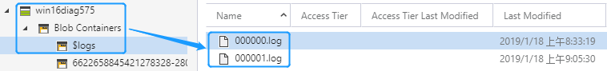
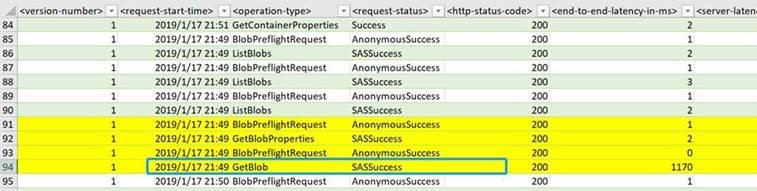
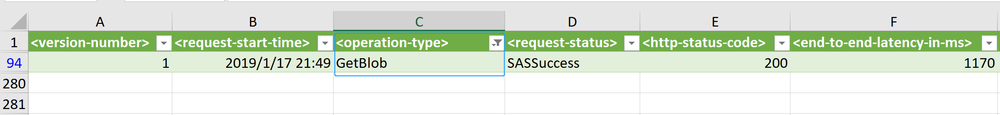

# 如何分析储账户日志记录

出于审计的要求，我们需要对存储账户的读取、写入等行为进行分析，因此 Azure 提供了存储账户日志记录功能，本文将介绍如何分析存储账户日志记录。

## 前提条件

1. 已经为目标存储账户开启诊断日志（经典）- [日志记录](https://docs.azure.cn/zh-cn/storage/common/storage-monitor-storage-account#configure-monitoring-for-a-storage-account)功能。

2. 已经在本地安装 [Microsoft Azure Storage Explorer](https://azure.microsoft.com/en-us/features/storage-explorer/)。

## 解决方案

1. 使用 Microsoft Azure Storage Explorer 下载日志，日志位于存储账户的 Blob Containers - $logs 目录中：

    

2. 由于默认的日志是 .log 格式，我们需要进行格式调整，以便于分析。

    1. 首先使用记事本打开日志，在开头加入以下表头信息并保存：

        ```shell
        <version-number>;<request-start-time>;<operation-type>;<request-status>;<http-status-code>;<end-to-end-latency-in-ms>;<server-latency-in-ms>;<authentication-type>;<requester-account-name>;<owner-account-name>;<service-type>;<request-url>;<requested-object-key>;<request-id-header>;<operation-count>;<requester-ip-address>;<request-version-header>;<request-header-size>;<request-packet-size>;<response-header-size>;<response-packet-size>;<request-content-length>;<request-md5>;<server-md5>;<etag-identifier>;<last-modified-time>;<conditions-used>;<user-agent-header>;<referrer-header>;<client-request-id>
        ```

    2. 然后新建 Excel，使用 Data-From Text/CSV 导入上述日志即可查看详细信息：

        

3. 我们可以使用 Excel 筛选功能，来获取特定类型的操作记录，有关表头的详细说明请参考文档[存储分析日志格式](https://docs.microsoft.com/zh-cn/rest/api/storageservices/storage-analytics-log-format)。

    

# 参考文档

* [存储分析日志格式](https://docs.microsoft.com/zh-cn/rest/api/storageservices/storage-analytics-log-format)