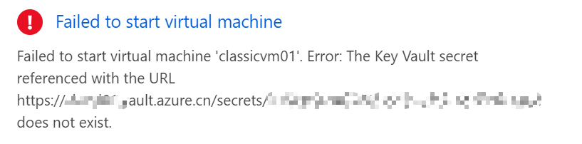

# 如何修复因密钥保管库丢失而造成的虚拟机无法启动故障

## 问题描述

从经典部署模型迁移到 Azure Resource Manager 部署模型的过程中，会自动生成一个 Key Vault 用来存储密钥（通常是证书）。迁移完成后资源组中可见这个 Key Vault，如下图所示：


如果这个 Key Vault 被误删除，则虚拟机会进入 Fail 的状态而无法开机，错误提示 Key Vault 不存在。



## 解决方案

使用 PowerShell 或者 Azure CLI 命令移除虚拟机上的密钥/证书：

```pweorshell
$vm = Get-AzureRmVM -ResourceGroupName "<MyRG>" -Name "<MyVM>"
Remove-AzureRmVMSecret -VM $vm
Update-AzureRmVM -ResourceGroupName "<MyRG>" -VM $vm
```

或者：

```cli
az vm update -g "<myrg>" -n "<myvm>" --set osProfile.Secrets=[]
```

命令执行成功后，使用如下命令确认虚拟机 OS Profile 中 Secrets 已经被移除：

```cli
az vm get-instance-view --name "<MyVM>" --resource-group "<MyRG>"
```