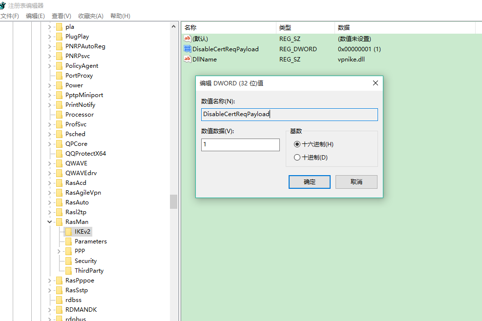

# Azure P2S VPN 升级到 TLS1.2 后遇到 Error 800 的解决方案

众所周知，从 2018 年 7 月 1 日开始，Azure VPN 网关已不再支持 TLS 1.0 和 1.1。 VPN 网关将仅支持 TLS 1.2。

多数 Windows 7 和 Windows 8.1，以及 Windows 10 的早期版本（10240）需要启用对 TLS1.2 的支持，包括修改注册表以及安装系统补丁，详细步骤可参考[如何在 Windows 7 和 Windows 8.1 中启用对 TLS 1.2 的支持？](https://docs.azure.cn/zh-cn/vpn-gateway/vpn-gateway-vpn-faq#tls1)

但即使在执行了上述操作之后，仍然有些终端会遇到类似 Error 800 的错误：

通过检查诊断日志，发现详细的 Err Code 是 0x80092013：

The revocation function was unable to check revocation because the revocation server was offline.

通常情况下，如果客户端无法访问 <http://crl3.digicert.com/ssca-sha2-g1.crl> 和 <http://crl4.digicert.com/ssca-sha2-g1.crl>，则会发生此错误消息。进行吊销检查需要访问这两个站点。此问题通常发生在配置了代理服务器的客户端上。在某些环境中，如果请求不通过代理服务器，则在边缘防火墙处会被拒绝。

针对这种场景，推荐的解决方案是检查代理服务器设置，确保客户端可以访问 <http://crl3.digicert.com/ssca-sha2-g1.crl> 和 <http://crl4.digicert.com/ssca-sha2-g1.crl>。

对于某些始终不能访问这两个链接的客户端，可推荐修改注册表禁用吊销检查的方案，具体方法如下：

1. 打开注册表 HKEY_LOCAL_MACHINE\SYSTEM\CurrentControlSet\Services\RasMan\IKEv2。

2. 添加一个 DWORD 项命名为 DisableCertReqPayload 并赋值为 1。

    

3. 重启系统。
