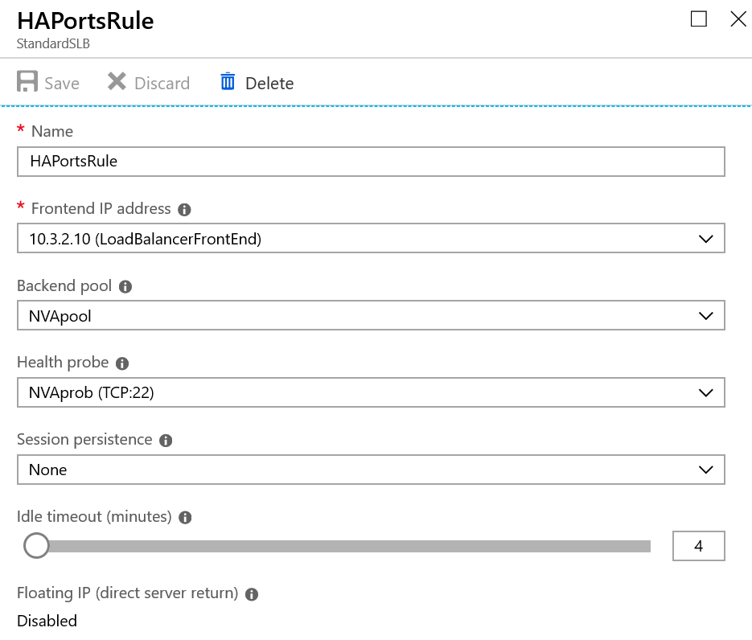
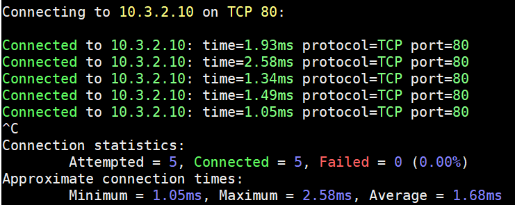
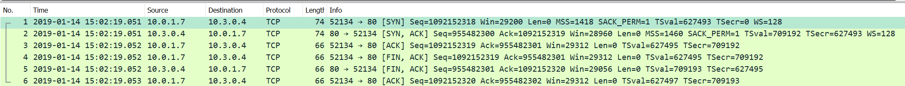
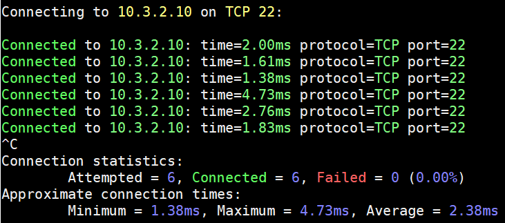
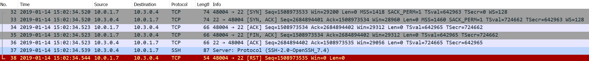

# 使用 Poweshell 为标准内部负载均衡器配置高可用性端口

本文提供了通过 PowerShell 在标准内部负载均衡器上部署高可用性端口的示例。

## 标准内部负载均衡器高可用性端口概述

使用内部负载均衡器时，Azure 标准负载均衡器可帮助同时对所有端口上的 TCP 和 UDP 流进行负载均衡。

高可用性 (HA) 端口负载均衡规则是在内部标准负载均衡器中配置的负载均衡规则的变体。可以通过提供单个规则对到达内部标准负载均衡器的所有端口的所有 TCP 和 UDP 流进行负载均衡，来简化负载均衡器的使用，按流进行负载均衡决策。此操作基于以下五元组连接：“源 IP 地址”、“源端口”、“目标 IP 地址”、“目标端口”和“协议”。

HA 端口负载均衡规则可帮助实现关键方案，如虚拟网络内部网络虚拟设备 (NVA) 的高可用性和缩放。当大量端口必须进行负载均衡时，此功能也可以帮助完成。

当将前端和后端端口设为 “0” 并将协议设为 “All” 时，即配置了 HA 端口负载均衡规则。然后，不管端口号是什么，内部负载均衡器资源都会均衡所有 TCP 和 UDP 流。

## PowerShell 配置高可用性端口负载均衡器规则

获取资源标准内部负载均衡器：

```powershell
$lb = Get-AzureRmLoadBalancer -Name "StandardSLB" -ResourceGroupName "OrealRG"
```

获取资源前端 IP 池，后端地址池和运行探测规则：

```powershell
$frontendIP = Get-AzureRmLoadBalancerFrontendIpConfig -Name "LoadBalancerFrontEnd" -LoadBalancer $lb
$backendPool = Get-AzureRmLoadBalancerBackendAddressPoolConfig -Name "NVApool" -LoadBalancer $lb
$healthProbe = Get-AzureRmLoadBalancerProbeConfig -Name "NVAprob" -LoadBalancer $lb
```

使用以下命令，使用 PowerShell 创建内部负载均衡器时，创建高可用性端口负载均衡器规则：

```powershell
$lbrule = New-AzureRmLoadBalancerRuleConfig -Name "HAPortsRule" -FrontendIpConfiguration $frontendIP -BackendAddressPool $backendPool -Probe $healthProbe -Protocol "All" -FrontendPort 0 -BackendPort 0
```

更新负载均衡器：

```powershell
$lb.LoadBalancingRules.Add($lbrule)
Set-AzureRmLoadBalancer -LoadBalancer $lb
```

通过门户查看高可用性端口负载均衡器规则：



## 测试内部负载均衡器高可用性端口

* 源端虚拟机地址：10.0.1.7

* 内部负载均衡器地址：10.3.2.10

* 后端池虚拟机地址：10.3.0.4

从源端虚拟机分别测试 TCP 连接负载均衡器前端 10.3.2.10 的 22 端口和 80 端口。

在后端池虚拟进行抓包，TCP SYN（Destination 80 port）消息通过负载均衡器分发至后端池虚拟机：





在后端池虚拟进行抓包，TCP SYN（Destination 22 port）消息通过负载均衡器分发至后端池虚拟机：




