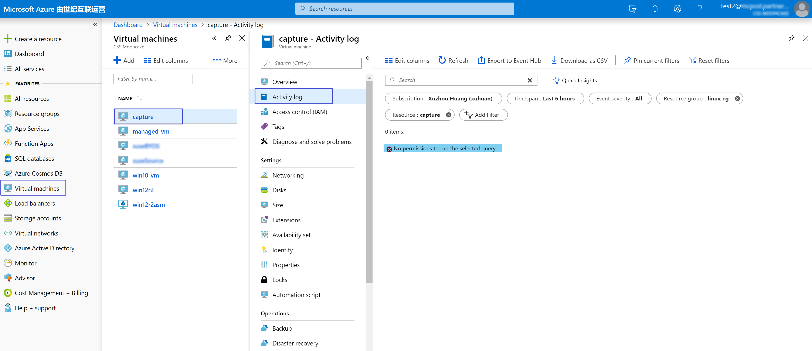

# 如何自定义角色属性以限制用户访问活动日志

## 问题描述

管理员有时需要根据组织的需求限制 Azure AD 用户访问特定资源的权限，本文描述的是如何而设置 [RBAC role](https://docs.azure.cn/zh-cn/role-based-access-control/overview) 以允许用户读取 Azure Monitor 中除活动日志以外的所有信息。

## 解决方法

用户可以参考如下 JSON 模板修改自定义角色属性，其中 `"Actions": ["Microsoft.Insights/*/read"]` 允许用户读取所有 Azure Monitor 中的数据，`"NotActions": ["Microsoft.Insights/eventtypes/*"]在 Actions` 中排除了对活动日志的所有访问权限。

```json
{
  "Name": "Custom Role",
  "Id": null,
  "IsCustom": true,
  "Description": "No access to Monitor/Activity Log",
  "Actions": [
    "Microsoft.Insights/*/read"
  ],
  "NotActions": [
    "Microsoft.Insights/eventtypes/*"
  ],
  "AssignableScopes": [
    "/subscriptions/<xxxxxxxx-xxxx-xxxx-xxxx-xxxxxxxxxxxx>"
  ]
}
```

[使用 JSON 模板更新自定义用户角色](https://docs.azure.cn/zh-cn/role-based-access-control/custom-roles-powershell#update-a-custom-role-with-a-json-template)后，被授予该角色的用户访问资源的活动日志时，会查看到如下显示 “No permissions to run the selected query”。

由于该用户对活动日志的访问权限限制，因此没有权限运行针对该资源活动日志的筛选查询，而得到如下返回结果：



## 参考文档

* RBAC role 自定义中 NotActions 属性指定要从允许的 Actions 中排除的管理操作，具体参考[自定义角色属性
](https://docs.azure.cn/zh-cn/role-based-access-control/custom-roles#custom-role-properties)