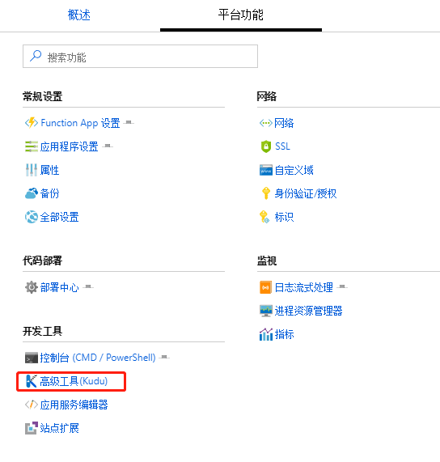
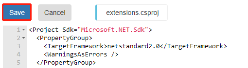

# 使用 Function App 在门户中开发时如何添加新的扩展

## 解决方法

在 Function App 中添加函数时，选择对应的函数模板，就会提示添加相应的扩展。


对于另外要添加的扩展可以参考如下步骤进行添加：

1. 停止当前的 Function App：

    

2. 通过如下步骤进入到 Kudu Console 界面：

    点击【平台功能】→【高级工具】，

    

    进入 Kudu 以后，切换到【Debug Console】，选择【CMD】，

    

3. 在【CMD】页面导航到目录 `d:\home\site\wwwroot` 下，删除 *bin* 目录：

    

4. 选择文件 *extensions.csproj* 进行编辑，选择想要安装的扩展：

    

    假设要添加一个新的扩展 Microsoft.Azure.WebJobs.Extensions.SendGrid，版本为 3.0.0，则文件编辑内容如下：

    

    关于扩展的信息可以参考：[What NuGet packages do i need?](https://github.com/Azure/azure-functions-host/wiki/Updating-your-function-app-extensions#what-nuget-packages-do-i-need)

5. 点击【保存】按钮：

    

6. 在命令行运行如下命令：

    ```shell
    dotnet build extensions.csproj -o bin --no-incremental --packages D:\home\.nuget
    ```

7. 运行完毕以后重启 Function App 即可。

## 参考文档

* [Updating your function app extensions](https://github.com/Azure/azure-functions-host/wiki/Updating-your-function-app-extensions)