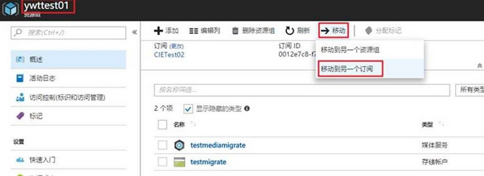

# 如何迁移媒体服务账户

目前无法直接通过 Azure 管理门户进行迁移，如果您的迁移媒体服务账户在同一个订阅下，可以通过 Azure Media Services Explorer 进行迁移，这个工具是 GitHub 上的开源项目，下载地址是：[Azure Media Services Explorer](https://github.com/Azure/Azure-Media-Services-Explorer/releases/)。

> [!Note]
> 新版本 Azure Media Services Explorer 无法通过 AAD Settings 手动指定 Endpoint，用户可选择本文中示例版本 Version 4.3.2.1 for Media Services v2。

1. 登录到 China Azure 的媒体服务帐号，需要在 AAD Settings 手动指定 Endpoint：

    

2. 在 Credentials 中输入媒体服务的 tenant domain、Rest Api Endpint 进行登录，可以在媒体服务 API 查看 tenant domain、Rest Api Endpint 这些信息:

    

    

    

3. 登录成功后，您可以右键点击需要迁移的文件，选择迁移到另一个存储帐号或者媒体服务帐号:

    

4. 也可以选择多个文件同时进行迁移。

如果您的迁移媒体服务账户不在同一个订阅下，这两个订阅是在同一个 tenant 下，您可以通过如下的步骤进行操作：

1. 进入旧的订阅下媒体服务账户资源组：

    

2. 点击移动，移动到另一个订阅中，选择要迁移到订阅：

    

迁移成功后，可以过一段时间（会有一些延时）在新的订阅中查看到媒体服务账户信息。

如果您需要移动的新订阅和之前订阅没有关系的话，可以通过 Blob 从某个存储帐户复制到一个 AMS 帐户中，具体内容参考链接：[将 Blob 从存储帐户复制到 AMS 帐户](https://docs.azure.cn/zh-cn/media-services/previous/media-services-copying-existing-blob#copy-blobs-from-a-storage-account-into-an-ams-account)。
