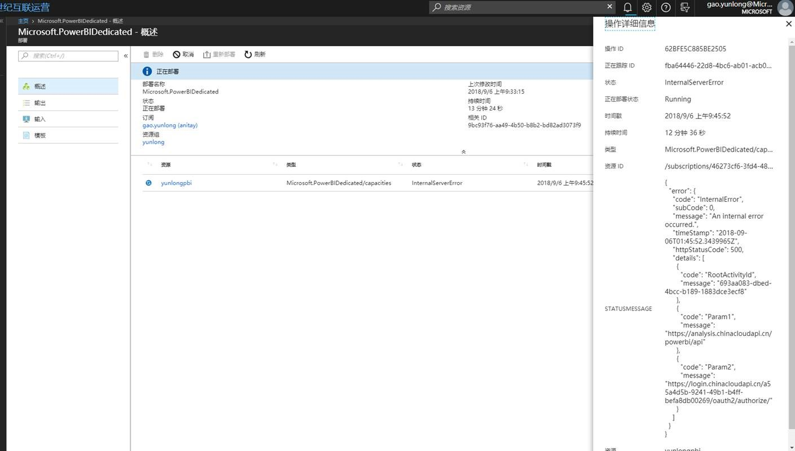
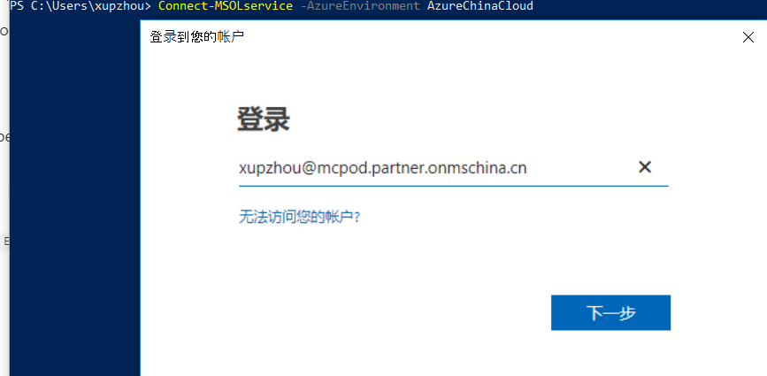

# 如何检查 Power BI Embedded 容量的可使用性

本文详述了由于 O365 功能被 disable 造成的已经具有创建 Power BI Embedded 的权限，但是在门户上无法创建 Power BI Embedded 服务的问题的解决方法。

如果是由于上述问题造成的无法创建 Power BI Embedded 的问题会出现如下两个现象：

* 现象一是无法访问 [Office 365 Admin center](https://portal.partner.microsoftonline.cn/AdminPortal/Home#/homepage) 的网站。

* 现象二会出现如下 Power BI Embedded 无法创建的问题：

    

如果出现上述问题，可以采用如下步骤进行解决。

1. 用下面的 PowerShell 命令连接到 Azure China 的 MSOnlie，需要用 global admin 的账号和密码：

    ```powershell
    Connect-MSOLservice -AzureEnvironment AzureChinaCloud
    ```

    

2. 用下面的 PowerShell 命令连接到查看 O365 的状态：

    请关注 AccountEnabled 的信息，如果 AccountEnabled 为 true 则 O365 已经使能，如果为 false 则需要运行步骤 3 进行 enable。

    ```powershell
    Get-MsolServicePrincipal -AppPrincipalId 00000006-0000-0ff1-ce00-000000000000
    ```

3. 用下面的 PowerShell 命令使能 O365 的状态：

    ```powershell
   Set-MsolServicePrincipal -AppPrincipalId 00000006-0000-0ff1-ce00-000000000000 -AccountEnabled $true
   ```