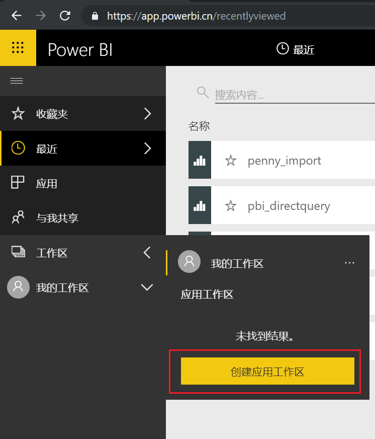
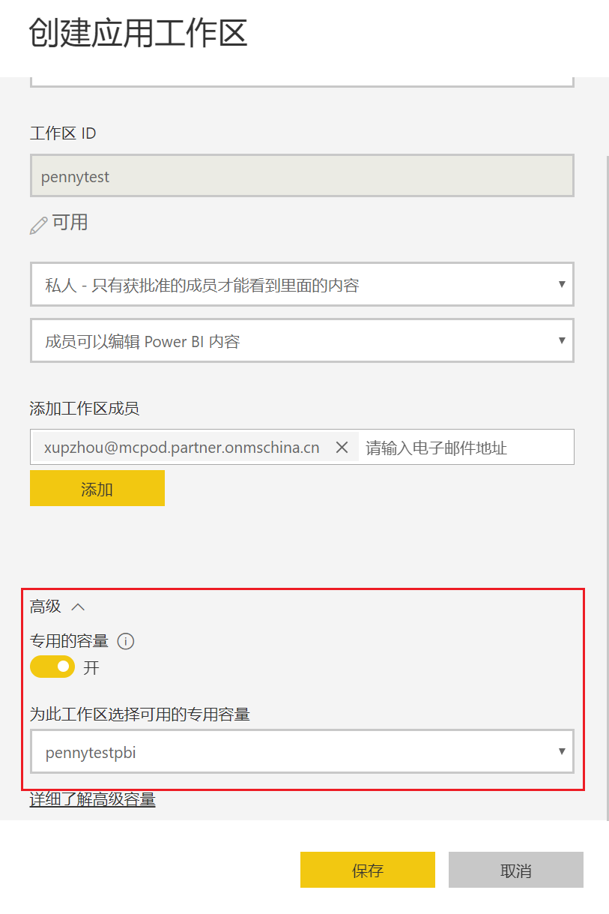
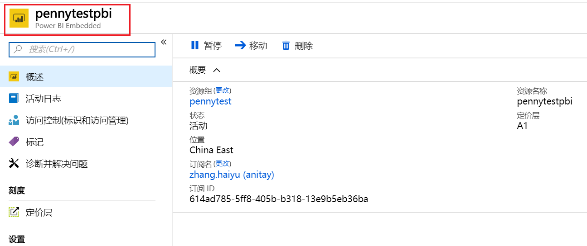
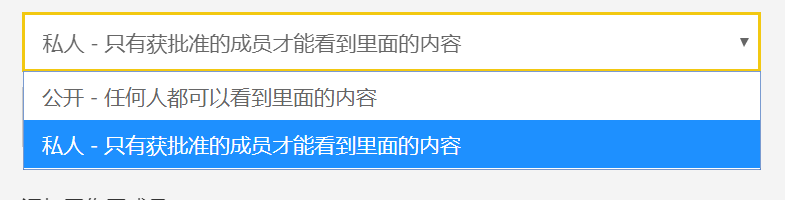
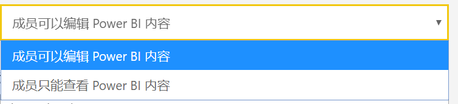
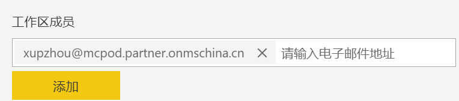
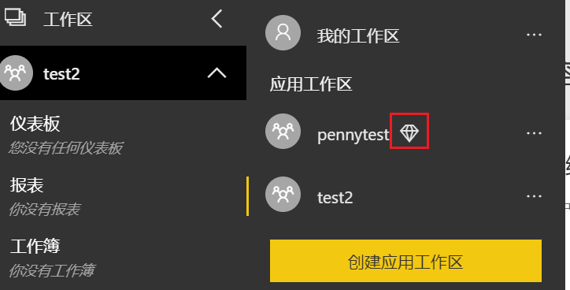
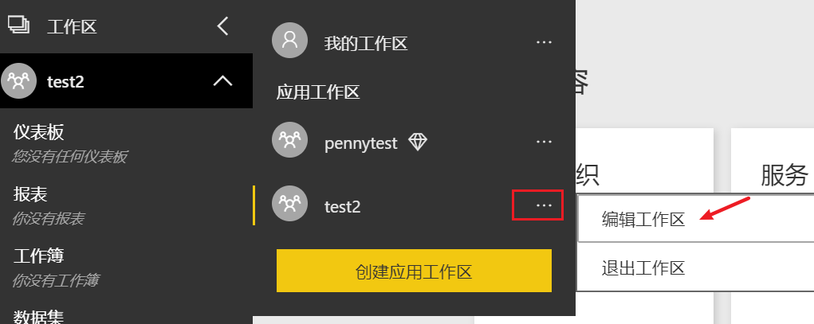
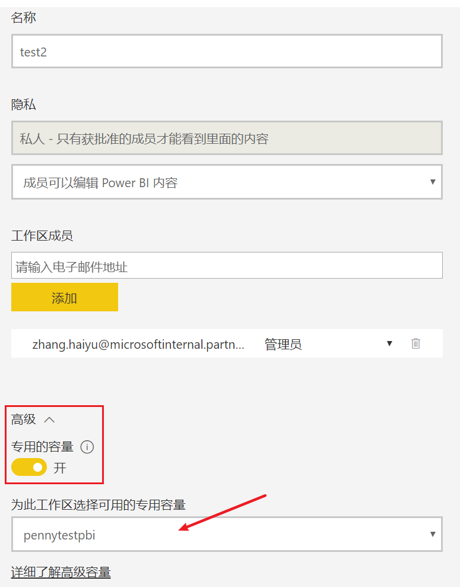

# 如何在 Power BI 服务中使用 Power BI Embedded 容量

本文详述了如何在 Power BI 服务 (app.powerbi.cn) 中使用已经创建好的 Power BI Embedded 容量。

本文假定用户具 Power BI Pro 的服务，并已创建了 Power BI Embedded 容量。如果尚未具有 Power BI Pro 的服务，请参阅[开启 Power BI Pro 服务](https://docs.azure.cn/zh-cn/articles/azure-operations-guide/power-bi-embedded/aog-power-bi-embedded-qa-creation-issue)。 如果尚未创建Power BI Embedded 容量，请参阅[在 Azure 门户中创建 Power BI Embedded 容量](https://docs.azure.cn/zh-cn/power-bi-embedded/create-capacity)以开始创建。

## 创建应用工作区并使用 Power BI 容量

1. 登录 Power BI 服务网站。

2. 点击工作区，然后点击创建应用工作区：

    

3. 创建应用工作区的地方可以选择是否开启专有容量，如果开启专用容量就可以使用已经创建的 Power BI Embedded 容量:

    

    在 Power BI 服务中选用的就是已经创建的 Power BI Embedded 容量:

    

4. 需要设置几个选项。如果你选择“公开”，则组织中的任何人都可以看到工作区内容。“私人”是指只有工作区的成员可以查看其内容。创建组后，将不能更改 “公开”/“私人”设置：

    

5. 此外，还可以选择成员是可以编辑还是具有仅查看访问权限：

    

6. 添加你要允许其访问工作区的用户的电子邮件地址，然后选择“添加”。无法添加组别名，只能添加单个用户别名。

    

## 已创建应用工作区启用 Power BI 容量

已使用 Power BI Embedded 容量的工作区会在右边显示一个钻石，对于已经创建的应用区也可以再开启 Power BI Embedded 容量使用，具体方法如下文所示。

1. 点击编辑工作区：

    

2. 打开“专用的容量”，并选用已经创建的 Power BI Embedded 容量。

    

## 后续步骤

如果要增加或减少容量，请参阅[缩放 Power BI Embedded 容量](https://docs.azure.cn/zh-cn/power-bi-embedded/scale-capacity)。

若要开始在应用程序中嵌入 Power BI 内容，请参阅[如何嵌入 Power BI 仪表板、报表和磁贴](https://docs.microsoft.com/en-us/power-bi/developer/embedding-content/)。

有更多问题？尝试在 [Power BI 社区](https://community.powerbi.com/)中提问。