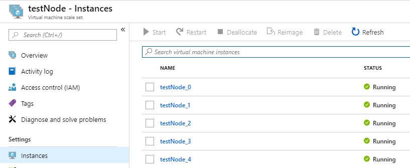
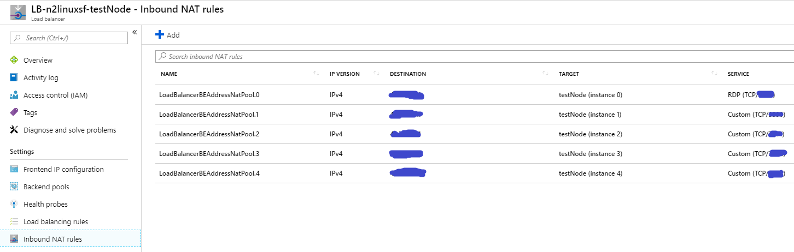
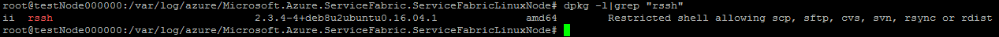
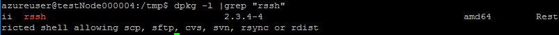
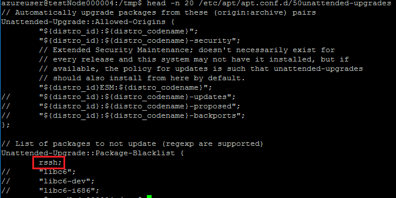

# 由 rssh 版本升级导致的 Ubuntu Fabric 创建失败的手动修复

Ubuntu 在 2019 年 2 月 6 日发布的一个升级包 2.3.4-4+deb8u1build0.16.04.1 与当前的 Fabric ImageBuilder 有些冲突，使得基于 Ubuntu 的 Service Fabric 最终创建失败。这个问题同样影响 Mooncake 上基于 Ubuntu 的 Fabric 的创建。但当下，我们可以通过修改 Fabric 创建时的 *template* 修复这个问题。具体方法请参照文档：[Known Issue for Service Fabric Linux Clusters
](https://blogs.msdn.microsoft.com/azureservicefabric/2019/02/07/known-issue-for-service-fabric-linux-clusters/)。

若通过修改 *template* 的方式创建依然失败。我们依然可尝试以下方式，ssh 进入每一个虚拟机规模集的 node，然后手动修复。

1. 确认虚拟机规模集下的 node 已经正常创建完成，并处于运行状态：

    

2. 从 LB 处获取每一台 node 的网络信息：

    

3. 使用 ssh 客户端登录进入每一台 node 并执行如下检查：

    ```ssh
    dpkg -l |grep "rssh"
    ```

    

4. 确认环境信息后(rssh 版本如上或显示没安装)，手动执行如下指令：

    ```ssh
    cd /tmp
    sudo wget http://archive.ubuntu.com/ubuntu/pool/universe/r/rssh/rssh_2.3.4-4_amd64.deb -O rssh_2.3.4-4_amd64.deb
    sudo dpkg -i /tmp/rssh_2.3.4-4_amd64.deb
    sudo sed -i 's+//\t\"vim\"+\trssh+g' /etc/apt/apt.conf.d/50unattended-upgrades
    ```

5. 核查执行上述指令后的结果：

    ```ssh
    dpkg -l | grep "rssh"
    ```

    

    ```ssh
    head -n 20 /etc/apt/apt.conf.d/50unattended-upgrades
    ```

    

6. 确认每一台 node 都手动更新完成后，建议 ssh 进 node0，然后 reboot 这台 node，激活 reconfig，等一段时间后在门户上查看是否已经不再是 *wait for nodes* 状态。