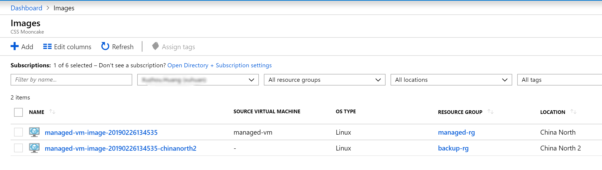

# 如何使用 CLI 在不同区域间复制托管镜像

## 问题描述

在 Azure 可以使用自定义托管镜像在同一区域内创建虚拟机，但若需要创建和托管镜像所在区域不同的虚拟机，则必须先将镜像拷贝至目标区域。拷贝托管镜像的一般做法为：

1. [通用化生成镜像的虚拟机](https://docs.azure.cn/zh-cn/virtual-machines/linux/capture-image#step-1-deprovision-the-vm)。

2. 使用 PowerShell [针对虚拟机的托管磁盘创建快照，再将快照导出成 VHD 文件，保存在指定的存储账户中](https://docs.azure.cn/zh-cn/articles/azure-operations-guide/virtual-machines/aog-virtual-machines-howto-export-managed-disks#powershell)。

3. 使用 [Azcopy](https://docs.azure.cn/zh-cn/storage/common/storage-use-azcopy#copy-a-single-blob-and-its-snapshots-from-one-storage-account-to-another) 将源存储账户中的 VHD 文件拷贝至不同区域的存储账户中。

4. 从[存储帐户中的 VHD 创建映像](https://docs.azure.cn/zh-cn/virtual-machines/windows/capture-image-resource#create-an-image-from-a-vhd-in-a-storage-account)，再使用该镜像创建托管虚拟机。

本文提供的方法是通过安装 CLI 拓展 image-copy-extension，直接通过 CLI 命令 `az image copy` 拷贝镜像至目标区域。值得注意的是，该命令本质上使用的仍然是源虚拟机的系统磁盘作为拷贝对象，因此若您准备将镜像拷贝至不同区域，请您在[创建自定义镜像](https://docs.azure.cn/zh-cn/virtual-machines/windows/capture-image-resource)时不要删除源虚拟机的系统磁盘。

## 解决方法

1. [下载并安装 CLI](https://docs.azure.cn/zh-cn/cli/install-azure-cli?view=azure-cli-latest)。

2. 安装 CLI 拓展 image-copy-extension：

    ```cli
    az extension add --name image-copy-extension
    ```

3. 使用 Azure CLI 登录：

    ```cli
    az cloud set -n AzureChinaCloud
    az login
    ```

4. 拷贝源镜像至目标区域示例：

    ```cli
    az image copy --source-resource-group "managed-rg" --source-object-name "managed-vm-image-20190226134535" `
    --target-location "chinanorth2" --target-resource-group "backup-rg" --cleanup --verbose
    ```

    运行上述示例后会得到如下类似返回结果：

    ```cli
    az : WARNING: Getting os disk id of the source vm/image
    At line:1 char:1
    + az image copy --source-resource-group "managed-rg" --source-object-na ...
    + ~~~~~~~~~~~~~~~~~~~~~~~~~~~~~~~~~~~~~~~~~~~~~~~~~~~~~~~~~~~~~~~~~~~~~
    + CategoryInfo          : NotSpecified: (WARNING: Gettin...source vm/image:String) [], RemoteException
    + FullyQualifiedErrorId : NativeCommandError

    WARNING: Creating source snapshot
    WARNING: Getting sas url for the source snapshot with timeout seconds: 3600
    WARNING: Creating resource group: image-copy-rg
    WARNING: Target location count: 1
    WARNING: Starting async process for all locations
    chinanorth2 - Creating target storage account (can be slow sometimes)
    chinanorth2 - Creating container in the target storage account
    chinanorth2 - Copying blob to target storage account
    chinanorth2 - Copy progress: 0%
    chinanorth2 - Copy progress: 1%
    chinanorth2 - Copy progress: 2%
    chinanorth2 - Copy progress: 100%
    chinanorth2 - Copy time: 0:01:30.514978
    chinanorth2 - Creating snapshot in target region from the copied blob
    chinanorth2 - Creating final image
    WARNING: Deleting transient resources
    ```

    也可以从门户查看到拷贝到目标区域的托管镜像文件：

    

## 参考文档

* [CLI 拓展 image-copy-extension 的更多帮助](https://github.com/Azure/azure-cli-extensions/tree/master/src/image-copy)

* [az extension list-available](https://docs.microsoft.com/en-us/cli/azure/extension?view=azure-cli-latest#az-extension-list-available) 查看更多可用的 CLI 拓展