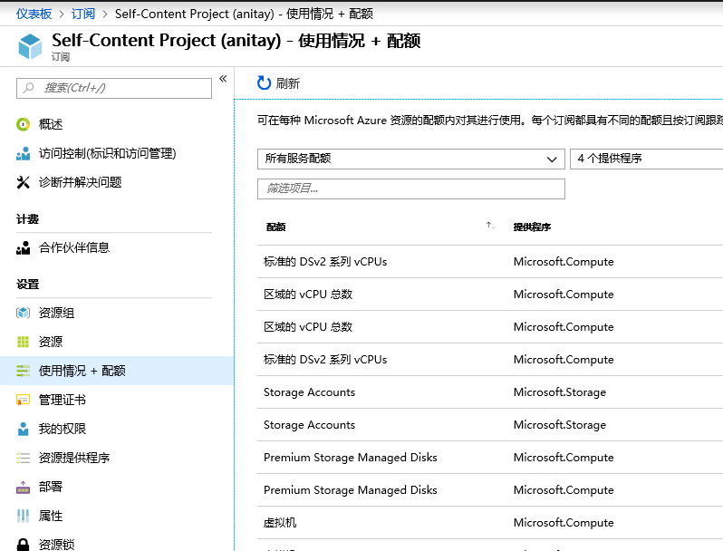
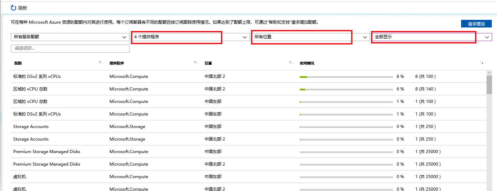
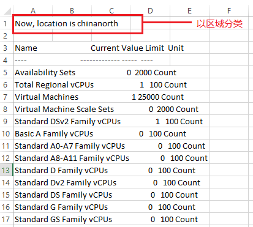

# 通过 Azure 门户或者 PowerShell 查看所有区域的虚拟机配额使用情况

## 问题描述

用户在新建虚拟机时，出现以下错误提示：

```
Deployment to resource group '<yourResourceGroup>' failed. Additional details from the underlying API that might be helpful: At least one resource deployment operation failed. Please list deployment operations for details. Please see https://aka.ms/arm-debug for usage details. (Code: DeploymentFaiIed) Operation results in exceeding quota limits of Core. Maximum allowed: 20, Current in use: 24, Additional requested: 4. (Code: OperationNotAIIowed)
```

## 问题分析

虚拟机和虚拟机规模集的 vCPU 配额已根据每个区域中的每个订阅划分成两层。第一层是区域的 vCPU 总数，第二层是各种 VM 大小系列核心（如 D 系列 vCPU）。每当部署新 VM 时，VM 的 vCPU 数不能超过 VM 大小系列的 vCPU 配额或区域 vCPU 配额总数。如果超过了上述任一配额，将不允许部署 VM。此外，区域中的虚拟机总数也有一个配额。可以在 [Azure 门户](https://portal.azure.cn)的 “**订阅**” 页的 “**用量 + 配额**” 部分中查看其中每项配额的详细信息，或者，可以使用 PowerShell 查询这些值。

## 解决方法

### 检查订阅配额

使用以下方法检查您的订阅是否已超出配额：

- Azure 门户

    1. 登录 Azure 门户，点击【所有服务】，点击【订阅】，选择需要查看的订阅并点击，在订阅页面左侧菜单选择【使用情况+配额】：

        

    2. 选择需要查看的相关资源类型与区域, 在第四个选项框中选择 “全部显示”，会列出来所有的配额情况：

        

- Azure PowerShell

    1. 登录到中国区 Azure 并切换到相应订阅下（替换为您的订阅 ID）：

        ```powershell
        Login-AzureRmAccount -EnvironmentName AzureChinaCloud
        $subscriptionid = "<xxxxxxxx-xxxx-xxxx-xxxx-xxxxxxxxxxxx>”
        Select-AzureRmSubscription -SubscriptionId $subscriptionid
        ```

    2. 使用以下脚本，并修改您所希望输出的文件路径：

        ```powershell
        $locations=(get-azurermlocation).Location
        foreach ($location in $locations)
        {
            $usage=Get-AzureRmVmUsage -Location $location
            "Now, location is $location" |out-file D:\<output>.csv -Append
            $usage | out-file D:\<output>.csv -Append
        }
        ```

    3. 在相应路径中打开文件，即可查看所有区域虚拟机的运行状况，显示的运行状况以区域分类如下图所示：

        

### 申请配额

您可以拨打 Azure 世纪互联客户服务热线：+86 400 0890 365 / +86 010-84563652，或通过[网页在线提交服务请求](https://support.windowsazure.cn/support/support-azure)申请配额。