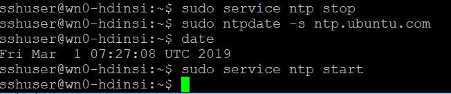
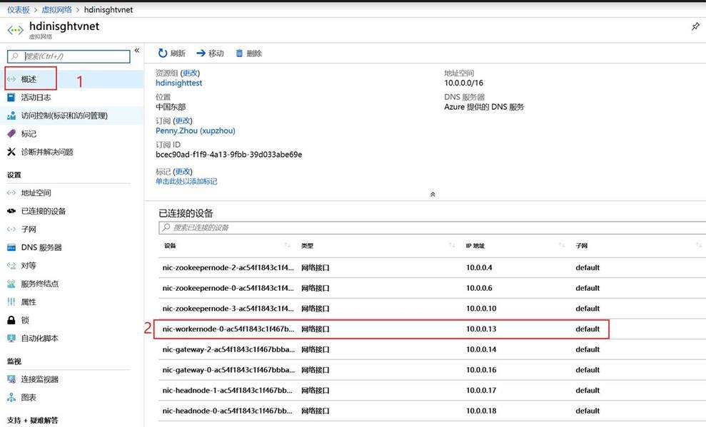
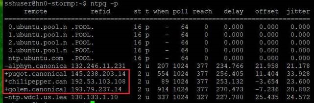
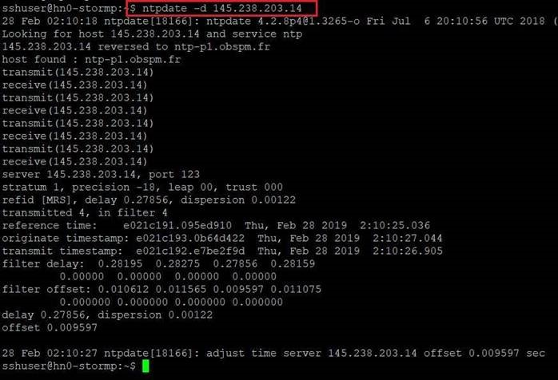
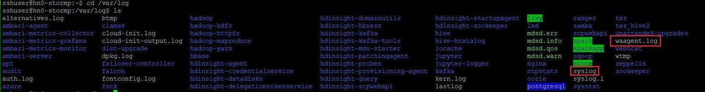

# HDInsight 节点中时钟不同步的解决方法

本文主要介绍了关于 HDInsight 集群节点中时钟不同步问题的解决方法。Azure HDInsight 上的节点都是使用 Linux 虚拟机，这些虚拟机默认都带有 ntp service 来跟外部的 ntp 时钟源同步。如果 HDInsight 中某些节点时钟不同步，可以尝试使用如下方法进行排查。

## 方法一：重启 ntp service

先使用 `ps -ef | grep ntp`，`sudo netstat -anlp | grep ntp` 判断 ntp service 是否正常运行启动，如果未能找到 ntp service，就运行 `sudo service ntp restart` 来启动 ntp service。

1. `ps -ef | grep ntp` 查看 ntp 是否正常：

    正常运行结果参考如下：

    ```shell
    sshuser@wn0-hdinsi:~$ ps -ef | grep ntp
    ntp       1977     1  0 01:49 ?        00:00:00 /usr/sbin/ntpd -p /var/run/ntpd.                                   pid -g -u 114:118
    sshuser  16725 16645  0 02:52 pts/0    00:00:00 grep --color=auto ntp
    ```

2. `sudo netstat -anlp | grep ntp` 可以用来排查 ntp server 的状态：

    运行结果如下则正常：

    ```shell
    sshuser@wn0-hdinsi:~$ sudo netstat -anlp | grep ntp
    udp        0      0 10.0.0.13:123           0.0.0.0:*                           1977/ntpd
    udp        0      0 127.0.0.1:123           0.0.0.0:*                           1977/ntpd
    udp        0      0 0.0.0.0:123             0.0.0.0:*                           1977/ntpd
    udp6       0      0 fe80::217:faff:fe00:123 :::*                                1977/ntpd
    udp6       0      0 ::1:123                 :::*                                1977/ntpd
    udp6       0      0 :::123                  :::*                                1977/ntpd
    unix  2      [ ]         DGRAM                    23759    1977/ntpd
    ```

3. 如果运行上述两个命令结果异常，可以使用如下命令重启 ntp service。

    ```shell
    sshuser@wn0-hdinsi:~$ sudo service ntp restart
    ```

## 方法二：强制配置 ntp 时钟源

如果方法一不成功则使用强制配置 ntp 时钟源的方式进行修复，具体操作如下：

1. 依次执行以下命令：

    关闭 ntp 服务：

    ```shell
    sudo service ntp stop
    ```

    ntpdate 强制与外部 ntp 时钟源同步：

    ```shell
    sudo ntpdate -s ntp.ubuntu.com
    ```

    查看时间：

    ```shell
    date
    ```

    开启 ntp 服务：

    ```shell
    sudo service ntp start
    ```

2. 执行结果如下：

    

## 方法三：排查时钟源不同步是否和 HDInsight 的 NSG 相关

如果方法二不成功，则可以去排查 HDInsight 上有问题的节点的 NSG 是否有相关限制，并对 NSG 规则进行查看：

打开 HDInsight 所在的 VNET，点击相关的网络接口：



在节点的网络接口中点击网络安全组 (NSG) 进行查看：


## 方法四：排查相关 log

如果方法一到三都没有修复好问题，则可以收集以下 log 进行分析：

1. 运行 `ntpq -p`，“+” 代表良好的且优先使用的远程节点或服务器（包含在组合算法中），“*” 代表当前作为优先主同步对象的远程节点或服务器：

    

2. 运行 `sudo apt install ntpdate` 安装 ntpdate，对于 `ntpq -p` 中查出来的 * 和 + 的 time server 运行 `ntpdate -d <serverIP>`，具体如下：

    

3. 查看 /var/log/syslog 和 /var/log/waagent.log 进行分析：

    

4. 查看 cat /etc/ntp.conf 下 ntp server 的配置是哪些，检查是否正常：

    运行结果如下则正常：

    ```shell
    sshuser@wn0-hdinsi:~$ cat /etc/ntp.conf
    # /etc/ntp.conf, configuration for ntpd; see ntp.conf(5) for help

    driftfile /var/lib/ntp/ntp.drift

    # Enable this if you want statistics to be logged.
    #statsdir /var/log/ntpstats/

    statistics loopstats peerstats clockstats
    filegen loopstats file loopstats type day enable
    filegen peerstats file peerstats type day enable
    filegen clockstats file clockstats type day enable

    # Specify one or more NTP servers.

    # Use servers from the NTP Pool Project. Approved by Ubuntu Technical Board
    # on 2011-02-08 (LP: #104525). See http://www.pool.ntp.org/join.html for
    # more information.
    pool 0.ubuntu.pool.ntp.org iburst
    pool 1.ubuntu.pool.ntp.org iburst
    pool 2.ubuntu.pool.ntp.org iburst
    pool 3.ubuntu.pool.ntp.org iburst

    # Use Ubuntu's ntp server as a fallback.
    pool ntp.ubuntu.com

    # Access control configuration; see /usr/share/doc/ntp-doc/html/accopt.html for
    # details.  The web page <http://support.ntp.org/bin/view/Support/AccessRestrictions>
    # might also be helpful.
    #
    # Note that "restrict" applies to both servers and clients, so a configuration
    # that might be intended to block requests from certain clients could also end
    # up blocking replies from your own upstream servers.

    # By default, exchange time with everybody, but don't allow configuration.
    restrict -4 default kod notrap nomodify nopeer noquery limited
    restrict -6 default kod notrap nomodify nopeer noquery limited

    # Local users may interrogate the ntp server more closely.
    restrict 127.0.0.1
    restrict ::1

    # Needed for adding pool entries
    restrict source notrap nomodify noquery

    # Clients from this (example!) subnet have unlimited access, but only if
    # cryptographically authenticated.
    #restrict 192.168.123.0 mask 255.255.255.0 notrust


    # If you want to provide time to your local subnet, change the next line.
    # (Again, the address is an example only.)
    #broadcast 192.168.123.255

    # If you want to listen to time broadcasts on your local subnet, de-comment the
    # next lines.  Please do this only if you trust everybody on the network!
    #disable auth
    #broadcastclient

    #Changes recquired to use pps synchonisation as explained in documentation:
    #http://www.ntp.org/ntpfaq/NTP-s-config-adv.htm#AEN3918

    #server 127.127.8.1 mode 135 prefer    # Meinberg GPS167 with PPS
    #fudge 127.127.8.1 time1 0.0042        # relative to PPS for my hardware

    #server 127.127.22.1                   # ATOM(PPS)
    #fudge 127.127.22.1 flag3 1            # enable PPS API
    ```