# 应用拥有数据将 Power BI 报表、仪表板或磁贴嵌入应用程序中

在获取 Power BI 资源进行认证时，可以使用主帐户和服务主体这两种认证类型。如果使用主账户认证类型，则需要在应用程序代码中嵌入 Power BI 主帐户的用户名和主帐户的密码。本教程演示当针对使用“应用拥有数据”的客户使用 “Azure 中的 Power BI Embedded” 时，如何使用 Power BI .NET 将报表集成到应用程序中，因此本教程中将使用主帐户的认证方式进行演示。“应用拥有数据”的优点是将用户名和密码都嵌入到程序中，使用者在使用的过程当时就无需再输入用户名和密码，但是由于将用户名和密码嵌入到程序中，所以安全性也是其中的隐患。

## Azure Active Directory 中注册一个本机应用

本教程中将使用主帐户的认证方式进行演示，需要先在 Azure Active Directory 中注册一个本机应用，用于获取 Power BI 资源进行认证。注意，需要使用具有 Power BI Pro 的账号（即可以登录需要访问 Power BI Service 网址的账号），登录 Azure 门户，然后到 Azure Active Directory 中注册一个本机应用。

1. 根据如下方式，在 Azure Active Directory 中注册一个应用，可以选择自己需要的网址进行注册(可以选择 <http://localhost:42734/> 这个网址作为重定向 URI)：

    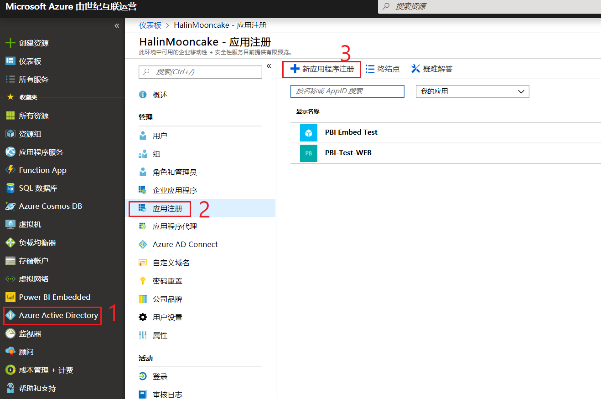

    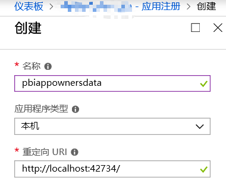

    添加该登录 Azure 门户的账号为所有者：

    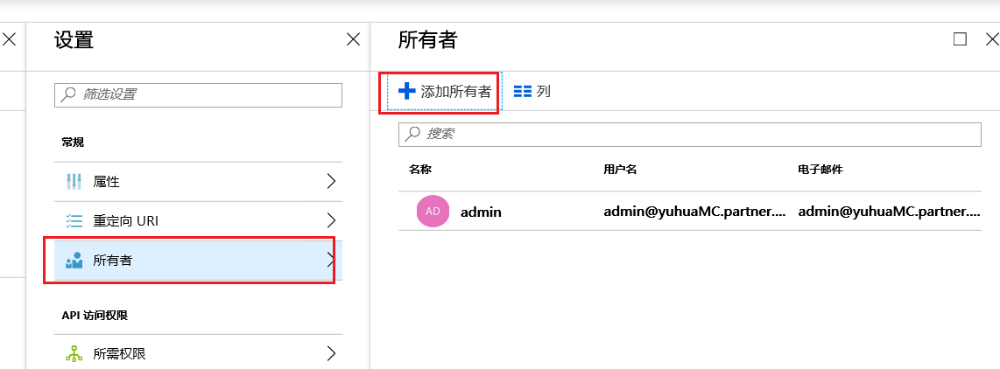

2. 授予注册的本地应用程序相关 Windows Active Directory 和 Power BI Service 权限，具体如下所示：

    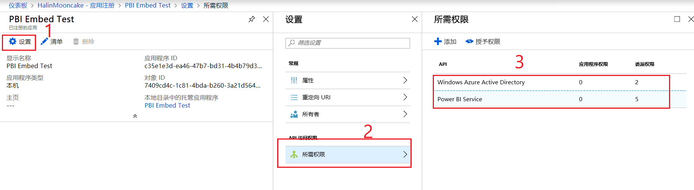

    点击 Windows Azure Active Directory，授予所需权限：

    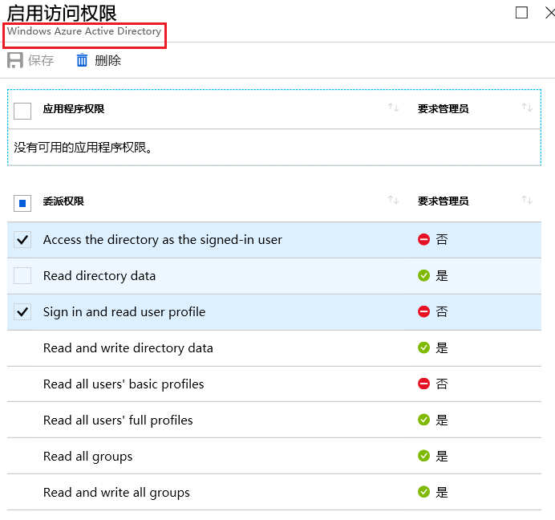

    如果该应用没有授予 Power BI Service 权限，则需要先添加 Power BI Service，然后再授权：

    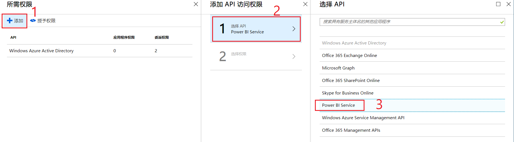

    Power BI Service 需要的权限具体如下：

    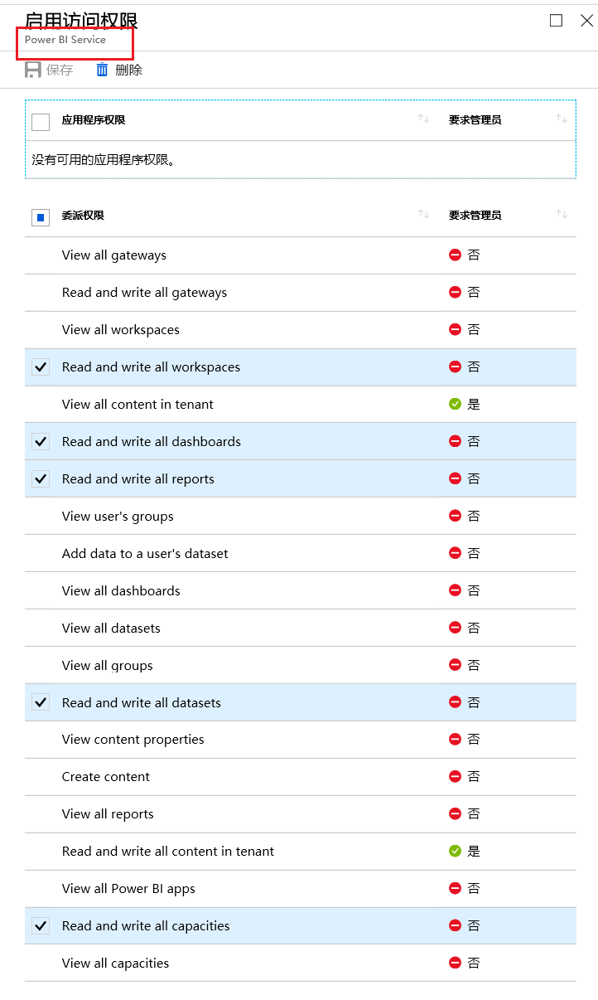

3. Windows Active Directory 和 Power BI Service 权限添加完成以后，需要点击授予权限，才能完成所有步骤：

    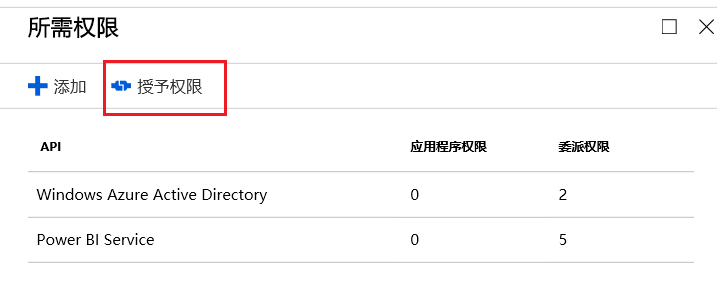

## 将 PBIX 报表上传到 Power BI Service 网站并选用 Power BI Embedded 容量

用户可以选择使用自己编辑的 pbix 文件，也可以从 GitHub 下载示例[博客演示](https://github.com/Microsoft/powerbi-desktop-samples)。

1. 在 Power BI Desktop 中点击发布就可以将 pbix 文件发布到 Power BI Service 网站 (app.powerbi.cn) 中。

    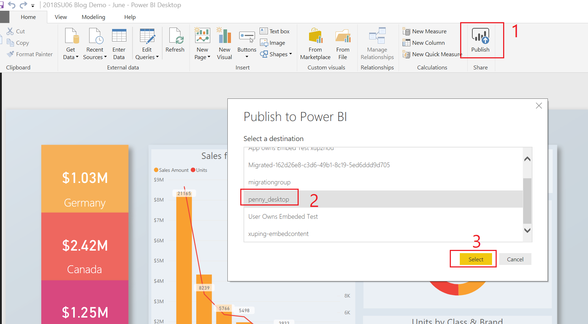

2. 在 Power BI Service 网站 (app.powerbi.cn) 中选中刚才上传的工作区，就可以打开“专用的容量”，并选用已经创建的 Power BI Embedded 容量。

    选中工作区，然后点击编辑工作区：

    

    在编辑工作区中，选择打开专用容量，就可以选择使用 Azure 门户中创建的 Power BI Embedded 容量，如下所示：

    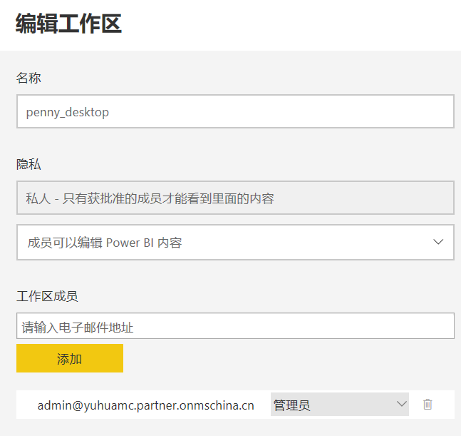

    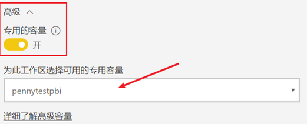

3. 选中需要展示的报表，在如下图的网址中的字段分别代表 workspace id 和 report id：

    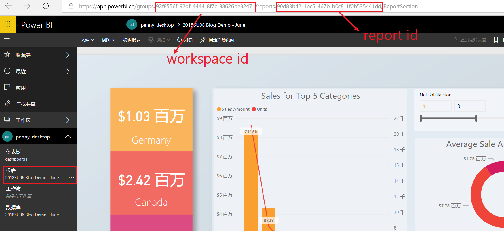

## 使用示例应用程序嵌入内容

本实例演示的是比较简单的样例，并没有对 Power BI 主帐户的用户名和主帐户的密码进行加密，用户可以根据自己的使用情况进行加密。

请按照以下步骤，使用示例应用程序开始嵌入内容。

1. 下载 [Visual Studio](https://visualstudio.microsoft.com/)（2013 版或更高版本）。 请务必下载最新版 [NuGet 包](https://www.nuget.org/profiles/powerbi)。

2. 从 GitHub 下载相应的[示例代码](https://github.com/XupingZhou/Mooncake-App-Owns-Data)。

3. 编辑代码中的 Web.config 中的如下字段。其中的 workspaceid 和 reportid 是上文中 Power BI Service 中的一部分：

    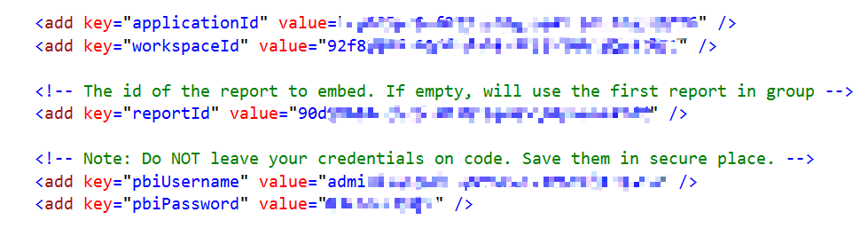

4. 运行 Visual Studio 中就可以运行程序了：

    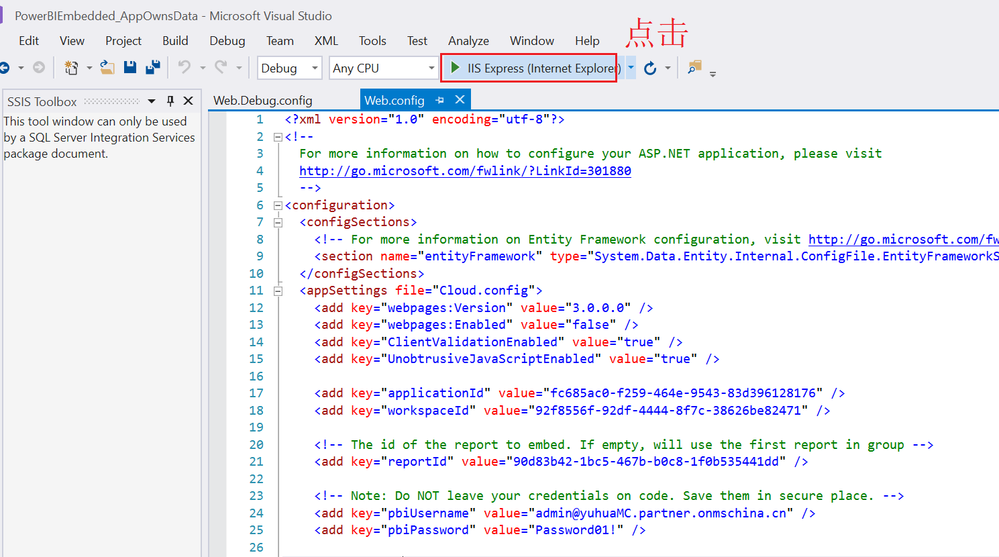

    运行以后就会跳转到 Web 页面，如下所示：

    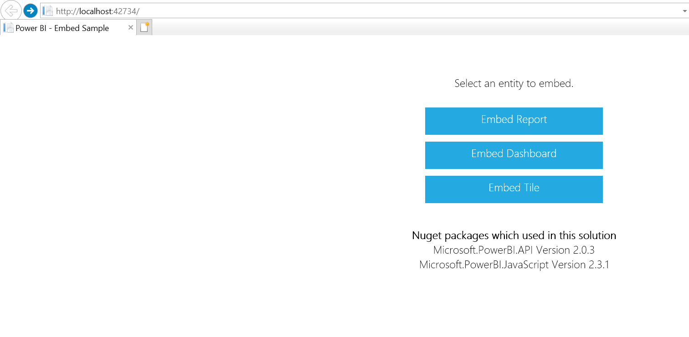

    点击 Embedded Report 可以显示如下内容：

    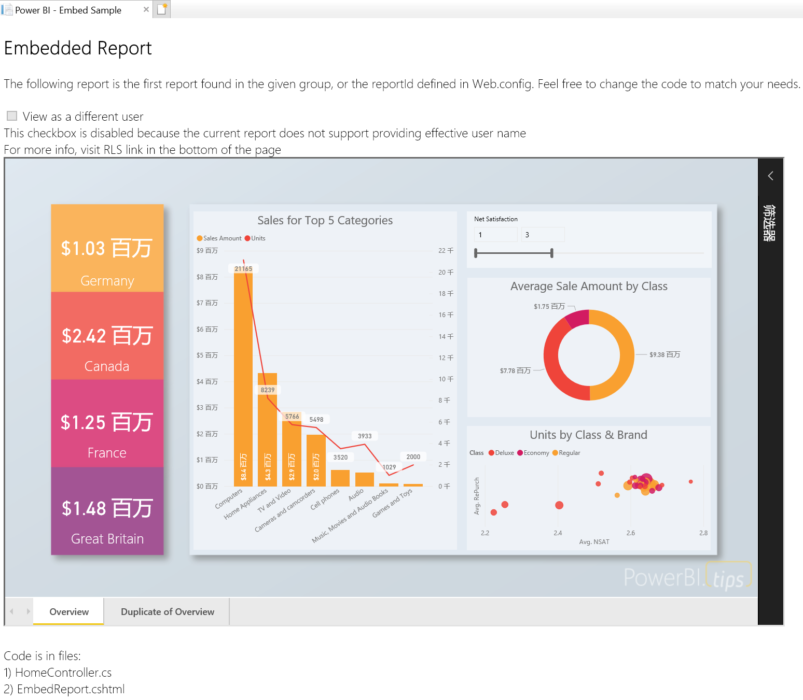

    点击 Embedded Dashboard 可以显示如下内容：

    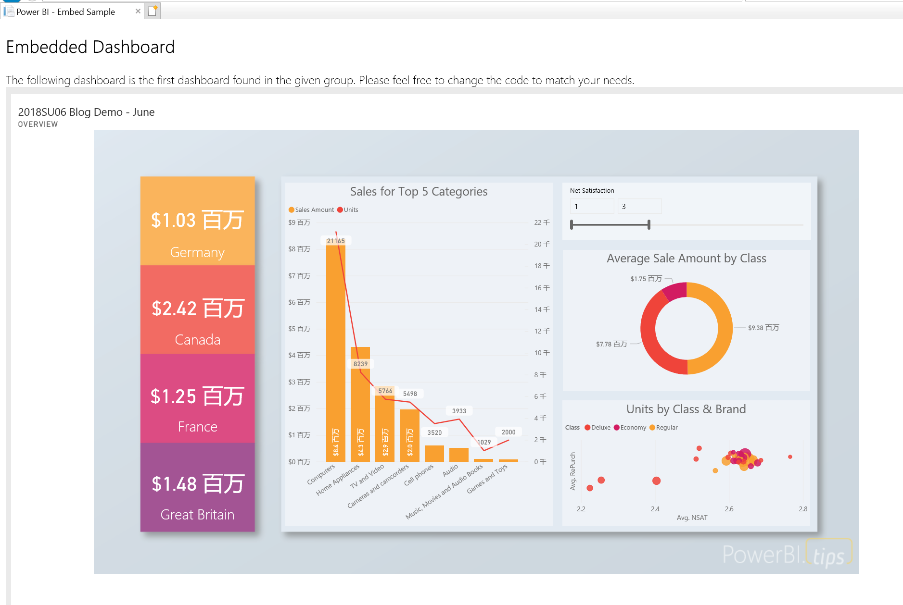

    点击 Embedded Tile 可以显示如下内容：

    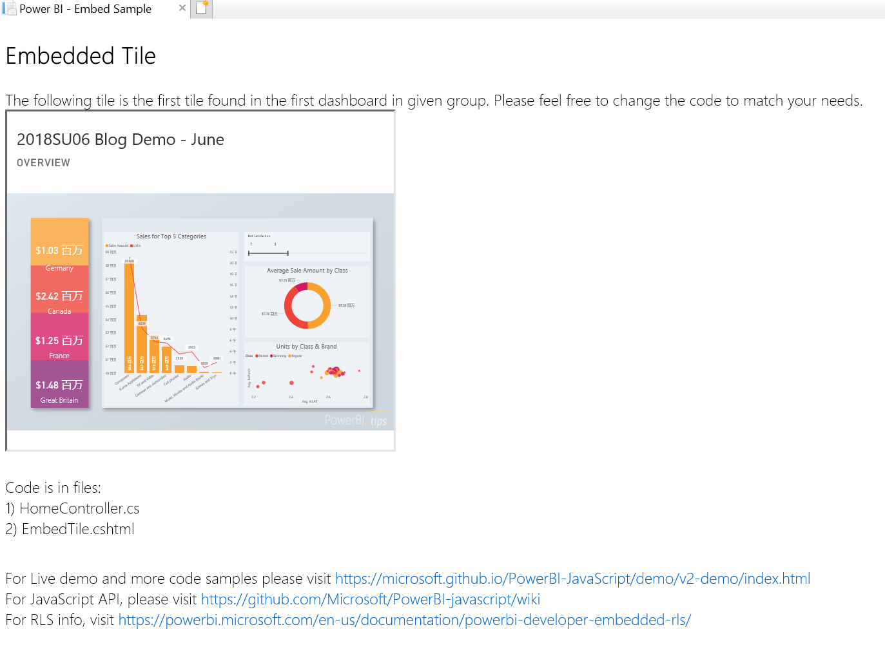