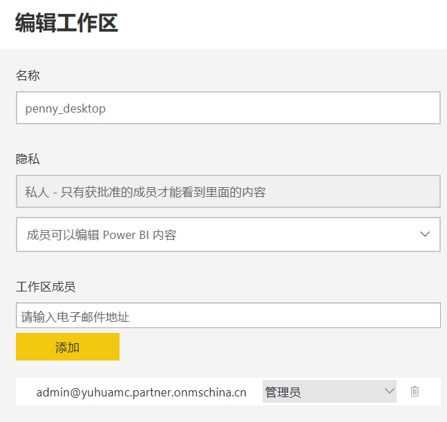
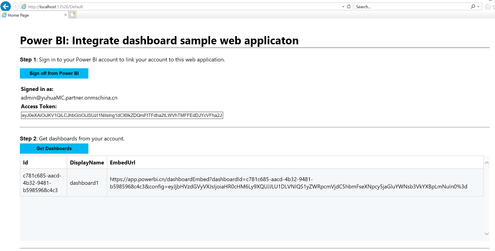

# 用户拥有数据将 Power BI 报表、仪表板或磁贴嵌入应用程序中

本教程演示当针对使用“用户拥有数据”的客户使用 “Azure 中的 Power BI Embedded” 时，如何使用 Power BI .NET 将报表集成到应用程序中，因此本教程中将使用服务主体的认证方式进行演示。“用户拥有数据”的样例中，用户在网站上获取相关 Power BI 资源的时候需要登录相关 Power BI 主体账号的用户名和密码，这样用户名和密码由用户保管会更安全。

## Azure Active Directory 中注册一个 Web 应用

本教程中将使用服务主体的认证方式进行演示，需要先在 Azure Active Directory 中注册一个 Web 应用，用于获取 Power BI 资源进行认证。注意，需要使用具有 Power BI Pro 的账号（即可以登录需要访问 Power BI Service 网址的账号），登录 Azure 门户，然后到 Azure Active Directory 中注册一个本机应用。

1. 根据如下方式，在 Azure Active Directory 中注册一个应用，可以选择自己需要的网址进行注册（可以选择 <http://localhost:13526/> 这个网址作为重定向 URI）：

    

    

    在回复 URL 中添加 <http://localhost:13526/Redirect>。如果使用其他网址，可以按照此做相应修改：

    

    添加该登录 Azure 门户的账号为所有者：

    

2. 授予注册的本地应用程序相关 Windows Active Directory 和 Power BI Service 权限，具体如下所示：

    

    点击 Windows Azure Active Directory，授予所需权限：

    

    如果该应用没有授予 Power BI Service 权限，则需要先添加 Power BI Service，然后再授权：

    

    Power BI Service 需要的权限具体如下：

    

3. Windows Active Directory 和 Power BI Service 权限添加完成以后，需要点击授予权限，才能完成所有步骤：

    

## 将 PBIX 报表上传到 Power BI Service 网站并选用 Power BI Embedded 容量

用户可以选择使用自己编辑的 pbix 文件，也可以从 GitHub 下载示例[博客演示](https://github.com/Microsoft/powerbi-desktop-samples)。

1. 在 Power BI Desktop 中点击发布就可以将 pbix 文件发布到 Power BI Service 网站 (app.powerbi.cn) 中：

    

2. 在 Power BI Service 网站 (app.powerbi.cn) 中选中刚才上传的工作区，就可以打开“专用的容量”，并选用已经创建的 Power BI Embedded 容量。

    选中工作区，然后点击编辑工作区：

    

    在编辑工作区中，选择打开专用容量，就可以选择使用 Azure 门户中创建的 Power BI Embedded 容量，如下所示：

    

    

## 使用示例应用程序将 Report 嵌入内容

请按照以下步骤，使用示例应用程序开始嵌入内容。

1. 下载 [Visual Studio](https://visualstudio.microsoft.com/)（2013 版或更高版本）。 请务必下载最新版 [NuGet 包](https://www.nuget.org/profiles/powerbi)。

2. 从 GitHub 下载相应的[示例代码](https://github.com/XupingZhou/Mooncake-User-Owns-Data/tree/master)。

    本示例使用 integrate-report-web-app，如下所示：

    

3. 将 Cloud.config 和 Settings.settings 下的 “Enter your app ClientID” 替换为 Web 应用的应用程序 ID，“Enter your app Secret” 替换为 Web 应用的密钥：

    

    Web 应用的密码，可以通过如下方式添加。注意，添加密钥以后需要在关闭之前先保存到另一个地方，因为一旦关闭页面，密钥将会被隐藏：

    

4. 点击运行 Visual Studio 程序，就可以得到相应报表的结果了：

    

    点击 Get Report 进行登录，使用 PowerBI 主体账号的用户名和密码登录，如下所示：

    

    成功登录以后，就可以正确显示 Report，默认显示的是 Power BI Service 网站下，“我的工作区”下的第一个 Report，如果需要修改可以在应用代码中进行修改。

    

## 使用示例应用程序将 Dashboard 嵌入内容

请按照以下步骤，使用示例应用程序开始嵌入内容。

1. 下载 [Visual Studio](https://visualstudio.microsoft.com/)（2013 版或更高版本）。 请务必下载最新版 [NuGet 包](https://www.nuget.org/profiles/powerbi)。

2. 从 GitHub 下载相应的[示例代码](https://github.com/XupingZhou/Mooncake-User-Owns-Data/tree/master)。

    本示例使用integrate-dashboard-web-app，如下所示：

    

3. 将 Cloud.config 和 Settings.settings 下的 “Enter your app ClientID” 替换为 Web 应用的应用程序 ID，“Enter your app Secret” 替换为 Web 应用的密钥：

    

4. 点击运行 Visual Studio 程序，就可以得到相应报表的结果了。

    运行以后，点击 Step1 的 Sign In Power BI，使用 Power BI 主体账号用户名和密码登录，然后再点击 Get Dashboard 就可以得到 EmbedUrl：

    

    将 EmbedUrl 输入 Step3 就可以得到相应的 Dashboard。注意，这里的 Dashboard 显示的是 Power BI Service 网站下，“我的工作区”下的第一个 Dashboard，如果需要修改可以在应用代码中进行修改。

    

    点击 Dashboard 的相应区域，可以显示对应的 Log View：

    

## 使用示例应用程序将 Tile 嵌入内容

请按照以下步骤，使用示例应用程序开始嵌入内容。

1. 下载 [Visual Studio](https://visualstudio.microsoft.com/)（2013 版或更高版本）。 请务必下载最新版 [NuGet 包](https://www.nuget.org/profiles/powerbi)。

2. 从 GitHub 下载相应的[示例代码](https://github.com/XupingZhou/Mooncake-User-Owns-Data/tree/master)。

    本示例使用 integrate-tile-web-app，如下所示：

    

3. 将 Cloud.config 和 Settings.settings 下的 “Enter your app ClientID” 替换为 Web 应用的应用程序 ID，“Enter your app Secret” 替换为 Web 应用的密钥：

    

4. 点击运行 Visual Studio 程序，就可以得到相应报表的结果了。

    点击 Get tile 使用 Power BI 主体账号用户名和密码登录：

    

    成功登录以后，就可以显示如下：

    