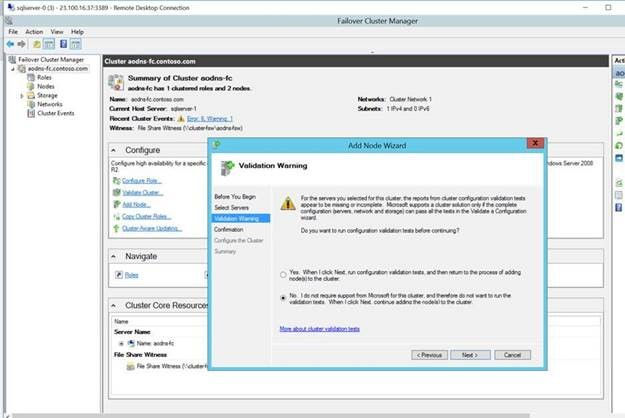
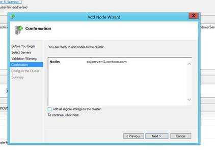
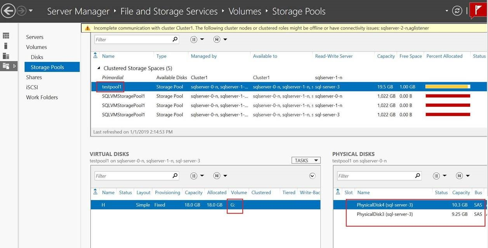
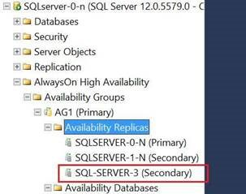

# 如何在有 SQL Server Always on 的机器上进行条带化虚拟机磁盘

本文详述了如何在有 SQL Server Always on 的虚拟机上进行条带化磁盘。通过在虚拟机上条带化磁盘可以聚合其 IOPS，带宽和存储容量等。在有 SQL Server Always on 的机器上进行条带化磁盘可以采用本文中的两种方法，这两种方法合并磁盘以后的 I/O 效果是一样的，但是方法二需要先通过 Storage Pools 的方式创建磁盘以后，再把虚拟机作为节点加入 Always on 中才能生效。

方法一可以直接通过 [New Stripped Volume](https://docs.azure.cn/zh-cn/articles/azure-operations-guide/virtual-machines/windows/aog-virtual-machines-howto-disk-striping) 的方式进行条带化磁盘。这种方式可以在虚拟机已经作为节点加入 Always on 的 Availability group 以后再进行条带化来合并磁盘。

方法二是需要先在虚拟机上通过 [Storage Pools](https://docs.azure.cn/zh-cn/articles/azure-operations-guide/virtual-machines/windows/aog-virtual-machines-windows-howto-disk-striping-with-storage-spaces) 的方式创建磁盘，然后再将虚拟机加入到 Availability Group（AG）。

将虚拟机加入到 AG 中需要注意如下几点：

1. 在添加节点时，“验证警告”页上，单击“否”（在生产方案中，应执行验证测试）。然后单击“下一步”。

    

2. 在“确认”页上不勾选为 “Add all eligible storage to the cluster” 的复选框。

    

3. 这样最终可以成功的先添加虚拟磁盘，然后再把虚拟机加入到 Availability Group 中。

    

    