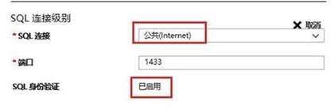

# 如何使用本机公网访问 Azure SQL SERVER 虚拟机中的 SSRS

本文详述了在本地电脑中，如何使用公网访问 Azure SQL Server 虚拟机中的 SQL Server 报表服务器 (SSRS)。本文使用的是 SQL Server 2016 SP2 Enterprise on Windows Server 2016 的虚拟机。

## 配置 Azure 虚拟机为使用公共 Internet 连接

在 Azure 虚拟机中选中需要配置 SSRS 的机器，选择左侧的 SQL Server 配置，然后在 SQL Server 连接中选择公共 Internet。

## 配置 Azure 虚拟机的 DNS 名字

在虚拟机左侧栏中点击“概述”，然后可以对 DNS 进行配置，如下所示。

## 配置 Azure 虚拟机网络入站规则开通端口 80 和 1433

选中虚拟机的网络，单击添加入站规则，可以添加端口 80 和 1433 到网络安全组中。

## 在 Windows 防火墙开通 80 和 1433 端口

1. 从“开始 (Start)”屏幕启动“高级安全 Windows 防火墙 (Windows Firewall with Advanced Security)”。

2. 在左窗格中，选择“入站规则 (Inbound Rules)”。在右窗格上，单击“新建规则 (New Rule...)”：

    

3. 在“规则类型 (Rule Type)”页上，选择“端口 (Port)”，然后单击“下一步”。

4. 在“协议和端口 (Protocol and Ports)”页上，选择 TCP，并键入端口 1433。然后，单击“下一步”。

5. 在“操作 (Action)”页面中，保持选中“允许连接 (Allow the connection)”，然后单击“下一步”。

6. 在“配置文件 (Profile)”页面中，接受默认设置并单击“下一步”。

7. 在“名称 (Name)”页上，在“名称”文本框中指定一个规则名称，如 sql port Probe，然后单击“完成”。

## 在 SSRS 所在的虚拟机上添加 DNS 的 URL

在 Azure 虚拟机中把 Azure 虚拟机的 DNS name 添加到 Web Service URL，也把 Azure 虚拟机的 DNS name 添加到 Web Portal URL。

在 SSRS 所在的虚拟机中把 Azure 虚拟机的 DNS name 添加到 Web Service URL 的操作如下：

在 SSRS 所在的虚拟机中把 Azure 虚拟机的 DNS name 添加到 Web Portal URL 的操作如下：

这样设置以后，就可以在本地机器上使用公网登录 Azure 虚拟机 SSRS 的 Web Portal URL。

