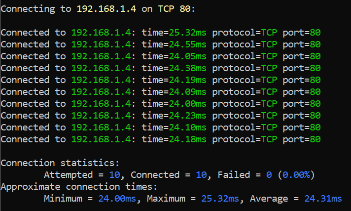

# Azure 虚拟网络的全局 VNET 对等互连

Azure 虚拟网络允许许多类型的 Azure 资源（例如 Azure 虚拟机 （VM））以安全方式彼此通信、与 Internet 通信，以及与本地网络通信。虚拟网络局限于单个区域。您可以在云中的专用网络构建可控的混合基础结构，自带 IP 地址和 DNS 服务器，借助 IPSec VPN 或 ExpressRoute 确保连接安全，并且能够精细控制子网之间的流量。

Azure 虚拟网络的全局 VNET 对等互连 2019-02-01 已正式发布。可在相同区域或不同区域中的虚拟网络之间建立对等互连。不同区域中的对等互连虚拟网络也称为“全局对等互连”。

## Azure 虚拟网络对等互连

使用虚拟网络对等互连可以无缝连接两个 Azure 虚拟网络。建立对等互连后，出于连接目的，两个虚拟网络会显示为一个。对等虚拟网络中虚拟机之间的流量通过 Azure 主干基础结构路由，非常类似于只通过专用 IP 地址在同一虚拟网络中的虚拟机之间路由流量。

Azure 支持：

* VNet 对等互连 - 连接同一 Azure 区域中的 VNet

* 全局 VNet 对等互连 - 跨 Azure 区域连接 VNet

使用虚拟网络本地对等互连 （无论本地还是全局） 的优点包括：

* 对等虚拟网络之间的网络流量是专用的。虚拟网络之间的流量仅限于 Azure 主干网络。在虚拟网络之间通信不需公共 Internet、网关或加密。

* 不同虚拟网络中资源之间的连接延迟低且带宽高。

* 在虚拟网络对等互连之后，一个虚拟网络中的资源与另一虚拟网络中的资源通信的功能。

* 跨 Azure 订阅、部署模型和 Azure 区域传输数据的功能。

* 可将通过 Azure 资源管理器创建的虚拟网络对等互连，或者将一个通过资源管理器创建的虚拟网络对等互连到通过经典部署模型创建的虚拟网络。若要详细了解 Azure 部署模型，请参阅[了解 Azure 部署模型](https://docs.azure.cn/zh-cn/azure-resource-manager/resource-manager-deployment-model?toc=%2fvirtual-network%2ftoc.json)。

* 在创建对等互连之时或之后，虚拟网络中的资源不会出现停机的现象。

## 虚拟网络全局对等互连要求和约束

当虚拟网络全局对等互连时，以下约束适用：

* 不能使用远程网关，也不能允许网关传输。若要使用远程网关或允许网关传输，对等互连的虚拟网络必须位于同一区域中。

## 通过 Azure 门户配置全局对等互连

配置全局 VNet 对等互连与 VNet 对等互连相同，只是在配置对端网络时选择其他区域的虚拟网络。

## 全局对等互连虚拟网络连接测试

测试源端虚拟机 VM2 在 China North Region 虚拟网络 testvnet 中，内部负载均衡器前端侦听地址 192.168.1.36，后端池虚拟机 192.168.1.6 和 192.168.1.4 在 China East2 Region 虚拟网络 east2Vnet 中，虚拟网络 testvnet 和 east2Vnet 建立全局对等互连。

从源端虚拟机 VM2 测试 TCP 连接内部负载均衡器前端侦听地址 192.168.1.36 和测试直接连接后端池虚拟机 192.168.1.6 和 192.168.1.4，TCP 连接均成功。China North Region 和 China East2 Region 虚拟网络建立全局对等互连后，虚拟机内网通信平均延迟在 25ms~27ms 左右。

