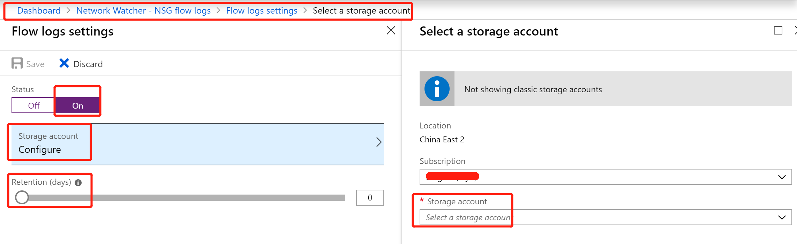

# 如何开启并使用 NSG 流日志分析进出虚拟机流量

## 使用场景

用户在针对 Azure 平台虚拟机做安全加固时，通常会使用平台提供的 NSG 策略（网络安全组），网络安全组可以工作在虚拟网络子网或虚拟机网卡之上，针对 TCP，UDP 协议端口提供流量阻断或放行。但是用户在使用此功能时，也往往需要类似传统网络安全中的流量控制的安全审计以及监控手段。

基于此，Azure 平台同样也提供了相应手段，即 NSG 流日志。

NSG 流日志提供了针对匹配了 NSG 策略的流量阻断和放行的详细信息。

所有外出或进入对应子网或是虚拟机网卡的流量，会根据 NSG 策略做匹配，匹配原则是基于五元组。如果匹配，会被执行 NSG 策略中的相应动作，同时，五元组信息以及执行动作会被记录到 NSG 流日志中。

本文针对如何开启并使用 NSG 流日志分析进出虚拟机或子网流量做详细介绍。

## 操作步骤

1. 为虚拟机的网络或虚拟机所在子网添加并配置 NSG 策略，具体步骤这里不做累述。

2. Azure 平台提供有 Network Watcher 功能，即网络观察程序，我们可以通过 Azure 门户进入 Network Watcher 页面下，找到 NSG flow logs：

    

    可以观察到所有已经添加过的 NSG 策略。我们可以针对需要开启 NSG 流日志的 NSG 策略开启流日志功能：

    

    配置流日志存储的存储账号，配置流日志的保存时间，0 为永久保存。

    开启后，一旦有流量匹配 NSG 策略，约五分钟后，会在对应的存储账号中看到如下文件名产生：

    

    在此目录文件中，进入最终底层目录，Azure 平台提供了根据 resourceID 以及时间的索引。

    下载对应时间戳目录中，下载其中的文件名为 PT1H 的 JSON 格式的 NSG 流日志，使用 JSON 编辑器打开，会观察到如下格式的日志：

    

    或

    

## 结论

以上 NSG 流日志信息中，我们可以得到匹配流量的五元组信息，以及对应执行动作：

* T-TCP

* I-Inbound

* O-Outbounf

* D-Deny

* A-Accept
