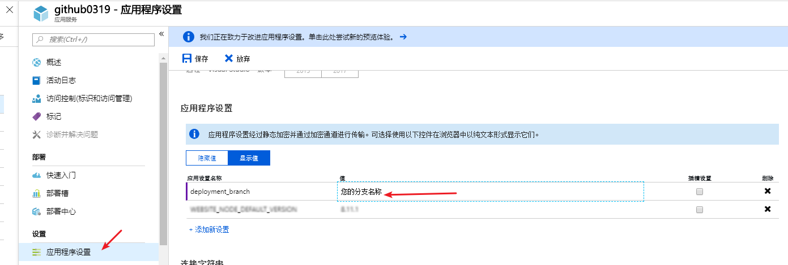

# Local Git 如何部署分支

## 问题描述

如果采用 Local Git 部署方法部署应用的话默认是只部署 *master* 分支的，如果我们想要部署其他分支那该怎么办呢？这篇文章就会解答你的疑问。

## 解决方案

1. 在 Azure 门户的应用设置界面添加 *deployment_branch* 键值对，如下图所示：

    

2. 在您本地设置好分支之后，使用 `git push azure <您的分支名称>` 的命令将您的程序发布到分支，之后访问即可。