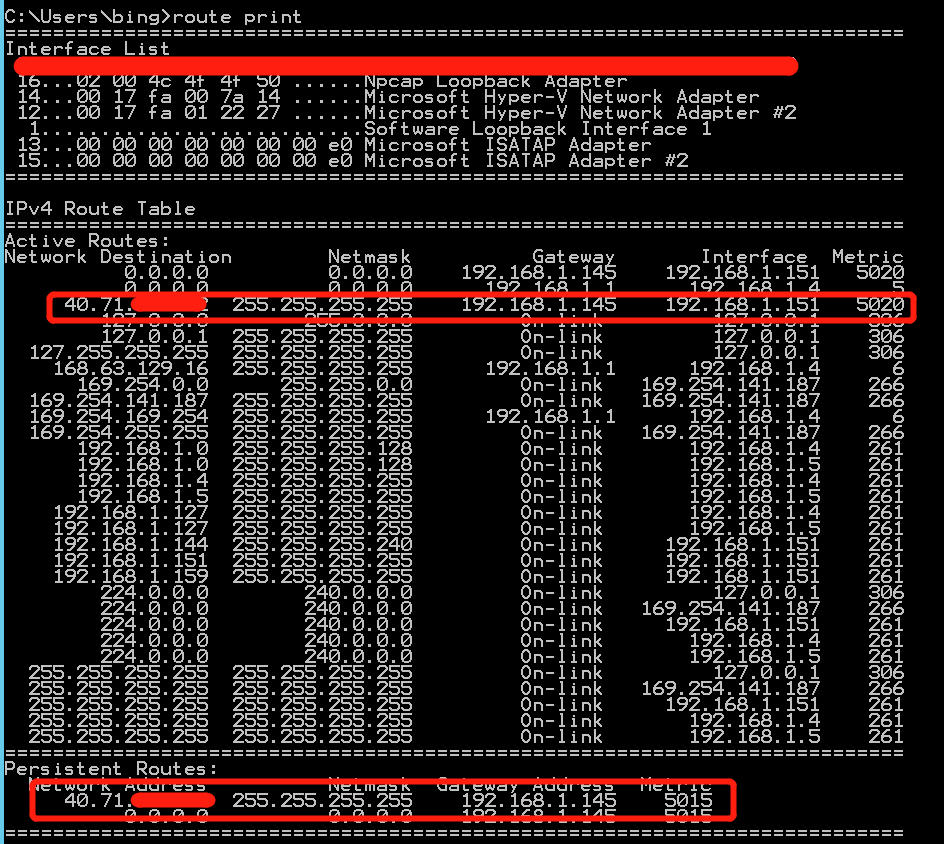
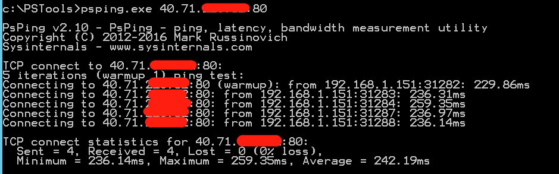
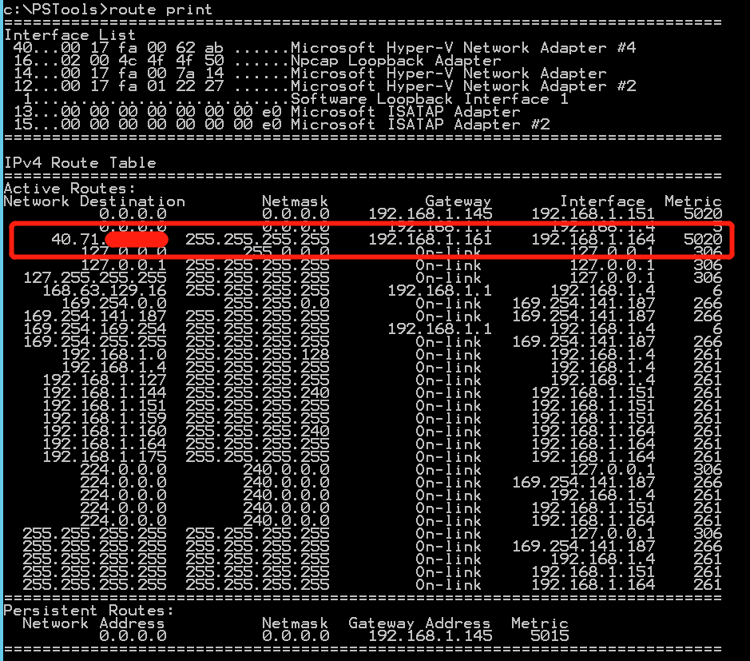
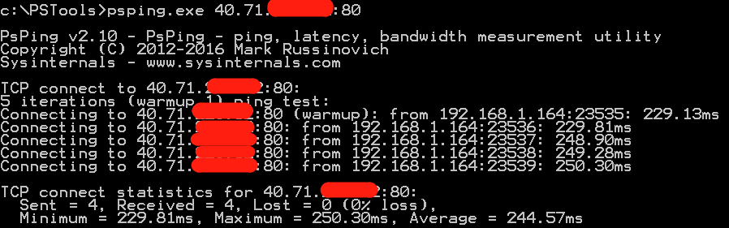

# 多网卡虚拟机外出 Internet 流量出口公网 IP 对应关系

## 应用场景

Azure 平台虚拟机向本地数据中心发业务流量，由于本地数据中心会在入口处部署防火墙，防火墙通常会有 *deny all* 规则作为默认最后一条规则，以白名单形式放行已知业务 IP 或端口流量，因此本地数据中心防火墙需要提供 Azure 虚拟机的流量出口 IP 作为策略匹配源 IP，针对此 IP 和相应端口在防火墙做安全准入策略。

本文介绍在不同场景下，Azure 平台虚拟机的外出 Internet 流量出口 IP 的配置以及对应关系。

## 场景 1：虚拟机单网卡，为此网卡配置了公网 IP

此时虚拟机外出流量源 IP 应为其网卡的公网 IP。

## 场景 2：虚拟机单网卡，没有为此网卡配置公网 IP，但是配置了有面向 Internet 的负载均衡，此负载均衡具有前端公网 IP，此时该虚拟机作为此负载均衡的后端池

此时虚拟机外出流量源 IP 应为此负载均衡的前端公网 IP。

## 场景 3：虚拟机双网卡，其中网卡 1 具有单独的公网静态 IP，网卡 2 在面向 Internet 的负载均衡后作为后端池

此时，默认外出流量会走网卡 1，虚拟机外出流量源 IP 应为此网卡的公网 IP；如果在虚拟机内部 OS 配置路由，具体可以参考：[为多个 NIC 配置来宾 OS](https://docs.azure.cn/virtual-machines/windows/multiple-nics#configure-guest-os-for-multiple-nics)。到某一个目的地地址下一跳地址为网卡 2 所在子网的网关地址，如此，虚拟机外出流量源 IP 应为此负载均衡的前端公网 IP。

具体测试过程如下：

1. 正常双网卡，外出流量会通过网卡 1 出去 Internet，源 IP 为此网卡的公网 IP。

2. 通过手动配置静态路由，指向网卡 2 所在子网的网关地址，**外出流量的源 IP 为负载均衡的前端 IP**：

    虚拟机内部添加静态路由：

    ```shell
    route add -p destination IP MASK 255.255.255.0 subnet gateway IP METRIC 5015 IF 7
    ```

    *subnet gateway IP* 是此子网网段的首个 IP。

    步骤：

    1. 路由添加成功后：

        

    2. 使用 psping 做到此路由指向的目的 IP 的 TCP80 端口测试：

        

    3. 在对端也就是此路由所指向的目的 IP 的虚拟机做抓包，看到来源 IP 确实是网卡 2 的对应负载均衡的前端公网 IP：

        ```shell
        [bing@CentOS7- ~]$ sudo tcpdump -vv host 139.219.xxx.xxx
        [sudo] password for bing:
        tcpdump: listening on eth0, link-type EN10MB (Ethernet), capture size 262144 bytes

        19:42:18.356911 IP (tos 0x2,ECT(0), ttl 104, id 20945, offset 0, flags [DF], proto TCP (6), length 52)
        139.219.xxx.xxx.midnight-tech > CentOS7-Web1.http: Flags [SEW], cksum 0x459d (correct), seq 2715255551, win 8192, options [mss 1440,nop,wscale 8,nop,nop,sackOK], length 0
        19:42:18.356985 IP (tos 0x0, ttl 64, id 0, offset 0, flags [DF], proto TCP (6), length 52)
        CentOS7-Web1.http > 139.219.xxx.xxx.midnight-tech: Flags [S.], cksum 0xd806 (incorrect -> 0x2e10), seq 4054242417, ack 2715255552, win 29200, options [mss 1460,nop,nop,sackOK,nop,wscale 7], length 0
        ```

## 场景 4：虚拟机三网卡，其中网卡 1 具有单独的公网静态 IP，网卡 2 在面向 Internet 的负载均衡的后端池中，网卡 3 仅具有虚拟网络内 IP，无公网 IP，也不在任何负载均衡后端池中

此时，前两张网卡如果配置如场景 3 中的路由，结果还是与场景 3 的结果一致。

但如果改变静态路由，使得其到达目标地址经过的下一跳为网卡 3 所在子网的网关地址，结果如何？

步骤：

1. 为此虚拟机添加第三个子网的网卡，此网卡获取了第三个子网内 IP。

2. 在此虚拟机系统内，添加静态路由，将到达目的地的下一跳指向网卡 3 所在子网的网关，并从网卡 3 到达指定目的地：

    

3. 添加路由成功后：

    

4. 做 psping 测试：

    

5. 在目的端做抓包，可以发现来源 IP 在短时间内并不是此虚拟机网卡 1 的公网静态 IP，也并非网卡 2 所在的负载均衡的前端公网 IP，而是平台随机分配的公网 IP：

    ```shell
    [bing@CentOS7-Web1 ~]$ sudo tcpdump port 80 | egrep -v "(168.63.129.16|169.254.169.254)"
    tcpdump: verbose output suppressed, use -v or -vv for full protocol decode
    listening on eth0, link-type EN10MB (Ethernet), capture size 262144 bytes
    17:43:05.197945 IP 42.159.xx.xxx.midnight-tech > centos75.http: Flags [.], ack 1, win 517, length 0
    17:43:05.199047 IP 42.159.xx.xxx.midnight-tech > centos75.http: Flags [F.], seq 1, ack 1, win 517, length 0
    17:43:05.199247 IP centos75.http > 42.159.xx.xxx.midnight-tech: Flags [F.], seq 1, ack 2, win 229, length 0
    17:43:05.201274 IP 42.159.xx.xxx.midnight-tech > centos75.http: Flags [.], ack 2, win 517, length 0
    ```

    再过一段时间，再次测试会发现，来源 IP 变回为网卡 2 所在的负载均衡的前端公网 IP：

    ```shell
    17:47:33.819182 IP 139.219.xxx.xx.1024 > centos75.http: Flags [SEW], seq 2890230846, win 8192, options [mss 1440,nop,wscale 8,nop,nop,sackOK], length 0
    17:47:33.819238 IP centos75.http > 139.219.xxx.xx.1024: Flags [S.], seq 1720120272, ack 2890230847, win 29200, options [mss 1460,nop,nop,sackOK,nop,wscale 7], length 0
    17:47:33.821885 IP 139.219.xxx.xx.1024 > centos75.http: Flags [.], ack 1, win 517, length 0
    ```

    通过持续在目的端抓包观察，最终会以网卡 2 所在的负载均衡前端公网 IP 作为源 IP 来访问目的端。