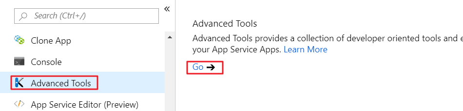
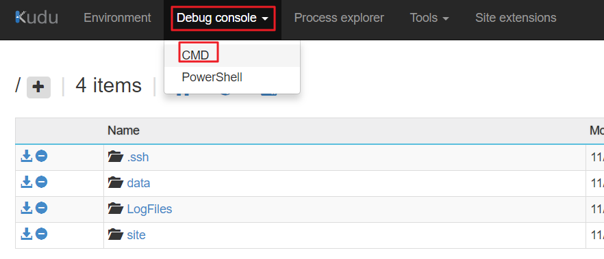
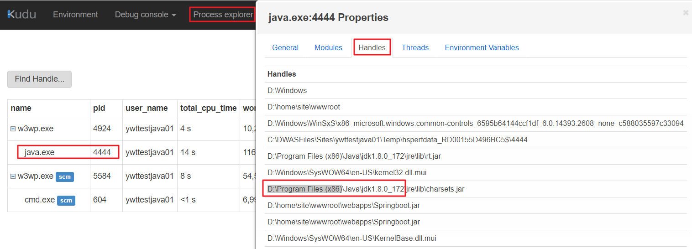
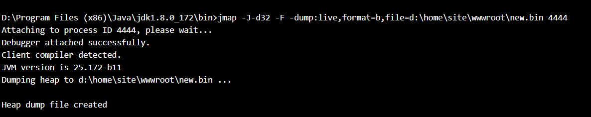

# 在 Azure Web 应用当中如何抓取 JAVA 线程 Dump

当 JAVA 网站部署到 Azure Web 应用出现了 CPU 比较高，请求超时等问题。需要查询具体原因的时候，此时 Thread dumps 能帮助判断 CPU 峰值、死锁、内存异常、应用反应迟钝、响应时间变长和其他系统问题。关于在 Azure Web 应用当中如何抓取 dump 步骤如下：

1. 更改 *web.config*，使用指定的 JVM：

    由于我们默认的 JVM 使用的是 zulu，zulu 没有集成 dump 分析工具，其他 JDK 的工具在和 zulu 联合使用上也有错误，因此请更改 web.config 如下：

    *processPath* 是 JVM 的路径，只要服务器不是 zulu 就可以。本文指向了这个路径 D:\ Program Files(x86)\\Java\jdk1.8.0_172\bin\。

    ```xml
      <httpPlatform processPath="D:\ Program Files(x86)\\Java\jdk1.8.0_172\bin\java.exe"
         arguments="-Djava.net.preferIPv4Stack=true -Dfile.encoding=UTF-8 -Dserver.port=%HTTP_PLATFORM_PORT% -jar &quot;%HOME%\site\wwwroot\XXX.jar&quot;"
         startupTimeLimit="300"
         startupRetryCount="10"
         requestTimeout="00:05:00"
         >
     </httpPlatform>
    ```

2. 重启网站，进入到高级工具，然后选择 Debug Console -> CMD, 并且进入到目录 D:\Program Files(x86)\\Java\jdk1.8.0_172\bin。

    为了进一步确认 JAVA JDK 路径，您可以在 Process explorer 的 JAVA 进程点击 Properties -> Handles 查看信息。

    进入到高级工具，然后选择 Debug Console->CMD：

    

    

    查看 JAVA 信息：

    

3. 进入 JAVA bin 目录，在该目录运行：

    ```bash
    jmap -J-d64 -dump:live,format=b,file=d:\home\site\wwwroot\new.bin Java 进程号
    ```

    Java 进程 ID 可以在高级工具的 Process Explorer 里可以找到，*-d64* 为您的 jvm 位数。

    如果该命令运行出现错误：Premature EOF，请加一个参数 *-F*。

    

    或者也可以使用 jstack 来抓取，直接运行如下的命令，F 后面是 JAVA 进程号：

    ```bash
    "D:\Program Files (x86)\Java\jdk1.8.0_172\bin"\jstack -F 4444 >D:/home/site/threaddump1.txt
    ```

    

4. 生成 dump 文件之后，下载该文件到本地，启动 jvisualvm.exe，并且打开该 dump 文件进行分析。
