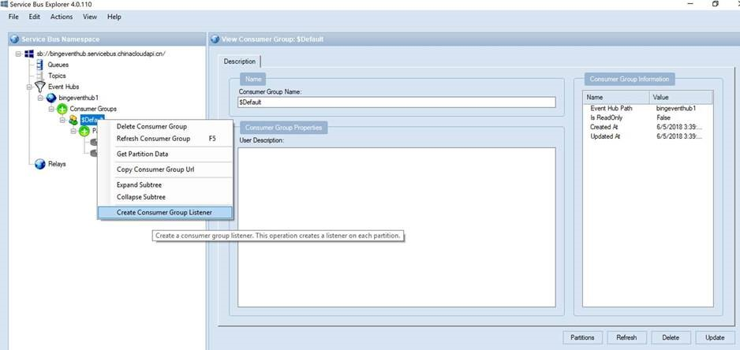

# 如何通过 Eventhub 方式获取应用程序网关的诊断日志

## 应用场景

用户在使用应用程序网关时往往需要访问日志，防火墙过滤日志，以及性能日志，作为进本指标判断，无论是生产环境监控还是测试环境的压力测试，都需要诊断日志作为分析基础。获取诊断日志的方式有很多。本文着重介绍如何提供 Eventhub 方式获取诊断日志，此种方式实时性更好，因为 Eventhub 可以实时获取诊断日志，但是会产生相应 Eventhub 的相关费用，详情需要参考 [Eventhub 的收费标准](https://www.azure.cn/en-us/pricing/details/event-hubs/)。

我们可以使用客户端工具：Service bus explorer 来获取。

## 安装 Service bus explorer

1. 通过 chocolatey 安装 Service bus explorer：

    1. 通过 CMD 安装 chocolatey，以管理员模式运行 CMD，参考 [Install with cmd.exe](https://chocolatey.org/docs/installation#install-with-cmdexe)：

        ```bash
        "%SystemRoot%\System32\WindowsPowerShell\v1.0\powershell.exe" -NoProfile -InputFormat None -ExecutionPolicy Bypass -Command "iex ((New-Object System.Net.WebClient).DownloadString('https://chocolatey.org/install.ps1'))" && SET "PATH=%PATH%;%ALLUSERSPROFILE%\chocolatey\bin"
        ```

    2. 通过 chocolatey 安装 Service bus explorer，参考 [ServiceBusExplorer 4.1.113](https://chocolatey.org/packages/ServiceBusExplorer)：

        ```bash
        choco install servicebusexplorer
        choco upgrade servicebusexplorer
        ```

    直接在 CMD 中运行 Service bus explorer。

2. 通过 C# package 下载 Service bus explorer，代码参考 [Service Bus Explorer](https://code.msdn.microsoft.com/windowsapps/Service-Bus-Explorer-f2abca5a)：

    解压压缩包，通过 Visual Studio 打开 *ServiceBusExplorer.sln*，运行 *Program.cs*。

    

## 配置

1. 在此订阅下建立 Eventhub namespace，此 namespace 内部至少建立一个 Eventhub 实体。

2. 在应用程序网关下开启诊断日志，配置其推送到 Eventhub：

    

3. 可以使用 Service bus explorer，通过 Eventhub 的 SAS connection string 在 Service bus explorer 中连接到此目标 Eventhub，再在其中的 Consumer Group 中右击创建 Listener：

    

    在此 Listener 中就可以看到日志内容了：

    

    诊断日志：

    

也可以使用 SDK 方式从 Eventhub 中获取 message，例如通过 [Python](https://docs.azure.cn/zh-cn/event-hubs/event-hubs-python-get-started-receive#install-python-package)。

微软提供了多种 SDK 方式，具体可参考[事件中心示例](https://docs.azure.cn/zh-cn/event-hubs/event-hubs-samples)。