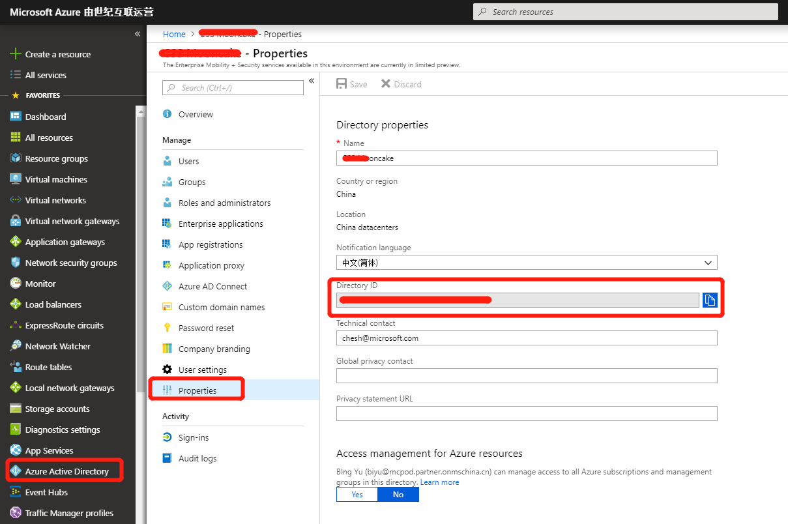
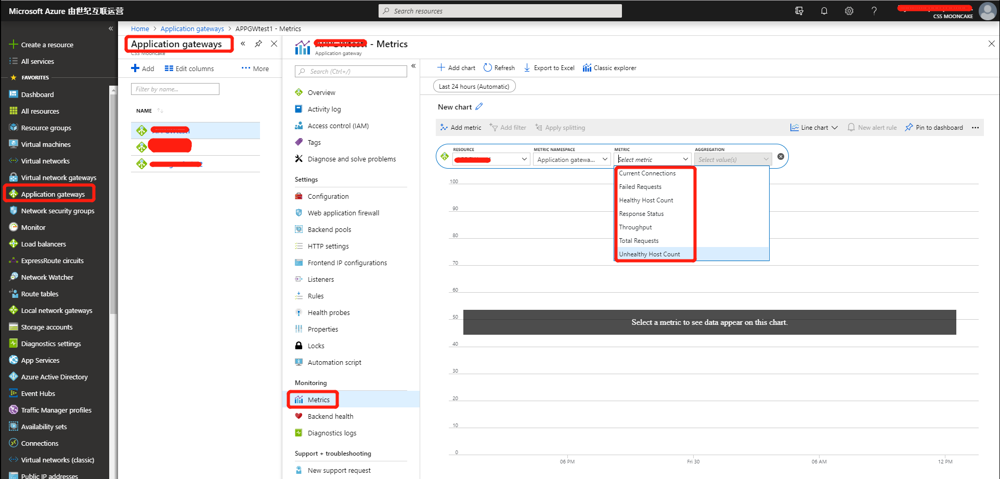

# 如何通过 Metric API 方式获取应用程序网关的监控数据

本文档仅为测试目的提供参考文档以及设计脚本范例，如您在生产环境中部署，请勿直接使用。

## 获取 Token

## 方法一：通过 Service Principle 即 SPN

[Using the Azure ARM REST API – Get Access Token](https://blogs.technet.microsoft.com/stefan_stranger/2016/10/21/using-the-azure-arm-rest-apin-get-access-token/) 有很详细的步骤，其中基本是分步执行的，即分解脚本逐步执行。

其中：

1. 配置中国区 Azure 订阅：

    将：

    ```powershell
    Add-AzureRmAccount
    ```

    改为:

    ```powershell
    Add-AzureRmAccount -Environment AzureChinaCloud
    ```

    以登录中国区 Azure。

2. 找到 TenantID：

    ```powershell
    Set-AzureRmContext -SubscriptionId $subscription.subscriptionId -TenantId $subscription.TenantID
    ```

    这一步中的 *TenantID* 可以在 Azure 门户中，进入服务 Azure Active Directory，在 Properties 中的 Directory ID 中找到：

    

3. 请将其中提到的 Assign the Contributor role to the service principal 给位 Reader Role：

    ```powershell
    New-AzureRmRoleAssignment -RoleDefinitionName Contributor -ServicePrincipalName $app.ApplicationId.Guid
    ```

    将 *Contributor* 替换为 *Reader*。

另外，注意请将如下两个 URL 略作改动：

1. 如果您使用第三方类 Curl 工具，请将：

    ```bash
    curl --request POST "https://login.windows.net/<tennantid>/oauth2/token" --data-urlencode "resource=https://management.core.windows.net" --data-urlencode "client_id=<clientid>" --data-urlencode "grant_type=client_credentials" --data-urlencode "client_secret=[clientsecret]"
    ```

    * login URL 改为：<https://login.chinacloudapi.cn/tennantid/oauth2/token>。

    * data-urlencode 中的 URL 改为 <https://management.chinacloudapi.cn/>。

2. 如果您使用 PowerShell，请将：

    ```powershell
    $ClientID       = "<clientid>"   #应用程序 ID
    $ClientSecret   = "<ClientSecret>"  #应用程序密钥
    $tennantid      = "<TennantID>"


    $TokenEndpoint = {https://login.windows.net/{0}/oauth2/token} -f $tennantid
    $ARMResource = "https://management.core.windows.net/";

    $Body = @{
            'resource'= $ARMResource
            'client_id' = $ClientID
            'grant_type' = 'client_credentials'
            'client_secret' = $ClientSecret
    }

    $params = @{
        ContentType = 'application/x-www-form-urlencoded'
        Headers = @{'accept'='application/json'}
        Body = $Body
        Method = 'Post'
        URI = $TokenEndpoint
    }

    $token = Invoke-RestMethod @params

    $token | select access_token, @{L='Expires';E={[timezone]::CurrentTimeZone.ToLocalTime(([datetime]'1/1/1970').AddSeconds($_.expires_on))}} | fl *
    ```

    * `$TokenEndpoint = {https://login.windows.net/{0}/oauth2/token} -f $tennantid` 中的 URL 改为 <https://login.chinacloudapi.cn/{0}/oauth2/token>，结尾的 *-f $tenantid* 不变。

    * `$ARMResource = "https://management.core.windows.net/"` 中的 URL 改为 <https://management.chinacloudapi.cn/>。

## 方法二：Azure Active Directory 用户名密码方式

通过如下函数：

```shell
# get-token 函数会获取应用的安全口令
function get-token {
    $username = "<xxxx@mcpod.partner.onmschina.cn>";     ## 订阅账号
    $password = "<xxxxx>";                               ## 订阅密码
    $client_id = "<clientid>"
    $resource = "https://management.chinacloudapi.cn/"
    $creds = @{
        grant_type = "password"
        username = $username
        password = $password
        client_id = $client_id
        resource = $resource
  
    };
  
    $headers = $null
  
    try
    {
        $response = Invoke-RestMethod "https://login.chinacloudapi.cn/common/oauth2/token" -Method Post -Body $creds -Headers $headers;
        $token = $response.access_token;
        return $token;
    }
    catch
    {
        $result = $_.Exception.Response.GetResponseStream();
        $reader = New-Object System.IO.StreamReader($result);
        $reader.BaseStream.Position = 0;
        $reader.DiscardBufferedData();
        $responseBody = $reader.ReadToEnd() | ConvertFrom-Json
        Write-Host "ERROR: $($responseBody.error)"
        return;
    }
}
  
$bearer = get-token

$header = @{
        Authorization = "Bearer " + $bearer
        }
```

# 通过 Token 从 Metric API 中获取需要的监控数值

## 解决方案

1. 通过 PowerShell，或者登陆 Azure 门户查看应用程序网关的属性，获取虚拟机的 Resource URL，并替换如下命令中的 Resource URL：

    ```powershell
    $uri = "https://management.chinacloudapi.cn/<resource uri>/providers/microsoft.insights/metrics?api-version=2018-01-01&metricnames=TotalRequests"
    ```

2. 调用 Rest API，获取虚拟机的历史状态数据：

    ```powershell
    $result = Invoke-RestMethod -Method GET -Uri $uri -Headers $header -Body $null
    ```

3. 打印虚拟机的历史状态数据

    ```powershell
    $result.value
    ```

## 示例

以我的测试环境资源 ID 为例：

```powershell
$uri = "https://management.chinacloudapi.cn/subscriptions/test-fbfe-4f11-9af2-b81f0ee26453/resourceGroups/testresourcegroup-E/providers/Microsoft.Network/applicationGateways/TESTAPPGW/providers/microsoft.insights/metrics?api-version=2018-01-01&metricnames=TotalRequests"
```

末端的 *TotalRequests* 可以替换为其他 METRIC：



```powershell
$result = Invoke-RestMethod -Method GET -Uri $uri -Headers $header -Body $null  
$result.value
```