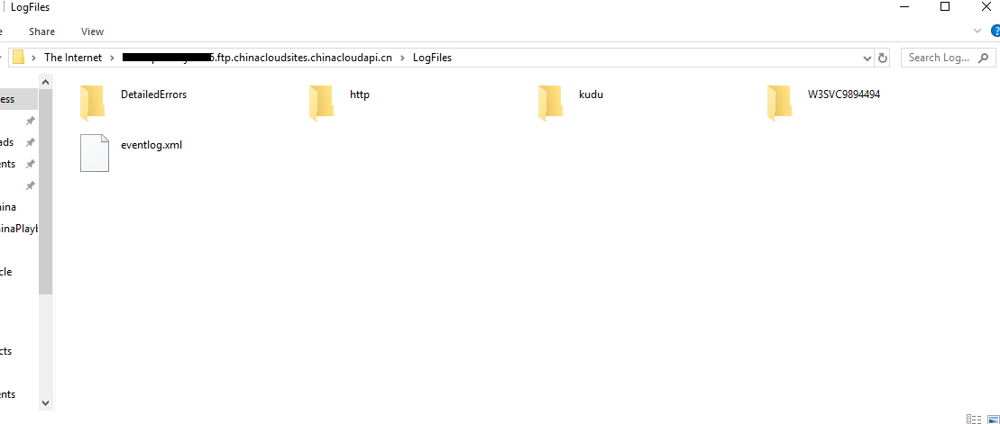

# 如何收集 Web 应用的诊断日志

## 问题描述

当 Azure Web 应用遇到异常时，用户需要通过查看诊断日志分析异常原因。本文介绍开启诊断日志以及通过 FTP 与 Kudu 这两个应用较为广泛的工具进行收集 Web 应用诊断日志的步骤。

## 解决方案

### 开启诊断日志

在 Azure 门户中进入目标 Web 应用，点击左选项卡的**诊断日志**，根据需要选择开启诊断日志：

### 通过 FTP 收集诊断日志

1. 确认 FTP 的部署凭据：

    进入目标应用，点击左选项卡的**部署中心**，点击 **FTP**：

    

    在 FTP 仪表盘中点击**用户凭据**，设置密码，完成 FTP 部署：

    

2. 进入 Azure Web 应用的仪表盘，查看 *FTP 部署用户名*以及 *FTP 主机名*：

    

3. 通过任意 FTP 客户端连接 Azure Web 应用，此处以 Windows 本地 FTP 工具为例：

    打开我的电脑，在地址栏中输入上文步骤中得到的 *FTP 主机名*，在弹出的窗口中输入 *FTP 部署用户名*以及在 FTP 部署中设置的密码，连接到 Azure Web 应用，即可出现的文件界面中进入 *LogFiles* 文件夹管理相应的诊断日志：

    

### 通过 Kudu 收集诊断日志

1. 进入目标应用，点击左选项卡的**高级工具**，点击**转到**，进入应用的 Kudu 页面。

2. 点击上方 **Debug Console** 选项，选择 **CMD** 或 **PowerShell**，即可在 *LogFiles* 文件夹中管理相应的诊断日志：

    
