# 在 IoT Edge 设备使用自定义视觉服务进行图像分类

目前中国区 Azure 暂时还无法创建自定义视觉服务，不过在 Global Azure 是可以的，可以在 Global Azure 创建自定义视觉服务，然后通过训练导出自定义视觉服务项目来安装到 IoT Edge 设备中，以下对该操作过程注意事项进行描述。

## 解决方案

1. 创建 Azure 容器注册表，需要启用管理员用户，启用管理员用户可以使用注册表名称作为用户名，并将管理员用户访问密钥作为密码，以 docker 方式登录容器注册表：

    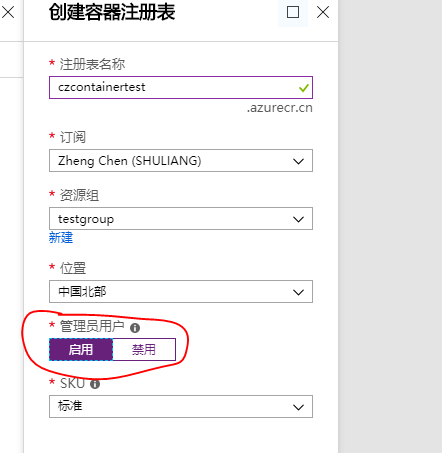

2. 创建 IotHub 和 IoT Edge 设备，并且按照以下文档在 linux 上安装 IoT Edge 运行时 。参考：[在 Linux 上安装 Azure IoT Edge 运行时 (x64)](https://docs.azure.cn/zh-cn/iot-edge/how-to-install-iot-edge-linux)。

3. 按照以下文档使用自定义视觉生成图像分类器，完成自定义视觉项目的创建和训练，将在下一部分使用导出的文件。参考：[使用自定义视觉生成图像分类器](https://docs.microsoft.com/zh-cn/azure/iot-edge/tutorial-deploy-custom-vision#create-a-new-project)。

4. 使用 Visual Studio Code 创建 iotedge 解决方案，在 【View】-> 【Command Palette】 选择 Azure IoT Edge:New IoT Edge Solution ，创建一个 python 模块，并且使用 Azure 容器注册表：

    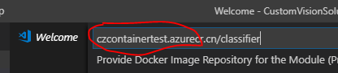

5. 添加图像分类器。在资源管理器找到之前导出的分类器项目，复制所有内容，其中有两个文件夹（app 和 azureml）和两个文件（Dockerfile 和 README），把它们粘贴到 *CustomVisionSolution/modules/classifier* 文件夹下。打开 classifier 文件夹中的 module.json 文件，更新 platforms 参数，使之指向已添加的新 Dockerfile，同时删除自定义视觉模块目前不支持的 ARM32 体系结构和 AMD64.debug 选项：

   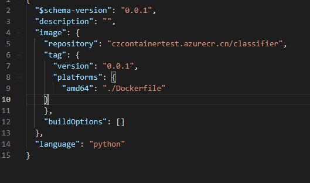 

6. 在该解决方案下创建 cameraCapture 模块，在 Visual Studio Code 中 【View】-> 【Command Palette】 选择 Azure IoT Edge:Add IoT Edge Module，选择该解决方案下的 deployment.template.json 文件，创建一个 cameraCapture 的 python 模块，并且使用 Azure 容器注册表。

7. 把 *modules/cameraCapture* 文件夹中的 main.py 文件替换为文档中的代码，该代码会把 POST 请求发送到在 classifier 模块中运行的图像处理服务，并把响应发送到 IotHub。替换代码参考：[添加并配置新模块](https://docs.microsoft.com/zh-cn/azure/iot-edge/tutorial-deploy-custom-vision#add-and-configure-a-new-module)。

8. 打开 requrements.txt 为将要包括在容器中的库添加新的一行：

    requests

9. 向 cameraCapture 模块添加测试图片。找到之前下载的图像 *Cognitive-CustomVision-Windows/Samples/Images/Test* 中的测试图像，复制 test_image.jpg，粘贴到 *modules/cameraCapture* 文件夹中，在 Visual Studio Code 中打开适用于 cameraCapture 模块的 Dockerfile.amd64 文件，在建立工作目录 *WORKDIR/app* 的行后面，添加以下代码行：ADD ./test_image.jpg .

    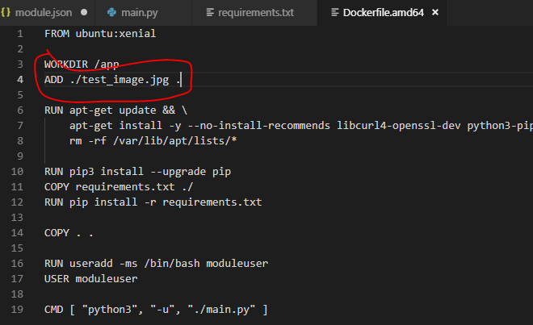

10. 准备部署清单。在解决方案文件夹中打开 deployment.template.json 文件，到 modules 节。删除 tempSensor 模块及其所有参数。

    使用以下 JSON 更新 cameraCapture 模块的 createOptions 参数：

    ```json
    "createOptions": "{\"Env\":[\"IMAGE_PATH=test_image.jpg\",\"IMAGE_PROCESSING_ENDPOINT=http://classifier/image\"]}"
    ```

    在文件底部，更新 $edgeHub 模块的 routes 参数：

    ```json
    "routes": {
      "CameraCaptureToIoTHub": "FROM /messages/modules/cameraCapture/outputs/* INTO $upstream"
    },
    ```

    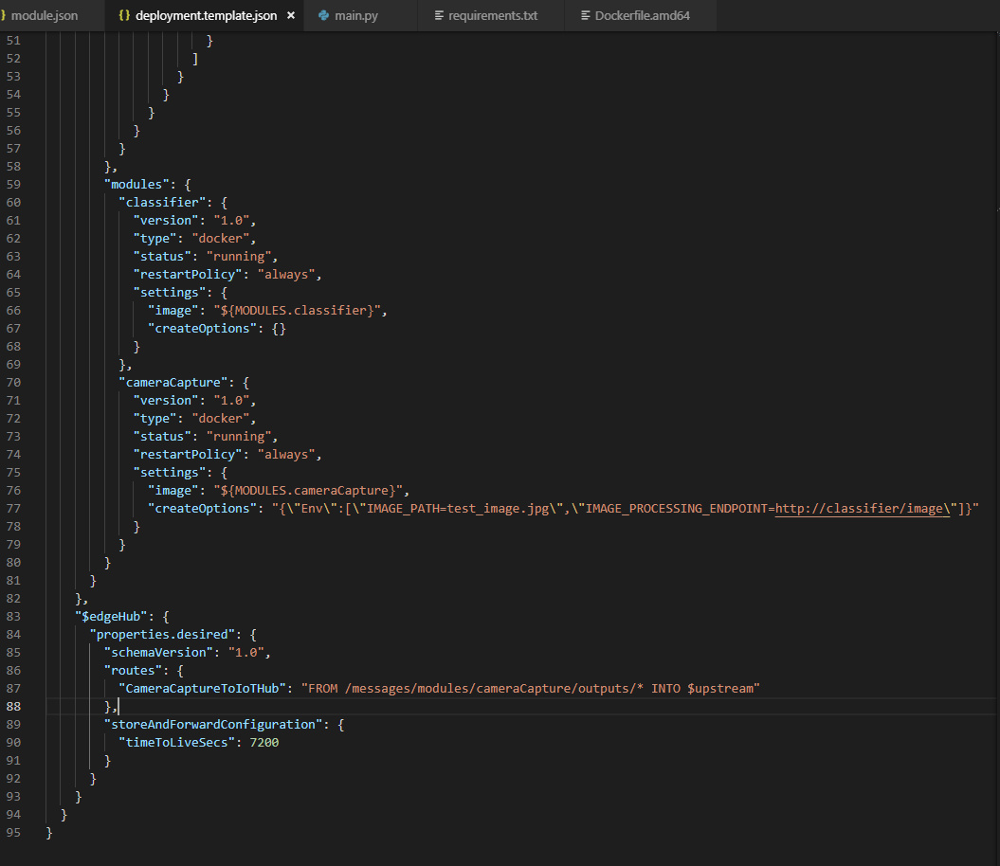

11. 添加注册表凭据。在 Visual Studio Code 中选择 【View】 -> 【Terminal】。输入 Azure 容器注册表的地址、用户名、密码：

    ```shell
    docker login -u <ACR username> -p <ACR password> <ACR login server>
    ```

12. 在解决方案文件夹中打开 .env 文件，输入 Azure 容器注册表的用户名、密码。

13. 生成容器映像并推送到 Azure 容器注册表。在 VS Code 资源管理器中右键单击 **deployment.template.json** 文件，然后选择**生成并推送 IoT Edge 解决方案**，会为解决方案添加 config 文件夹，并生成 deployment.amd64.json，用于后续部署到 IoT Edge 设备。并且会自动执行如下命令：

    ```shell
    docker build  --rm -f "e:\Work\IotEdgeCustomVision\IotedgeVisionCustomerSolution\CustomVisionSolution\modules\classifier\Dockerfile" -t czcontainertest.azurecr.cn/classifier:0.0.1-amd64 "e:\Work\IotEdgeCustomVision\IotedgeVisionCustomerSolution\CustomVisionSolution\modules\classifier"
    docker push czcontainertest.azurecr.cn/classifier:0.0.1-amd64
    docker build  --rm -f "e:\Work\IotEdgeCustomVision\IotedgeVisionCustomerSolution\CustomVisionSolution\modules\cameraCapture\Dockerfile.amd64" -t czcontainertest.azurecr.cn/cameracapture:0.0.1-amd64 "e:\Work\IotEdgeCustomVision\IotedgeVisionCustomerSolution\CustomVisionSolution\modules\cameraCapture"
    docker push czcontainertest.azurecr.cn/cameracapture:0.0.1-amd64
    ```

    如果图像比较大可能会 *timeout* 没有推送成功，可以单独再执行 push 推送，会接着上次继续推送，如果上次某个块推送成功的，则不推送，如果某个块推送失败的则重新推送。

    可以通过 `docker image list` 查看本地是否生成了相关镜像：

    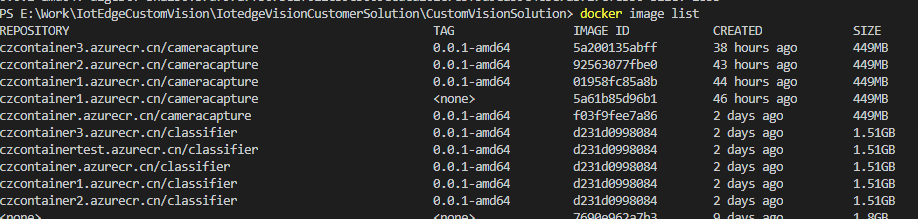

14. 推送成功后可以在 Azure 容器注册表里查看到：

    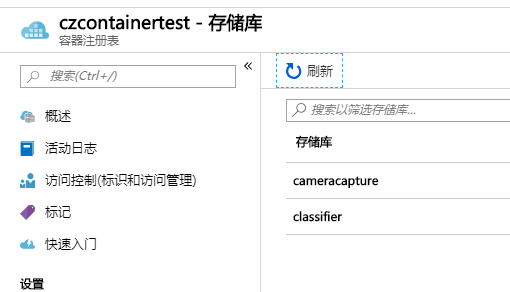

15. 使用 Visual Studio Code 连接 IotHub。在 Visual Studio Code 中选择 【View】 -> 【Command Palette】 输入 Azure IoT Hub: Select IoT Hub，然后选择订阅下的 IotHub。

16. 选择设备并部署解决方案。右键单击要将其作为部署目标的设备，然后选择**为单个设备创建部署**，在文件资源管理器中导航到该解决方案中的 config 文件夹，然后选择 deployment.amd64.json，单击**选择 Edge 部署清单**。部署成功后可能需要一些时间模块才全部运行起来，可以在 IoT Edge 设备上执行 `sudo iotedge list` 查看：

    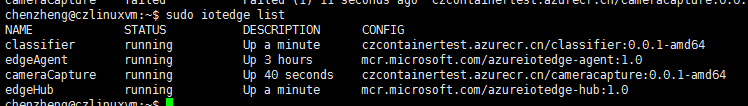

17. 可以通过两种方式来查看模块的结果，一种是生成和发送消息时在设备本身上查看，另一种是在消息到达 IoT 中心时通过 Visual Studio Code 查看：

    1. 通过设备查看 cameraCapture 模块的日志，了解发送消息以后系统确认 IoT 中心接收到消息这一过程：

        ```shell
        iotedge logs cameraCapture
        ```

        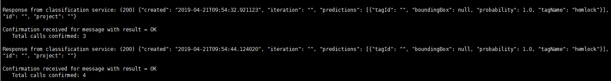

    2. 在 Visual Studio Code 中右键单击 IoT Edge 设备的名称，选择**开始监视 D2C 消息**。

        自定义视觉模块中的结果是从 cameraCapture 模块作为消息发送的，其中包括图像为铁杉树或樱花树的概率。由于图像为铁杉，因此会看到概率为 1.0：

        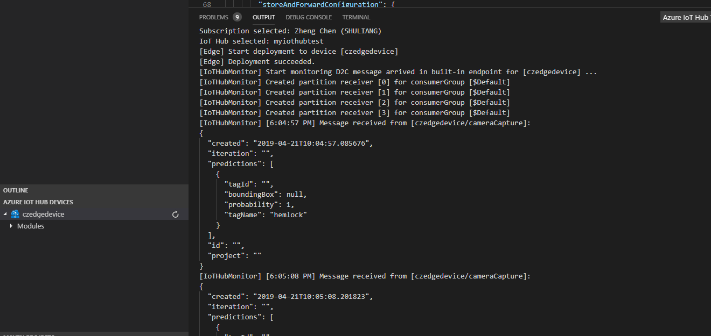

        Deployment.template.json 文件参考如下：

        ```json
        {
          "$schema-template": "1.0.0",
          "modulesContent": {
           "$edgeAgent": {
             "properties.desired": {
               "schemaVersion": "1.0",
               "runtime": {
                "type": "docker",
                "settings": {
                 "minDockerVersion": "v1.25",
                 "loggingOptions": "",
                 "registryCredentials": {
                   "czcontainertest": {
                     "username": "$CONTAINER_REGISTRY_USERNAME_czcontainertest",
                     "password": "$CONTAINER_REGISTRY_PASSWORD_czcontainertest",
                     "address": "czcontainertest.azurecr.cn"
                    }
                  }
                }
             },
             "systemModules": {
              "edgeAgent": {
              "type": "docker",
              "settings": {
                "image": "mcr.microsoft.com/azureiotedge-agent:1.0",
                "createOptions": {}
               }
             },
             "edgeHub": {
              "type": "docker",
              "status": "running",
              "restartPolicy": "always",
              "settings": {
               "image": "mcr.microsoft.com/azureiotedge-hub:1.0",
               "createOptions": {
                 "HostConfig": {
                  "PortBindings": {
                    "5671/tcp": [
                      {
                        "HostPort": "5671"
                      }
                    ],
                    "8883/tcp": [
                      {
                        "HostPort": "8883"
                      }
                    ],
                    "443/tcp": [
                      {
                        "HostPort": "443"
                      }
                    ]
                  }
                }
              }
            }
          }
        },
        "modules": {
          "classifier": {
            "version": "1.0",
            "type": "docker",
            "status": "running",
            "restartPolicy": "always",
            "settings": {
              "image": "${MODULES.classifier}",
              "createOptions": {}
            }
          },
          "cameraCapture": {
            "version": "1.0",
            "type": "docker",
            "status": "running",
            "restartPolicy": "always",
            "settings": {
              "image": "${MODULES.cameraCapture}",
              "createOptions": "{\"Env\":[\"IMAGE_PATH=test_image.jpg\",\"IMAGE_PROCESSING_ENDPOINT=http://classifier/image\"]}"
             }
            }
          }
        }
        },
        "$edgeHub": {
         "properties.desired": {
          "schemaVersion": "1.0",
          "routes": {
            "CameraCaptureToIoTHub": "FROM /messages/modules/cameraCapture/outputs/* INTO $upstream"
          },
          "storeAndForwardConfiguration": {
           "timeToLiveSecs": 7200
            }
           }
          }
         }
        }
        ```
推送到容器注册表后，也可以通过门户来进行部署模块，可以参考[通过 Azure 门户部署 Azure IoT Edge 模块](https://docs.azure.cn/zh-cn/iot-edge/how-to-deploy-modules-portal)。

## 注意事项

1. 设置 Azure 容器注册表的信息：

    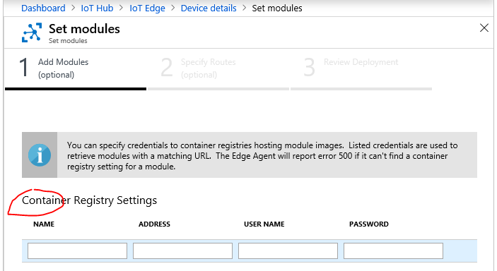

2. 添加 cameracapture 模块时需要填写环境变量 IMAGE_PATH，IMAGE_PROCESSING_ENDPOINT，值分别是 *test_image.jpg* 和 *http://classifier/image* ，在添加 Iot Edge 模块时的名称就是模块名称，由于 cameracapture 模块调用 classifier 模块，所以这个环境变量里的模块名称必须与被调用的 classifier 模块名称相同：

    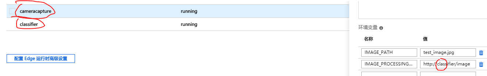

3. 路由参数修改为从 cameracapture 路由到 IoT 中心，此参数里的名称要与模块名称相同，区分大小写：

    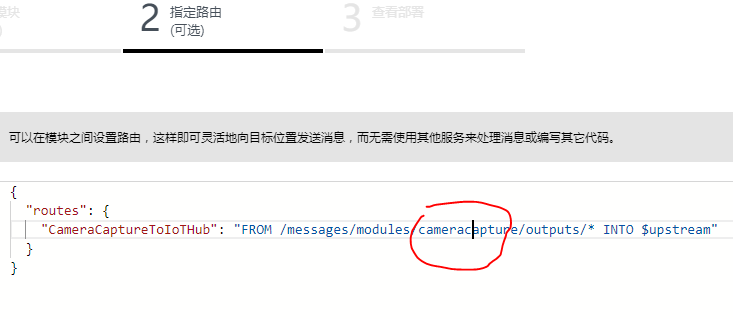
