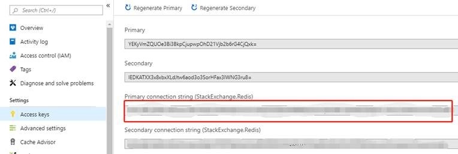
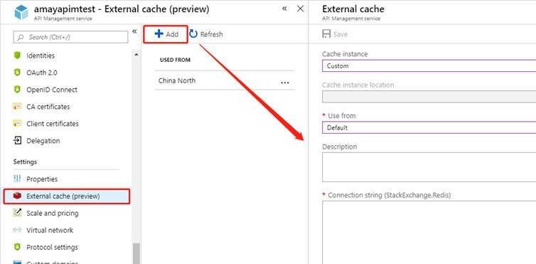
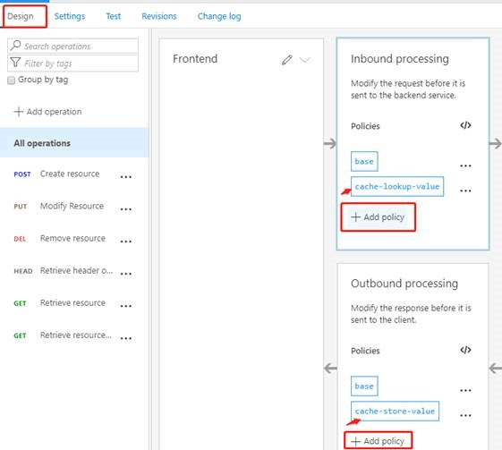
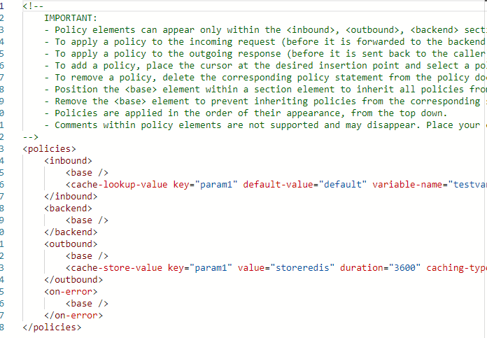
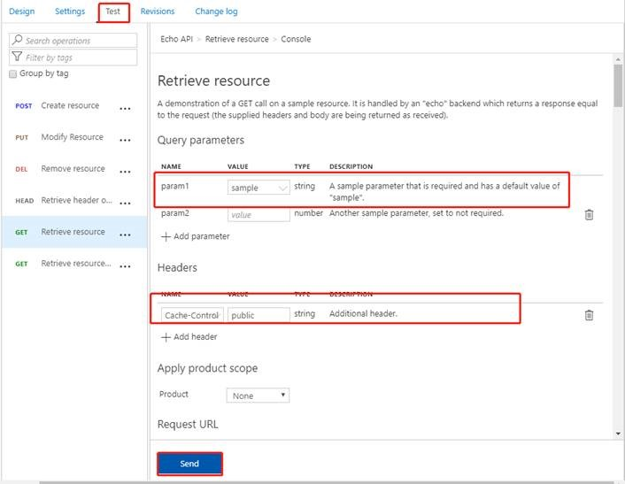
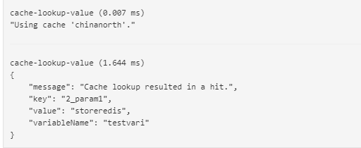
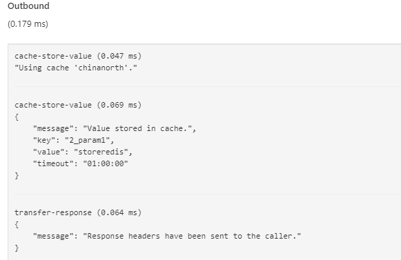
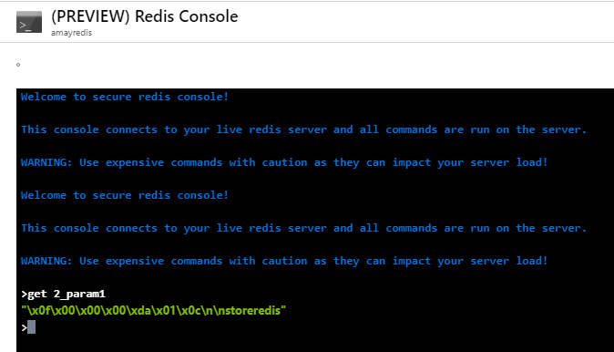

# 如何在 API 管理服务中使用 Redis 缓存服务

## 解决方案

### 配置步骤

1. 创建 Azure Redis 缓存服务，复制 Redis 缓存的链接字符串：

    

2. 在 API 管理端添加外部缓存，填入必要的属性以后点击**添加**：

    

3. 添加完毕后在 API 里去配置缓存策略，具体的缓存策略说明可以参考 [API 管理缓存策略](https://docs.azure.cn/zh-cn/api-management/api-management-caching-policies)：

    

    注意：具体配置可以点击添加的策略以后进入 XML 配制页面，如下示例是在请求到来时查询是否有名称为 param1 的值，在请求外发时将 param1 的值存储到缓存里，有效时间为 3600s：

    

### 测试步骤

1. 切换到 API 的测试页面，在发送请求时填入 param1 的值，并添加 cache-control 的 Header，值根据实际情况而定。

    这边为了测试方便值填入为 public，点击发送进行测试：

    

2. 发送完毕以后，可以查看 Response 的 Trace 页去验证 cache 是否生效。

    从 Inbound 的部分，看到执行了 cache-lookup-value：

    

    从 Outbound 部分，看到执行了 cache-store-value：

    

3. 为了更进一步验证，我们可以继续查询 Redis，从 Redis 的控制台我们也看到了存储的结果。

    如上 2 步骤在缓存时带了前缀，所以我们查询时查询的参数变为 2_param1：

    

## 参考文档

* [Use an external Azure Cache for Redis in Azure API Management](https://docs.microsoft.com/en-us/azure/api-management/api-management-howto-cache-external)

* [添加缓存以提高 Azure API 管理中的性能](https://docs.azure.cn/zh-cn/api-management/api-management-howto-cache)

* [API 管理缓存策略](https://docs.azure.cn/zh-cn/api-management/api-management-caching-policies)