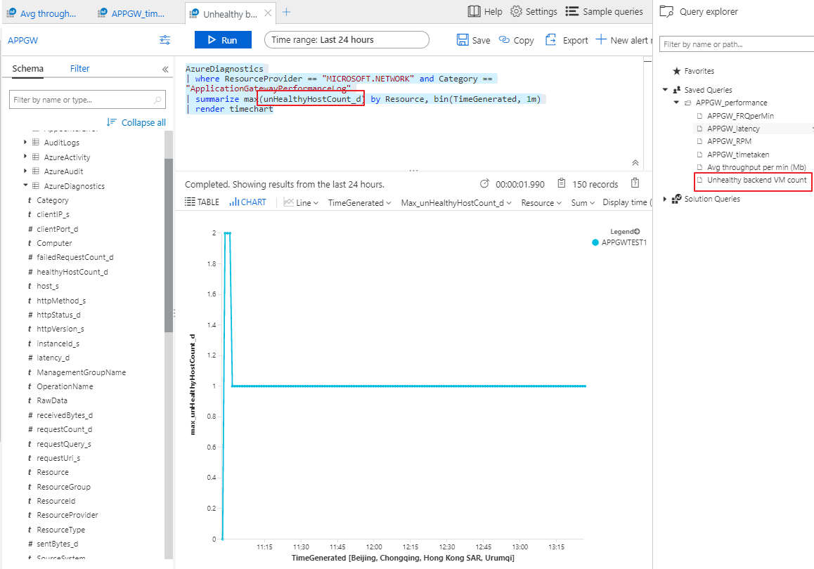
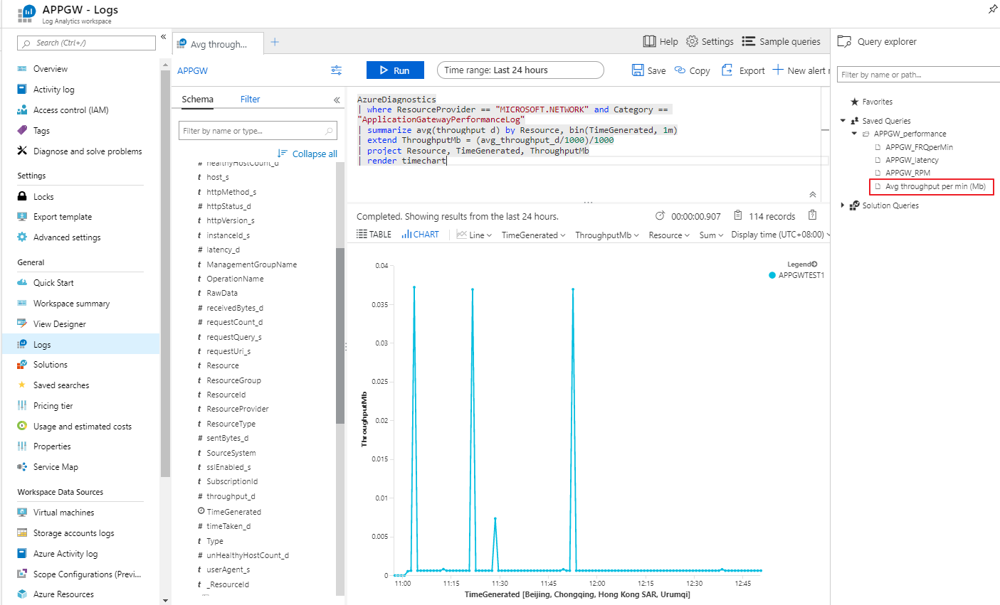
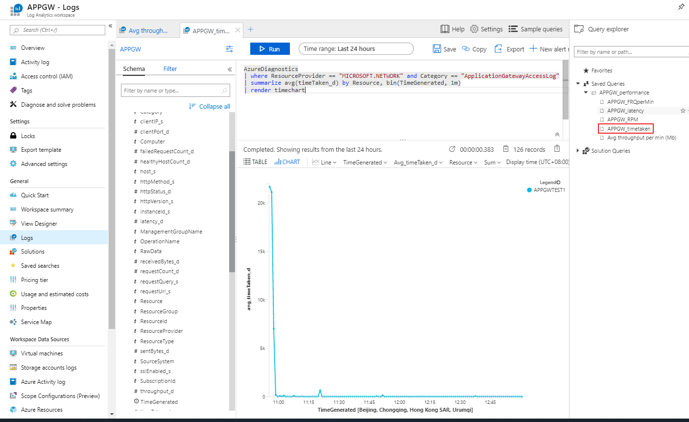
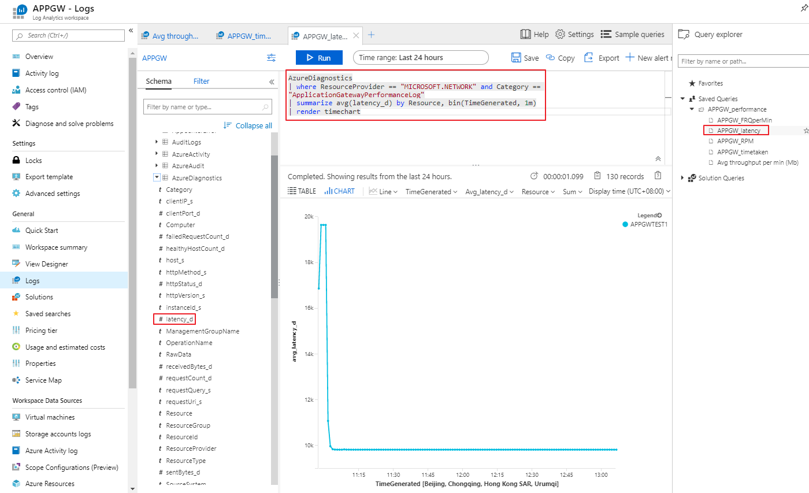

# Azure 应用程序网关常见问题场景分析

## 场景一：WAF 功能对应用程序网关性能的影响

在开启了 WAF 功能后，WAF 功能模块运行会占据很大一部分系统负载。以下针对有安全性合规需求的前提（必须开启 WAF）做进一步性能分析：

开启了 WAF 后，随之会有基于一些列 OWASP 规则的 HTTP 层的安全扫描，这些扫描会产生大量的 CPU 开销，涉及前后文规则匹配，评分计算，执行动作等等逻辑。因此，规则匹配是消耗 CPU 的主要因素。

这里需要注意两点：

* 所有有效且网络上已经到达应用程序网关的 HTTP 请求均会被 WAF 模块做安全过滤。

    无论是检测（detection）模式还是阻止（blocking）模式，只有匹配了规则的请求才会被记录到 WAF 的防火墙日志记录中。

* 没有被记录进 WAF 的防火墙日志的请求，并不代表其没有被 WAF 规则扫描，相反，它们都是经过了规则的前后逻辑扫描，没有匹配任何规则，被视为“安全合规”的请求。

因此，基于以上两点，当我们做性能评估时，规则匹配是性能消耗的重要因素，但没有 WAF 的防火墙日志记录并不代表没有规则匹配，相反，没有日志记录说明所有请求被规则过滤后，没有任何匹配，因此不会被日志进程记录，因为日志进程仅会记录有规则匹配的请求。

但我们实际往往会观察到，当在短时间内有大量 WAF 防火墙日志匹配记录时，通常会伴随有处理请求慢，性能下降等情况出现。原因经后台工程师排查确认大多是由于系统负荷高引起。

既然如上阐述中已经提到，无论日志记录匹配数多与少，规则扫描都在进行，为什么往往匹配数量大时往往会引起系统负荷高？

究其原因，系统在规则扫描时，匹配的确比没有任何匹配所需的系统负荷高，虽然即使仅开启检测（detection）模式，不需要阻断，但系统仍需要额外资源来处理匹配，例如前后文匹配，综合评分等等逻辑。此外，日志进程本身也会消耗系统负荷，尤其是在短时间内有大量匹配时，日志进程有大量日志需要记录，对于系统的 CPU 和内存都有大量消耗。

综上，当开启了 WAF 功能后，首要性能指标为 WAF 防火墙日志条目数，即可以统计在存储日志中，一段时间内日志条目数，例如每五分钟的日志条目数。但日志存储在存储账户中毕竟是异步的，通常存在五分钟左右的延迟。如果需要实时监控，及时做出是否扩容的决定，建议通过事件中心的方式统计。方法可参考：[Azure 应用程序网关诊断日志详解及合规要求](https://docs.azure.cn/zh-cn/application-gateway/aog-application-gateway-diagnostic-log-details-and-compliance-requirements)。

一旦通过如上监控方式感知到如上性能问题，可以在第一时间做应用程序网关的扩容，这里建议先做 SKU 的扩容，再做实例数的扩容，从而将性能对业务影响最大程度降低。

这里列举一些容易造成大量安全规则匹配的常见触发条件：

1. 业务逻辑中频繁被调用 API 的 URL 设计不合规，导致针对这些 API 的调用频繁触发并匹配安全规则。

2. Cookie 中出现敏感字段，同样频繁触发并匹配安全规则，例如：

    ```xml
    {
      "instanceId": "ApplicationGatewayRole_IN_0",
      "clientIp": "219.1xx.xxx.xxx",
      "clientPort": "0",
      "requestUri": "/go/pipelineHistory.json?pipelineName=sims-integration-master",
      "ruleSetType": "OWASP",
      "ruleSetVersion": "3.0",
      "ruleId": "942450",
      "message": "SQL Hex Encoding Identified",
      "action": "Detected",
      "site": "Global",
      "details": {
        "message": "Warning. Pattern match \"(?i:(?:\\\\A|[^\\\\d])0x[a-f\\\\d]{3,}[a-f\\\\d]*)+\" at REQUEST_COOKIES:JSESSIONID.",
        "data": "Matched Data: e0x00e09b7 found within REQUEST_COOKIES:JSESSIONID: node0x00e09b7gkafqim8699b2xkw44438.node0",
        "file": "rules/REQUEST-942-APPLICATION-ATTACK-SQLI.conf",
    "line": "1085"
      },
      "hostname": "api.test.com.cn"
    }
    ```

3. API 中包含一些针对后端数据库的敏感请求语句。

一旦遇到以上情况，建议与开发工程师做更细致的安全合规性技术沟通，避免业务上线后产生大规模业务影响。

## 场景二：应用程序网关性能和服务的监控

短时间内没有大量安全规则匹配，或者没有开启 WAF 的情况下，如何第一时间监控到性能下降或服务异常。

如果排除安全规则扫描引起系统负荷高的因素，那么我们就需要从性能日志以及访问日志本身着手来分析。

有关诊断日志的访问日志（access log）中的字段的定义，可以参考：[访问日志](https://docs.azure.cn/zh-cn/application-gateway/application-gateway-diagnostics#access-log)。

有关诊断日志的性能日志(performance log)中的字段定义，可以参考：[性能日志](https://docs.azure.cn/zh-cn/application-gateway/application-gateway-diagnostics#performance-log)。

这里列出几个场景所参考的参数监控：

1. requestCount (performance log)

2. failedRequestCount (performance log)

3. timeTaken (access log)

4. throughput

5. unhealthyBackendVMCount

WAF 规则匹配与平时相比正常，requestCount 异常大，此时仅前端提示失败请求数增加，要判断是否由于应用程序网关性能引起；

此场景中，建议同时参考多个参数分析：failedRequestCount 也有明显增加；timeTaken 变大，与此同时，latency_d 并无明显增加：

```xml
AzureDiagnostics
| where ResourceProvider == "MICROSOFT.NETWORK" and Category == "ApplicationGatewayAccessLog"
| summarize avg(timeTaken_d) by Resource, bin(TimeGenerated, 1m)
| render timechart
```

unHealthyHostCount 始终是 0 或与平时一致：

```xml
AzureDiagnostics
| where ResourceProvider == "MICROSOFT.NETWORK" and Category == "ApplicationGatewayPerformanceLog"
| summarize max(unHealthyHostCount_d) by Resource, bin(TimeGenerated, 1m)
| render timechart
```



此时判断应用程序网关确有异常，可以通过监控告警在第一时间感知并扩容。

## 场景三：应用程序网关 failedRequestCount 异常增大

WAF 规则匹配以及 requestCount 与平时相比正常，但是 failedRequestCount 异常大，此时，建议先检查 throughput 是否远超出平时大小，以此观察是否存在频繁的超大尺寸的上传或下载导致系统异常。Analytics 常用查询语句：Avg throughput per min (Mb)。

```xml
AzureDiagnostics
| where ResourceProvider == "MICROSOFT.NETWORK" and Category == "ApplicationGatewayPerformanceLog"
| summarize avg(throughput_d) by Resource, bin(TimeGenerated, 1m)
| extend ThroughputMb = (avg_throughput_d/1000)/1000
| project Resource, TimeGenerated, ThroughputMb
| render timechart
```



## 场景四：应用程序网关 timeTaken 明显增加

WAF 规则匹配以及 requestCount 与平时相比有一定增加，但是 failedRequestCount 还未出现明显增加，而 timeTaken 已经有了明显增加：

```xml
AzureDiagnostics
| where ResourceProvider == "MICROSOFT.NETWORK" and Category == "ApplicationGatewayAccessLog"
| summarize avg(timeTaken_d) by Resource, bin(TimeGenerated, 1m)
| render timechart
```



再看 latency 是否也有同样的增加：

```xml
AzureDiagnostics
| where ResourceProvider == "MICROSOFT.NETWORK" and Category == "ApplicationGatewayAccessLog"
| summarize avg(latency_d) by Resource, bin(TimeGenerated, 1m)
| render timechart
```



如果 latency_d 也有明显增加，unHealthyHostCount 或有增加，那说明此问题是由于后端池服务器本身响应慢导致。应该先解决后端池中的服务问题。

反之，即 latency_d 没有明显增加，那么初步判断此问题是应用程序网关自身有关。其中有关如何排查从应用程序网关得到 HTTP 返回代码 502，可以参考：

* [如何排查应用程序网关返回 HTTP Code 502 或客户端得到应用程序网关响应慢的问题(一)](https://docs.azure.cn/zh-cn/articles/azure-operations-guide/application-gateway/aog-application-gateway-qa-web-server-backend-delay)

* [如何排查应用程序网关返回 HTTP Code 502 或客户端得到应用程序网关响应慢的问题(二)](https://docs.azure.cn/zh-cn/articles/azure-operations-guide/application-gateway/aog-application-gateway-qa-web-server-backend-error)

更多关于应用程序网关性能指标的分析查询方法可参考：[Azure 应用程序网关性能的分析](https://docs.azure.cn/zh-cn/application-gateway/aog-application-gateway-analysis-of-performance)。