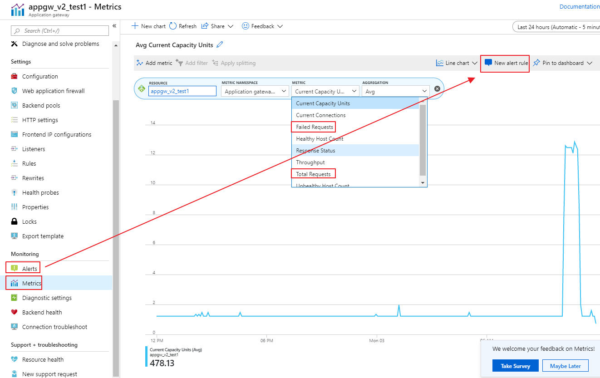
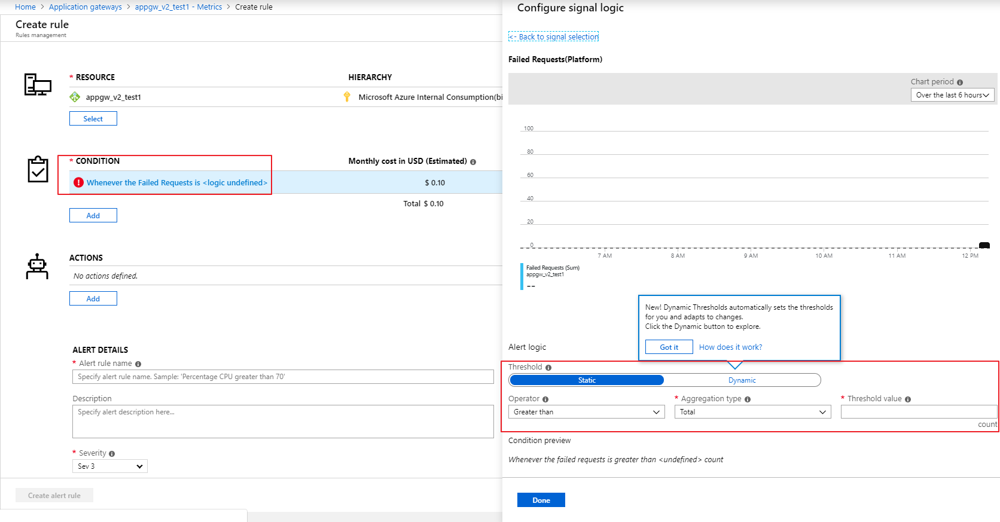
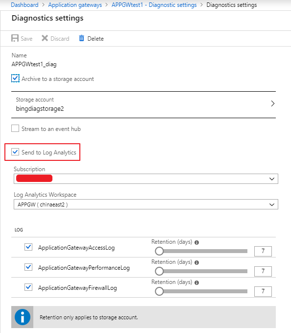
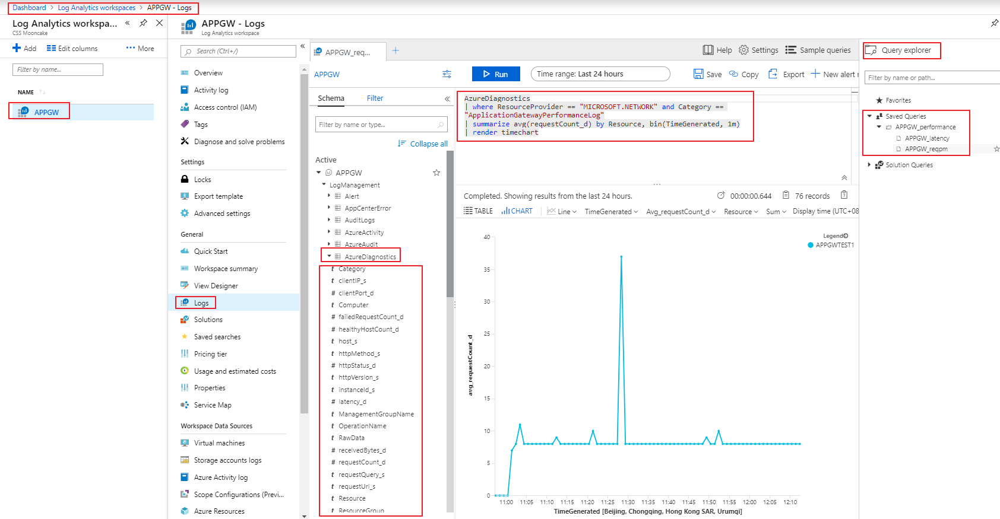
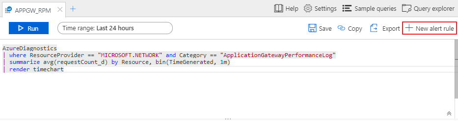

# Azure 应用程序网关性能指标的获取与分析

## Azure 应用程序网关性能指标分析

为了让管理员能及时获知应用程序网关的运行状态，并针对此种情况制定通知策略，实现对应用程序网关诊断日志的自动分析、监控和告警等。本文主要介绍基于 Log Analytics 对应用程序网关运行状态的监控及预警的部署方法。目前 Global Azure 的应用程序网关已经具备针对 Metrics 的监控参数做告警：

1. Metric：

    

2. Alert：

    

中国区 Azure 目前此功能还未上线，但是已经有替代方法，即在应用程序网关中的诊断设置中配置为将日志发送至 Log Analytics：



再在 Log analytics workspaces 中添加一个 workspace，在 Logs 中可以通过查询语句来查询指定日志中的字段：



## 常用 Log analytics 查询语句

Log analytics workspaces 中可以为日常运维保存常用查询语句，更加便捷地了解应用程序网关的状态。这里列出一些常用的查询语句：

1. Avg Latency (ms) by AppGW：

    ```xml
    AzureDiagnostics
    | where ResourceProvider == "MICROSOFT.NETWORK" and Category == "ApplicationGatewayPerformanceLog"
    | summarize avg(latency_d) by Resource, bin(TimeGenerated, 1m)
    | render timechart
    ```

2. Failed requests by API：

    ```xml
    AzureDiagnostics
    | where ResourceProvider == "MICROSOFT.NETWORK" and Category == "ApplicationGatewayAccessLog"
    | where httpStatus_d >= 400
    | summarize count() by requestUri_s, bin(TimeGenerated, 1m)
    | render timechart
    ```

3. Avg Requests per min：

    ```xml
    AzureDiagnostics
    | where ResourceProvider == "MICROSOFT.NETWORK" and Category == "ApplicationGatewayPerformanceLog"
    | summarize avg(requestCount_d) by Resource, bin(TimeGenerated, 1m)
    | render timechart
    ```

4. Avg Failed Requests per min：

    ```xml
    AzureDiagnostics
    | where ResourceProvider == "MICROSOFT.NETWORK" and Category == "ApplicationGatewayPerformanceLog"
    | summarize avg(failedRequestCount_d) by Resource, bin(TimeGenerated, 1m)
    | render timechart
    ```
  
5. Avg throughput per min (Mb)：

    ```xml
    AzureDiagnostics
    | where ResourceProvider == "MICROSOFT.NETWORK" and Category == "ApplicationGatewayPerformanceLog"
    | summarize avg(throughput_d) by Resource, bin(TimeGenerated, 1m)
    | extend ThroughputMb = (avg_throughput_d/1000)/1000
    | project Resource, TimeGenerated, ThroughputMb
    | render timechart
    ```

6. Unhealthy backend VM count：

    ```xml
    AzureDiagnostics
    | where ResourceProvider == "MICROSOFT.NETWORK" and Category == "ApplicationGatewayPerformanceLog"
    | summarize max(unHealthyHostCount_d) by Resource, bin(TimeGenerated, 1m)
    | render timechart
    ```

同样，我们可以根据查询结果配置告警触发规则，可以达到与 Global Azure 应用程序网关内的报警一样的效果:



告警手段包含短信，邮件，WebHook，Automation RunBook 等等，或可以进一步触发 RunBook 中的脚本来实现纵向和横向扩容。

管理员可根据如上工具，或其他日志分析工具有效监控应用程序网关，从而及时做出扩容的动作，以免进一步影响业务。具体场景下日志分析工具的应用可参考文档：[应用程序网关常见问题场景的分析](https://docs.azure.cn/zh-cn/articles/azure-operations-guide/application-gateway/aog-application-gateway-analysis-of-common-problems-scenarios)。
