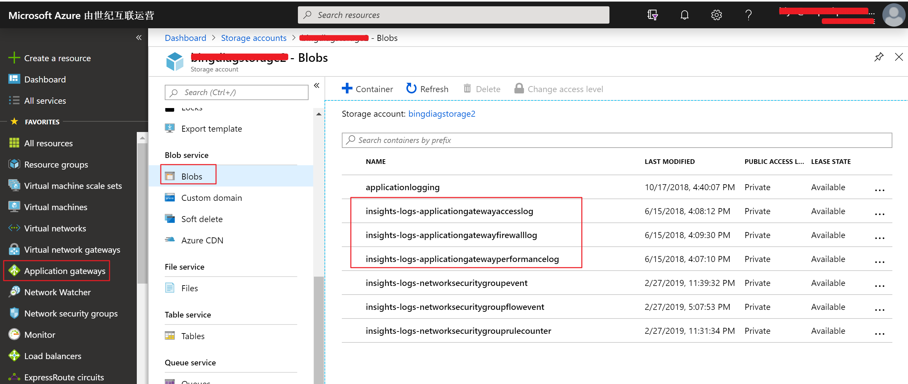
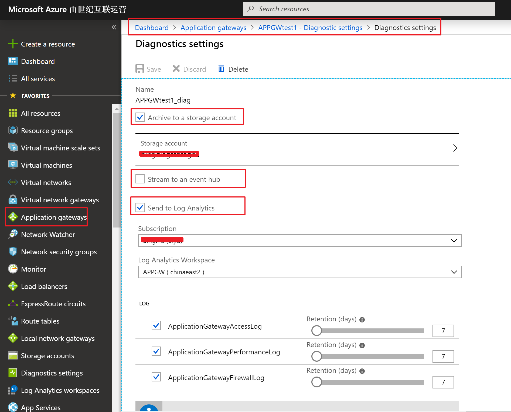

# Azure 应用程序网关诊断日志详解及合规性要求

## 如何启用诊断日志

启用 Azure 应用程序网关诊断日志记录，可查看资源的保存、使用性能、访问等其他数据信息，便于对应用程序网关进行管理和故障的排除。启用日志记录可参考以下文档：[通过 Azure 门户启用日志记录](https://docs.azure.cn/zh-cn/application-gateway/application-gateway-diagnostics#enable-logging-through-the-azure-portal)。

## 诊断日志类别

* 访问日志

* 性能日志

* 防火墙日志

## 日志存储方式

Azure 提供以下 3 个选项用来存储日志，可根据日志合规性、实时性及存储有效期等需求对存储方式进行选择。

* Storage account

* Event hub

* Log Analytics

日志存储方式选择：

* 如果需要在法务上满足[中国网络安全法](http://www.npc.gov.cn/npc/xinwen/2016-11/07/content_2001605.htm)，或需要遵从[信息安全等级保护](http://www.djbh.net/webdev/file/webFiles/File/jsbz/201232310421.pdf)标准，对日志审计有上述合法或合规要求，可以选用存储账号 (Storage account) 或 Log Analytics 的方式存储和读取日志，因为根据中国[网络安全法](http://www.npc.gov.cn/npc/xinwen/2016-11/07/content_2001605.htm)第二十一条规定：“采取监测、记录网络运行状态、网络安全事件的技术措施，并按照规定留存相关的网络日志不少于六个月”。

    Storage account 方式可以通过设置保存天数为 0 天来实现永久保留或者是实际大于六个月的具体天数，[Log Analytics](https://docs.azure.cn/zh-cn/azure-monitor/platform/manage-cost-storage) 最大保留天数是 730 天，而 Event hub 最多只能保留 7 天（具体参考文档：[Azure Event Hubs quotas and limits](https://docs.microsoft.com/bs-latn-ba/azure/event-hubs/event-hubs-quotas)），从 Storage account 获取日志方式有：通过 access key 方式；Azure Storage Explorer 工具 (字符连接串)；或直接在门户中浏览器下载。

* 如果对于日志读取的实时性要求比较高，可以选用 Event hub 方式，有关如何通过 Event Hub 方式获取应用程序网关的以上三种诊断日志，请参考如下文档：[如何通过 Event hub 方式获取应用程序网关的诊断日志](https://docs.azure.cn/zh-cn/articles/azure-operations-guide/application-gateway/aog-application-gateway-howto-get-diaglog-via-event-hub)。

    