# 如何简单实现对应用程序网关日志的自动监控和告警

我们经常遇到这样的场景：Azure 应用程序网关的**指标**功能不支持设置报警，平常想常规监控AppGW的运行情况，要么只能登陆到门户查看，要么只能配置获取 Access Log，Performance Log，WAF log 三种日志。人工分析这些日志太费时费力，用户体验也不够友好。

本文旨在结合使用 Monitor，Log Analytics workspace（下文简称 LA）服务，通过简单的步骤实现对应用程序网关诊断日志的自动分析、监控和告警。

## 应用程序网关的诊断有什么

如官方文档（[指标](https://docs.azure.cn/zh-cn/application-gateway/application-gateway-diagnostics#metrics)）所述，您可以通过三种方式监视资源：后端运行状况、日志、指标。

如果您已经对以上三种的适用场景和查询方法非常熟悉，可以直接看文章第二部分“如何配置诊断日志自动分析及监控告警”。

1.	后端运行状况：应用程序网关提供通过 Azure 门户和 PowerShell 监视后端池中的服务器运行状况的功能。也可通过性能诊断日志找到后端池的运行状况。

2.	日志：通过日志记录，可出于监视目的从资源保存或使用性能、访问及其他数据。本文第二部分会介绍如何使用 LA 分析日志并设置告警。

3.	指标：应用程序网关当前有七个指标可用来查看性能计数器。
应用程序网关的指标您需要在监视器（Monitor）服务界面的 Metrics 中看到，如下图：

    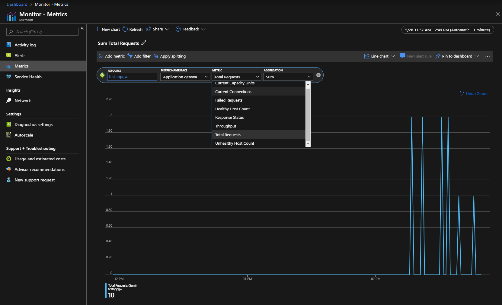

    如官方文档（[Microsoft.Network/applicationGateways](https://docs.azure.cn/zh-cn/azure-monitor/platform/metrics-supported#microsoftnetworkapplicationgateways)）所示，目前中国区 Azure 支持 7 种指标：吞吐量、UnhealthyHostCount、HealthyHostCount、TotalRequests、FailedRequests、ResponseStatus、CurrentConnections。在 Metrics 界面您可能还可以看到 *Current Capacity Units* ，这个属于在中国区 Azure 还未正式落地的功能，仅供参考。

    截取官网上对于中国区 Azure 应用程序网关支持的指标描述：

    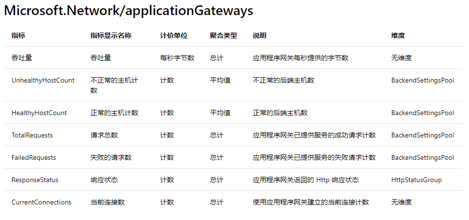

## 如何配置诊断日志自动分析及监控告警

以下测试环境为应用程序网关 + 虚拟机（Nginx）的架构。示例希望分析应用程序网关每个访问的耗时，对应用程序网关的日志做分析并在它大于 100 秒时告警发送邮件给固定邮箱。

1. 确认后端服务正常运行，可以通过应用程序网关访问：

    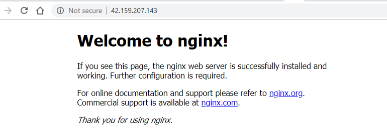

2. 在 Azure 门户中，为应用程序网关诊断开启 LA：

    点击应用程序网关界面 **Diagnostic settings** 上的 **Add Diagnostic setting** 或 **Edit setting**：

    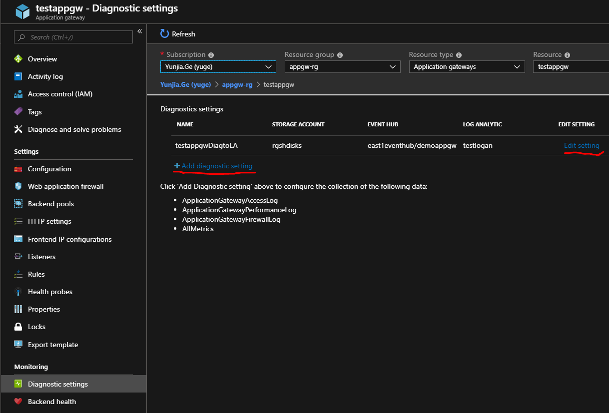

    勾选 **Send to Log Analytics**（需要您创建了至少一个 LA Workspace），目前 LA Workspace 只能创建在 China East 2，但任何区域的应用程序网关都可以选择位于 China East 2 的 LA Workspace 来分析日志：

    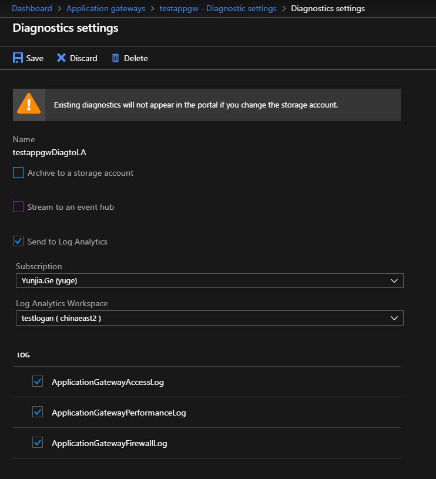
    
    如果您没有创建过 LA workspace，可以在 **All Service** 中找到 **Log Analytics workspaces** 服务，创建一个 workspace：

    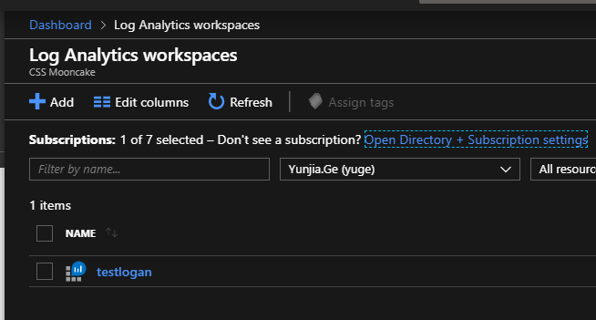

    如果您从未接触过 LA workspace，您可以参考这里做简单了解：[Azure Monitor Log Analytics 入门](https://docs.azure.cn/zh-cn/azure-monitor/log-query/get-started-portal)。

3. 在 LA workspace 中分析日志结果：

    在应用程序网关侧勾选配置后，日志会自动发布到 LA workspace 中，用户不需要在 LA 侧做更多配置。
    
    > [!NOTE]
    > 如果您的应用程序网关配置了 NSG，可能导致日志无法同步到 LA。更多解释及办法您可以参考：[Network firewall requirements](https://docs.microsoft.com/en-us/azure/azure-monitor/platform/log-analytics-agent#network-firewall-requirements)。

    接下来我们就可以自定义查询语句来分析应用程序网关的诊断日志了。

    > [!NOTE]
    > 第一次配置应用程序网关诊断发送到 LA，LA 可能需要花较长的时间（在我们的测试中花了几个小时），我们推测 LA 需要这些时间在后台构建对应数据库的表等等，建议预留大约一天的时间开启。之后，正常情况下日志延迟大约在 2-4 分钟以内。

    这里我查询了针对每个 URI 的 time_taken，查询语句如下：

    **Avg timeTaken per minute by API**：

    ```xml
    AzureDiagnostics
    | where ResourceProvider == "MICROSOFT.NETWORK" and Category == "ApplicationGatewayAccessLog"
    | where TimeGenerated >= ago(2h)
    | summarize avg(timeTaken_d) by Resource,requestUri_s, bin(TimeGenerated, 1m)
    | project avg_timeTaken_d, requestUri_s, TimeGenerated
    ```

    查询结果如下图：

    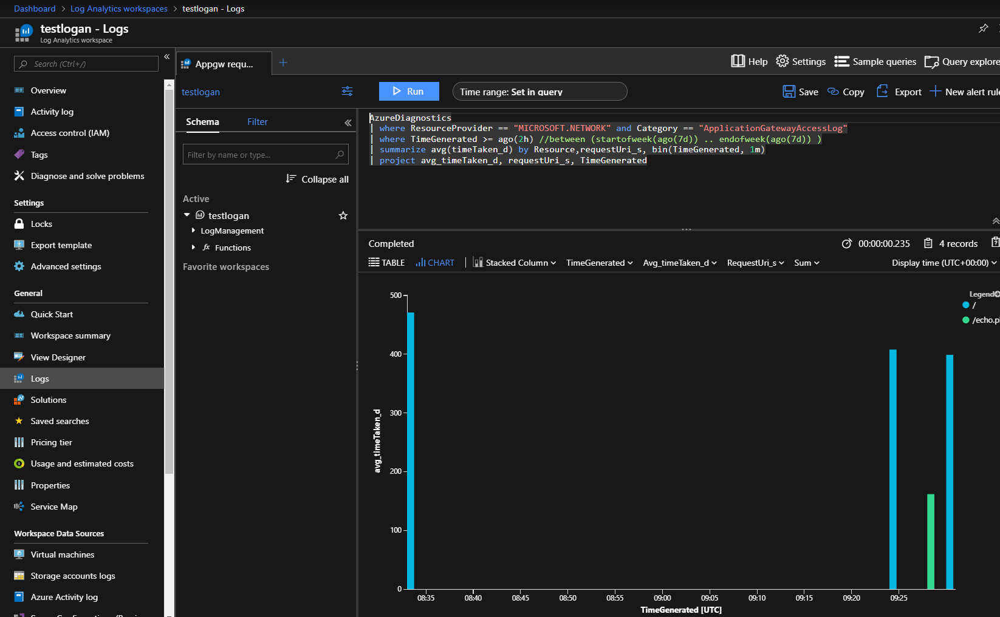

    查询语句属于 Azure Monitor 的功能，它使用了 Kusto 查询语言的一个版本以各种方式检索和分析日志数据。

    您可以参考[在 Azure Monitor 中分析日志数据](https://docs.azure.cn/zh-cn/azure-monitor/log-query/log-query-overview)了解更多查询语句说明和示例。

    Global Azure 文档（仅供参考）：[Analyze log data in Azure Monitor](https://docs.microsoft.com/en-us/azure/azure-monitor/log-query/log-query-overview)。

    这里列举了一些应用程序网关相关的常用查询，您可以根据实际需要编写更多复杂的语句：

    1. Avg throughput per second (Mb)：

        ```xml
        AzureDiagnostics
        | where ResourceProvider == "MICROSOFT.NETWORK" and Category == "ApplicationGatewayPerformanceLog"
        | summarize avg(throughput_d) by Resource, bin(TimeGenerated, 1m)
        | extend ThroughputMb = (avg_throughput_d/1000)/1000
        | project Resource, TimeGenerated, ThroughputMb
        | render timechart
        ```

    2. Avg Requests per min：

        ```xml
        AzureDiagnostics
        | where ResourceProvider == "MICROSOFT.NETWORK" and Category == "ApplicationGatewayPerformanceLog"
        | summarize avg(requestCount_d) by Resource, bin(TimeGenerated, 1m)
        | render timechart
        ```

    3. Unhealthy backend VM count：

        ```xml
        AzureDiagnostics
        | where ResourceProvider == "MICROSOFT.NETWORK" and Category == "ApplicationGatewayPerformanceLog"
        | summarize max(unHealthyHostCount_d) by Resource, bin(TimeGenerated, 1m)
        | render timechart

    4. Avg Latency (ms) by AppGW：

        ```xml
        AzureDiagnostics
        | where ResourceProvider == "MICROSOFT.NETWORK" and Category == "ApplicationGatewayPerformanceLog"
        | summarize avg(latency_d) by Resource, bin(TimeGenerated, 1m)
        | render timechart
        ```

    5. Error count past hour by AppGW：

        ```xml
        AzureDiagnostics
        | where ResourceProvider == "MICROSOFT.NETWORK" and Category == "ApplicationGatewayAccessLog"
        | where httpStatus_d >= 400
        | summarize count() by httpStatus_d, Resource
        | project httpStatus_d, Resource, count_
        ```

    6. HTTP Error count per hour by API：

        ```xml
        AzureDiagnostics
        | where ResourceProvider == "MICROSOFT.NETWORK" and Category == "ApplicationGatewayAccessLog"
        | where httpStatus_d >= 400
        | summarize count(httpStatus_d) by httpStatus_d,requestUri_s, bin(TimeGenerated, 1h)
        | order by count_httpStatus_d desc
        | project httpStatus_d, requestUri_s, TimeGenerated, count_httpStatus_d
        ```

    7. Failed requests by backend VM：

        ```xml
        AzureDiagnostics
        | where ResourceProvider == "MICROSOFT.NETWORK" and Category == "ApplicationGatewayAccessLog"
        | where httpStatus_d >= 400
        | parse requestQuery_s with * "SERVER-ROUTED=" serverRouted "&" *
        | extend httpStatus = tostring(httpStatus_d)
        | summarize count() by serverRouted, bin(TimeGenerated, 5m)
        | render timechart
        ```

4. 对分析结果设置自动告警：

    到这里，我们可以在门户上图形化地看到应用程序网关日志的分析结果。

    为了自动化监控应用程序网关，接下来我们使用 Azure Monitor 对这个分析结果设置告警。您可以在 Logs 的右上角（下图红圈部分），找到 **New Alert Rule**：

    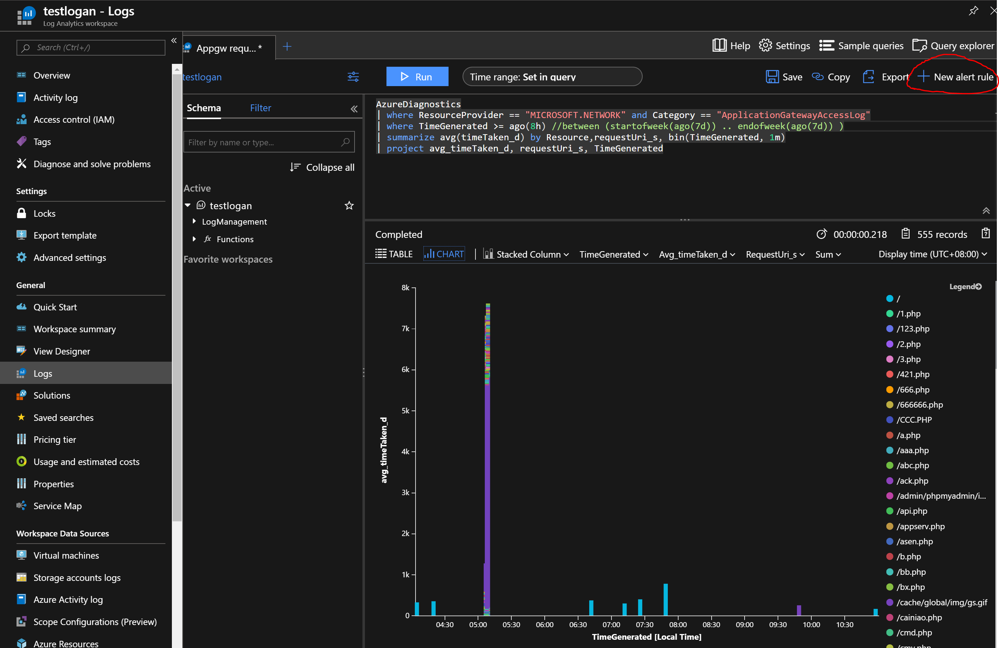
 
    在新的界面配置告警规则，共包含三部分：

    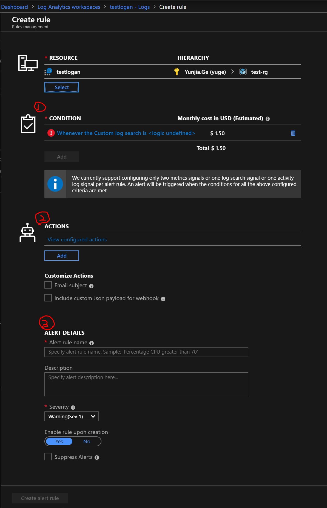

    1. Condition：

        触发告警的条件，点击感叹号部分，弹出配置框。如何配置的官方说明您可以参考：[Azure Monitor 中的日志警报](https://docs.azure.cn/zh-cn/azure-monitor/platform/alerts-unified-log)。

        * 日志查询 Search Query 

            这是每次触发预警规则时都会运行的查询。 此查询返回的记录用于确定是否将触发某个警报。有关更详细的视图，请参阅 [Azure Monitor 中的日志警报查询](https://docs.azure.cn/zh-cn/azure-monitor/platform/alerts-log-query)。

            默认这里会使用 3 中配置的查询语句，您也可以适当地修改。

        * Alert Logic

            针对 Azure Monitor 的日志查询规则可以分为两种类型。

            * 结果数。 当日志搜索返回的记录数超出指定数目时，将创建单个警报。
            
            * 指标度量值。 为日志搜索结果中其值超出指定阈值的每个对象创建警报。

            “结果数”警报规则始终创建单个警报，而“指标度量”预警规则将为超出阈值的每个对象创建一个警报；

            “结果数”预警规则会在超出阈值一次时创建一个警报。 当阈值在特定的时间间隔内超出特定的次数时，“指标度量”警报规则即可创建一个警报。

        * Evaluated based on

            频率：指定应运行查询的频率。 可以是介于 5 分钟到 24 小时之间的任何值。 应等于或小于时间段。如果该值大于时间段，则会有记录缺失的风险。

            阈值：对日志搜索的结果进行评估，确定是否应创建警报。不同类型的日志搜索警报规则的阈值不同。

        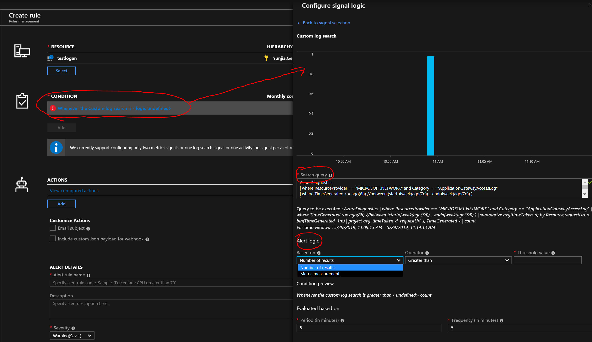

        一个成功创建的 Condition 如下图所示，这里选择了“结果数”作为日志查询规则，查询返回 timeTaken 大于一定阈值（100）的请求数:

        ```xml
        AzureDiagnostics
        | where ResourceProvider == "MICROSOFT.NETWORK" and Category == "ApplicationGatewayAccessLog"
        | summarize avg(timeTaken_d) by Resource,requestUri_s, bin(TimeGenerated, 1m)
        | where avg_timeTaken_d > 100
        ```

        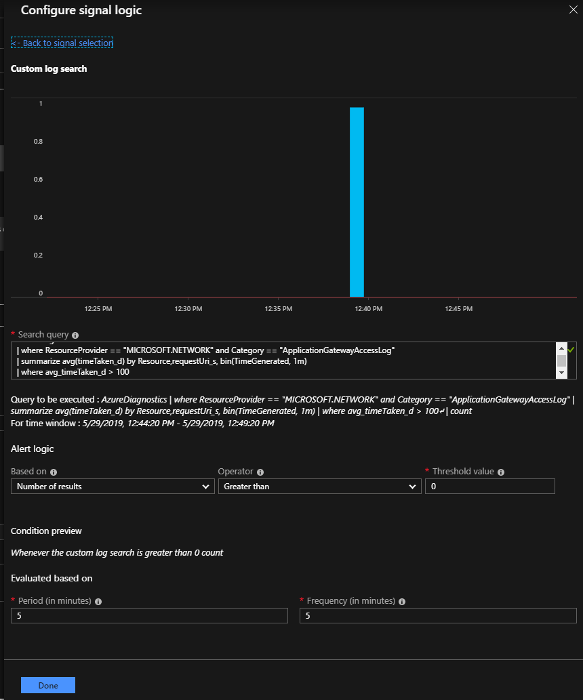

    2. Actions：

        Azure Monitor 和服务运行状况警报使用操作组来通知用户某个警报已触发。各种警报可以使用相同的操作组或不同的操作组，具体取决于用户的要求。

        您可以选择添加现有的操作组或/和操作规则（操作规则目前还是 Preview 状态，这个功能还未正式落地），并配置特定于操作的信息（比如发邮件/短信，或调用 Runbook + Webhook 实现更多自定义功能）。

        如果您还没有创建过操作组，可以参考：[Create and manage action groups in the Azure portal](https://docs.microsoft.com/en-us/azure/azure-monitor/platform/action-groups)。

        当操作配置为通过电子邮件或短信来通知某个人员时，该人员的邮箱或手机将收到确认，指出他 / 她已被添加到操作组。

        在下图红圈下方，您可以指定邮件的标题，以及是否包含 Webhook 的相关 Json：

        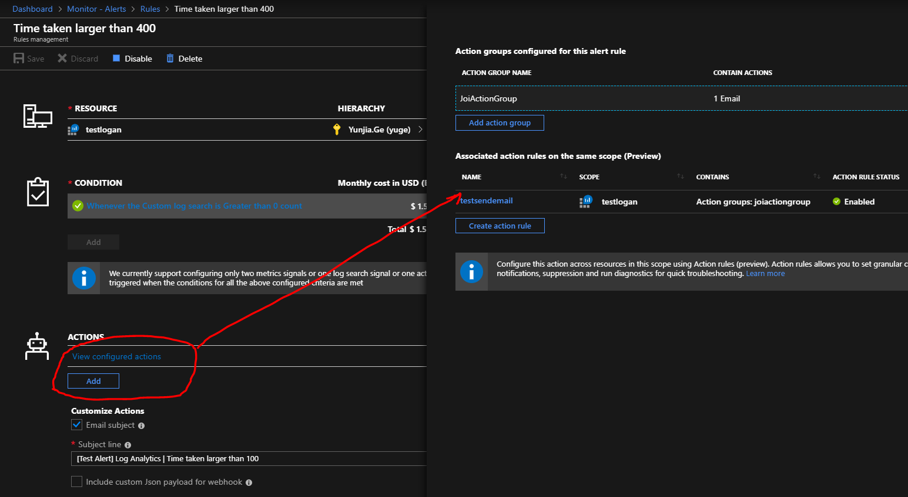

    3. Alert Details：

        指定 Alert 的名称、描述和严重性（警报规则中指定的条件符合后确定的警报严重性，严重性的范围为 0 到 4）。

        创建之后您可以在 **Monitor-Alerts** 界面查看历史警报，如下图：

        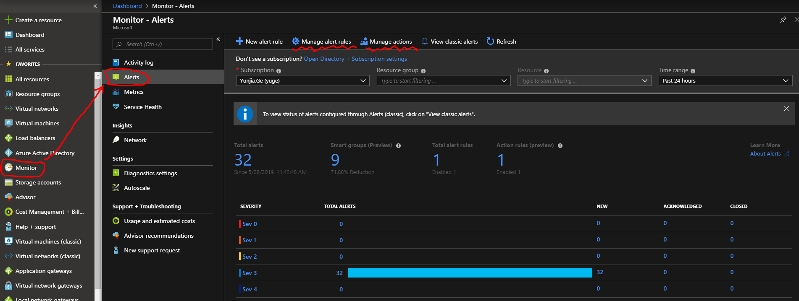
 
        您也可以在这个界面管理前面两步创建的警报规则（Manage Alert Rules）和操作组/操作（Manage actions）。

至此我们已经配置完毕日志分析（Log analytics Workspace）和自动监控告警（Monitor）。示例中配置了对应用程序网关的访问耗时的日志分析，当大于 100 秒时告警发送邮件。这里具体阈值建议根据实际业务配置，以避免收到大量误报警对被通知的人造成影响。

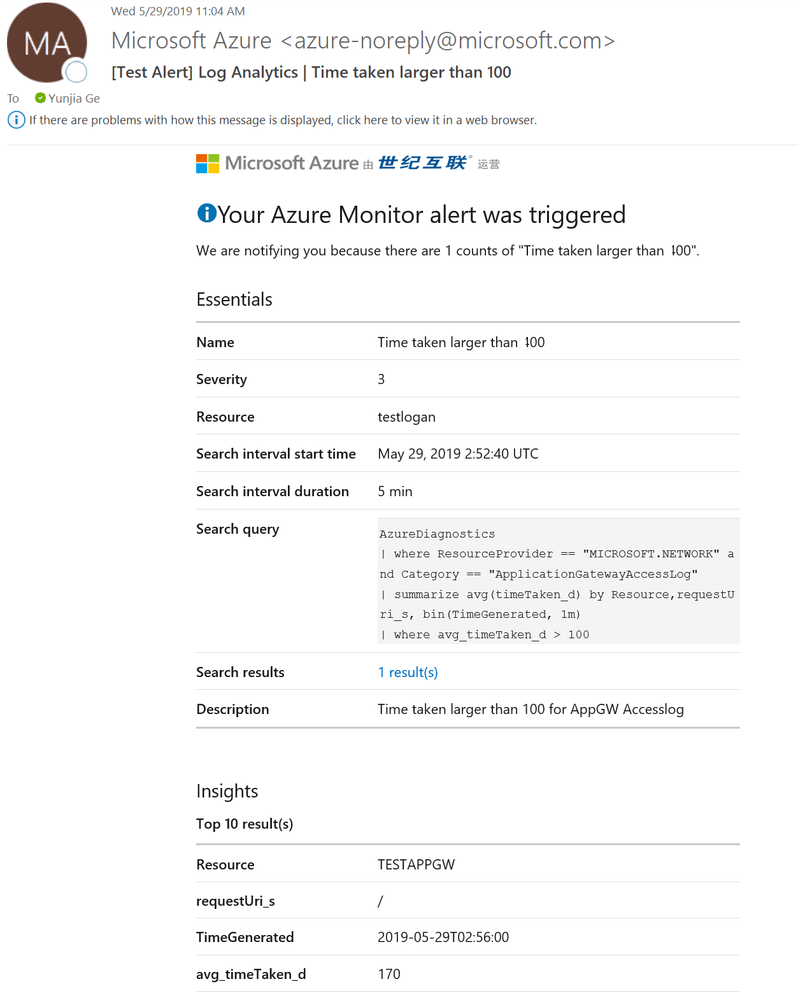