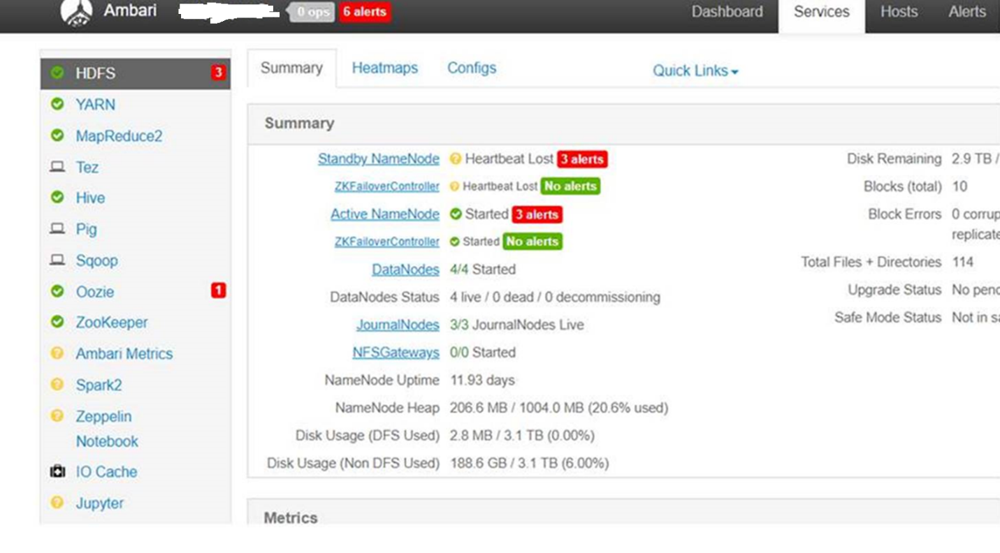
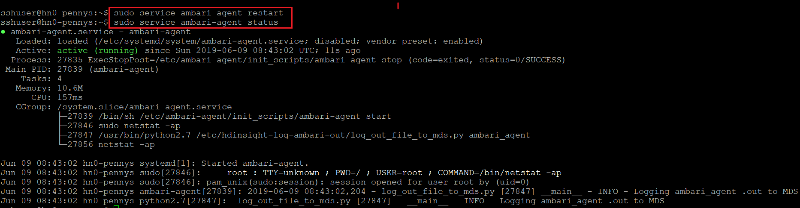
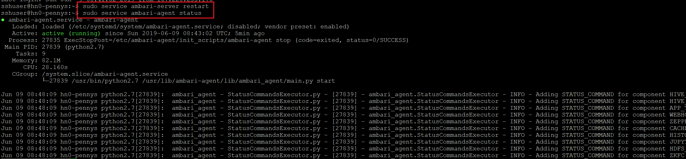
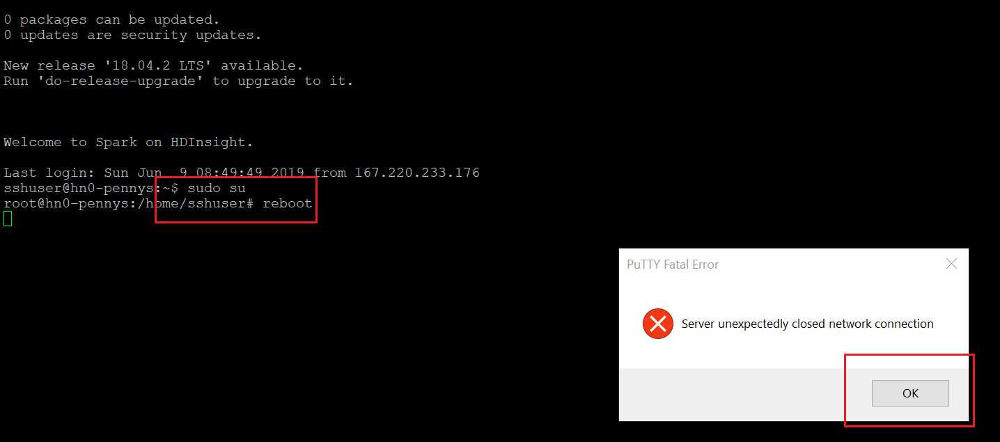

# HDInsight Ambari 心跳丢失常见排查方法

本文将介绍常见的引起 Azure HDInsight Ambari 心跳丢失的原因及相关排查方法。

## Ambari 心跳丢失常见原因

当 Ambari 出现心跳丢失的警告时，意味着 Ambari 代理不能向正确的服务器发送定期心跳消息，对于这个问题有许多可能的原因。有可能是 Ambari 代理没有正常启动，有可能是由于某个节点停机了，有可能是内存满了，有可能是 Ambari 代理占用过高的 CPU 造成的，也有可能是 JAVA 的某个协议或者 Linux 的内核软锁造成的。下图是 Ambari 心跳丢失时，可能出现的一种表现形式。



如下会对 Ambari 心跳丢失的常见解决方法进行说明阐述。

## 重启 Ambari 代理或者服务器解决心跳丢失

重启 Ambari 代理或者服务器是解决 Ambari 心跳丢失最常见的方法。如果 Ambari 代理没有正常启动或者 HDInsight 的 CPU 使用率太高，一般用户可以通过如下的方法进行排查修复：

1. 运行这行命令重启 Ambari 代理：`sudo service ambari-agent restart`。

2. 之后运行这行命令检查 Ambari 的状态：`sudo service ambari-agent status`：

    

3. 检查 Ambari 心跳丢失问题是否解决，如果解决可以忽略后面步骤，如果没有解决则继续如下步骤。

4. 如果 Ambari 心跳都是问题仍然存在，则可以通过如下命令重启 Ambari 服务器。

    ```shell
    sudo service ambari-server restart
    ```

5. 然后检查 Ambari 的状态：`sudo service ambari-agent status`：

    

## 修改 Java 的一个相关协议解决心跳丢失

部分 Azure HDInsight 的用户可能会遇到群集运行不正常的的问题。该问题是由于 Java 的一个安全更新禁止了 TLS v1 协议而导致的。Ambari 默认使用该协议，当其被禁止之后，就会导致群集出现异常。因此您有可能会在 Ambari 的用户界面上看到报错“心跳丢失”。

Azure 的工程师们正在针对 Java 的这个安全补丁进行修复工作，从而进一步解决该潜在问题。与此同时，用户也可以通过以下方式自行修复。可以检查下 */etc/amabri-agent/conf/ambari-agent.ini* 文件中是否有 *force_https_protocol=PROTOCOL_TLSv1_2*，没有的话需要按照如下步骤操作。

对于 3.6 版本的群集，可以更改 Ambari 代理设置来强制使用一个更新的协议（TLSv2）：

* 在群集的所有主机上，将以下选项添加到 */etc/amabri-agent/conf/ambari-agent.ini* 的安全性（security）部分：

    [security]  
    force_https_protocol=PROTOCOL_TLSv1_2

* 然后通过以下命令重启 Ambari 代理和服务器：

    ```shell
    sudo service ambari-agent restart
    sudo service ambari-server restart
    ```

## 运行脚本解决 Linux 内核软锁导致的心跳丢失

由于 Linux 内核软锁（Kernel Soft Lock）所导致。出现此情况的原因是系统进程占据 CPU 内核资源，导致其对用户进程无响应所致。

有关内核软锁的更多介绍请参考：[hdinsight.github.io](https://hdinsight.github.io/ClusterCRUD/KernelSoftLockFix/hdinsight-kernelsoftlockissue.html)。

此外，如果用户遇到 Linux 软内核导致的问题，也请在新创建集群的各个节点上均执行以下操作以防止错误影响 Ambari 运行。

## 重启有心跳丢失的节点解决问题

如果上述方法都不能解决问题，则可以重启有问题的节点进行解决问题。注意，重启节点会造成节点上的所有 Job 和应用停止。如果是生产环境，请选择合适的时间进行重启节点。

重启节点，可以先执行 `sudo su`，切换到 root 权限。然后再执行 `reboot` 进行重启。



## 减少内存使用解决心跳丢失

可以参考这篇文章解决由于某个节点内存太高导致的心跳丢失问题：[如何解决头节点一直处于心跳丢失的状态](https://docs.azure.cn/zh-cn/articles/azure-operations-guide/hdinsight/aog-hdinsight-howto-solve-head-knot-heartbeat-loseness)。