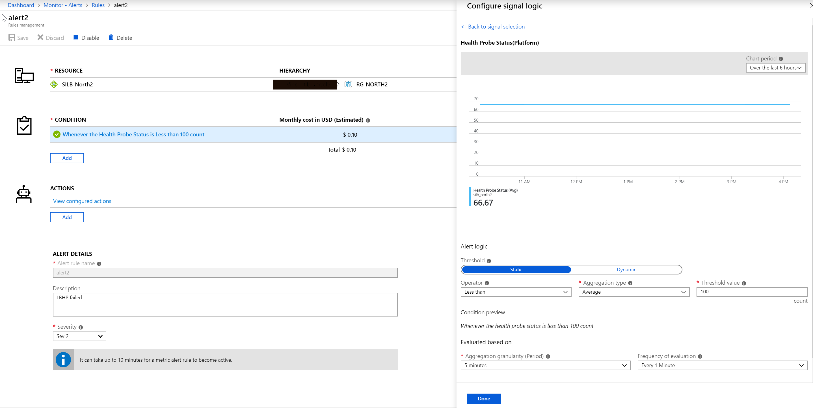
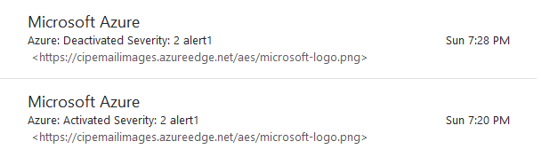

# 在标准负载均衡器探测失败时获得邮件或者短信警告的方法

## 问题概述

由于平台限制，基本负载均衡器不支持 Metrics，所以用户无法从门户或者 CLI 直观的获得探测的健康状态。而标准负载均衡器支持 Metrics，且满足用户从门户上监视探测状态的需求（具体指南可参考[在 Azure 门户中查看负载均衡器指标](https://docs.microsoft.com/zh-cn/azure/load-balancer/load-balancer-standard-diagnostics#view-your-load-balancer-metrics-in-the-azure-portal)），那么是否可以通过监视探测状态的 Metric 值，在探测探测失败的时候主动发通知呢？

## 实现步骤

1. 首先通过门户或者命令行创建操作组，主要用来编辑希望接收邮件提醒的邮箱地址，或者接收短信提醒的手机号码，具体步骤可参考：[在 Azure 门户中创建和管理器操作组](https://docs.azure.cn/zh-cn/azure-monitor/platform/action-groups)。

2. 通过命令行获取操作组 Resource ID：

    ```cli
    azure@server:~$ az monitor action-group show -g <Resource Group Name> -n <Action Group Name> --query id
    
    "/subscriptions/<Sub-id>/resourceGroups/<Resource Group Name>/providers/microsoft.insights/actionGroups/<Action Group Name>"
    ```

3. 通过命令行获取标准负载均衡器的 Resource ID:

    ```cli
    azure@server:~$ az network lb show -g <Resource Group Name> -n <Load Balancer Name> --query id

    "/subscriptions/<Sub-id>/resourceGroups/<Resource Group Name>/providers/Microsoft.Network/loadBalancers/<Load Balancer Name>"
    ```

4. 通过下列命令行创建一个基于探测状态的 Metric Alert，并在 Alert 触发的时候发警告到之前设置的邮箱或者手机号码：

    ```cli
    azure@server:~$ az monitor metrics alert create -n <Alert Name> -g <Resource Group Name> --scopes <LB Resource ID> --condition avg "DipAvailability < 100"  --evaluation-frequency 5m --action <Action Group Resource ID> --description "LBHP failed"
    ```

## 验证效果

配置结束后，在警告触发时，门户上可以看到上述配置的条件以及动作，并可以直接通过门户进行参数的修改：



根据本地测试结果，平台为避免频繁邮件骚扰，针对同一次偏离事件，只会发送一次触发警报的提醒，如果之后偏离纠正，则平台会发送解除警报的提醒：



另外，Metric 和 Alert 的具体价格可参考：[Azure 监控器](https://www.azure.cn/zh-cn/pricing/details/monitor/)。


