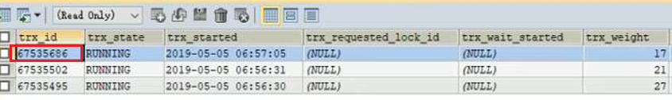
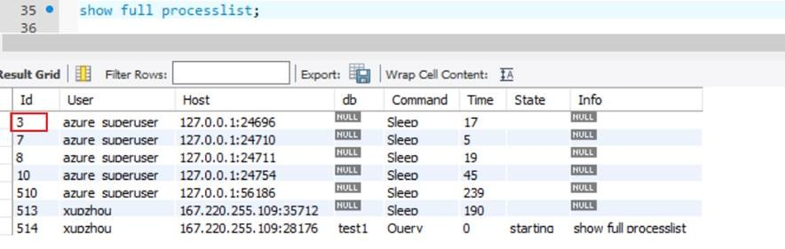
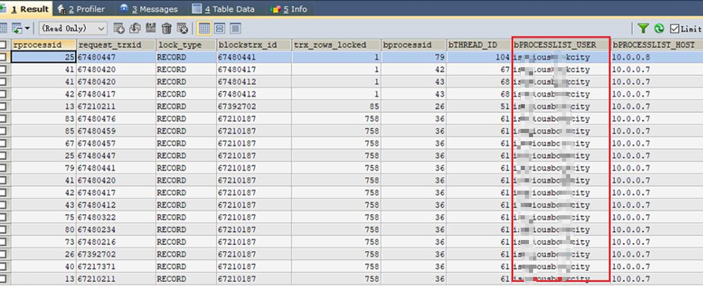

# Azure MySQL 阻塞排查及性能调优方法

本文将详细介绍 Azure MySQL 相关阻塞排查方法。用户遇到 MySQL 阻塞或者由于 MySQL 数据库问题导致应用响应慢，可以采用如下方法进行排查：

1. 通过如下语句，在问题时段找出未提交事务的语句：

    ```sql
    select trx_state, trx_started, trx_mysql_thread_id, trx_query from information_schema.innodb_trx
    ```

    > [!NOTE]
    > trx_started：事务是执行的起始时间，若时间较长，则要分析该事务是否合理。

2. 可以用如下语句查看各个锁之间的等待关系：

    查看当前出现的锁：

    ```sql
    select * from information_schema.INNODB_LOCKS
    ```

    查看事务之间的锁等待关系：
    
    ```sql
    select * from information_schema.innodb_lock_waits
    ```

    查看当前正在运行的事务：
    
    ```sql
    select * from information_schema.innodb_trx
    ```

    

3. 使用如下语句查看与 trx_mysql_thread_id 相同的正在运行的事务的 User 和相关信息：

    ```sql
    show full processlist;
    ```

    

    将以下语句中的 `porcesslistid` 替换成上图中的 id 可以查看更详细的信息：

    ```sql
    SELECT a.sql_text, 
       c.id, 
       d.trx_started 
    FROM   performance_schema.events_statements_current a 
       join performance_schema.threads b 
         ON a.thread_id = b.thread_id 
       join information_schema.processlist c 
         ON b.processlist_id = c.id 
       join information_schema.innodb_trx d 
         ON c.id = d.trx_mysql_thread_id 
    where c.id=<porcesslistid>
    ORDER  BY d.trx_started;
    ```

4. 使用如下语句查看当前的阻塞，以及阻塞和进程之间的关系，以及是哪个 User 造成的：

    ```sql
    select request.trx_mysql_thread_id rprocessid,
       request.trx_id request_trxid, 
       relock.lock_type , 
       blocks.trx_id blockstrx_id ,
       blocks.trx_rows_locked ,
       blocks.trx_mysql_thread_id bprocessid,
       threads.THREAD_ID bTHREAD_ID,
       threads.PROCESSLIST_USER bPROCESSLIST_USER,
       threads.PROCESSLIST_HOST bPROCESSLIST_HOST,
       threads.PROCESSLIST_DB bPROCESSLIST_DB
    from information_schema.INNODB_LOCK_WAITS innolock
    left join information_schema.INNODB_TRX request on innolock.requesting_trx_id=request.trx_id
    left join information_schema.INNODB_TRX blocks on innolock.blocking_trx_id=blocks.trx_id
    left join `performance_schema`.threads threads on blocks.trx_mysql_thread_id = threads.PROCESSLIST_ID
    left join information_schema.INNODB_LOCKS relock on request.trx_requested_lock_id=relock.lock_id
    left join information_schema.INNODB_LOCKS block on block.lock_id=blocks.trx_requested_lock_id;
    ```

    

5. 在问题存在的时段运行如下语句，可帮助找到阻塞的源头 thread-ID（表中的这一列 blocked_thread_id）：

    ```sql
    SELECT b.trx_mysql_thread_id             AS 'blocked_thread_id' 
      ,b.trx_query                      AS 'blocked_sql_text' 
      ,c.trx_mysql_thread_id             AS 'blocker_thread_id'
      ,c.trx_query                       AS 'blocker_sql_text'
      ,( Unix_timestamp() - Unix_timestamp(c.trx_started) ) 
                              AS 'blocked_time' 
    FROM   information_schema.innodb_lock_waits a 
    INNER JOIN information_schema.innodb_trx b 
         ON a.requesting_trx_id = b.trx_id 
    INNER JOIN information_schema.innodb_trx c 
         ON a.blocking_trx_id = c.trx_id 
    WHERE  ( Unix_timestamp() - Unix_timestamp(c.trx_started) ) > 4;
    ```
