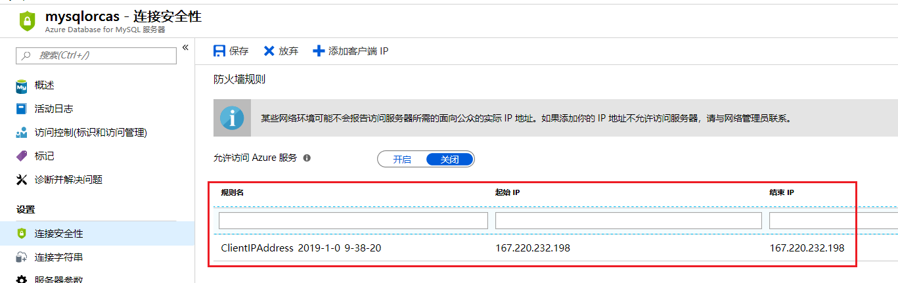
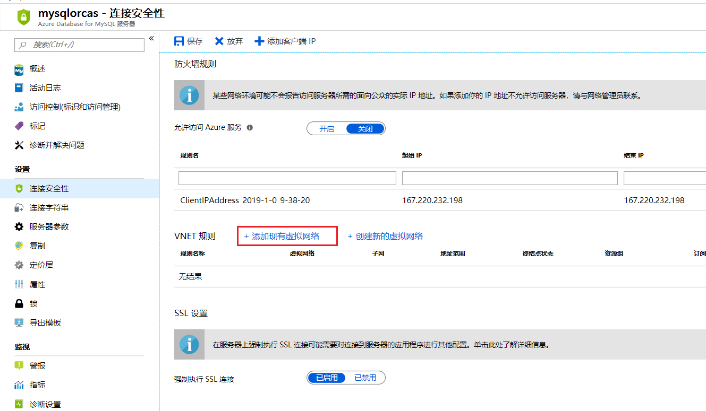
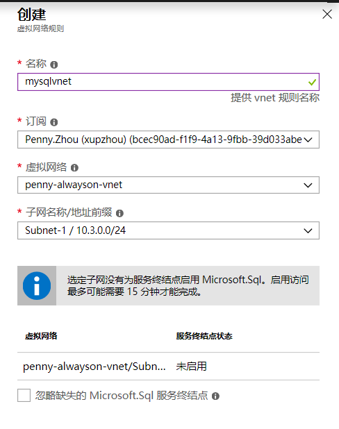
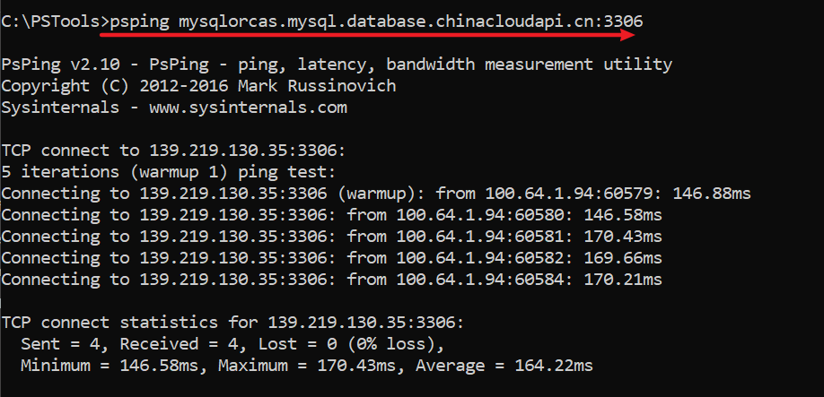
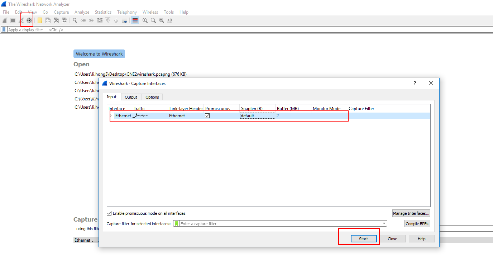
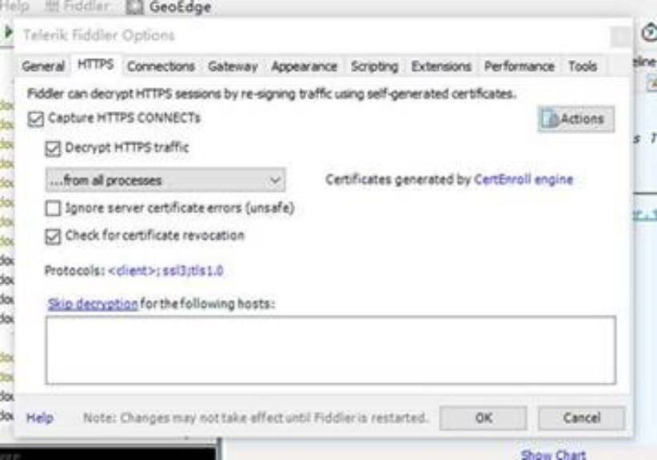
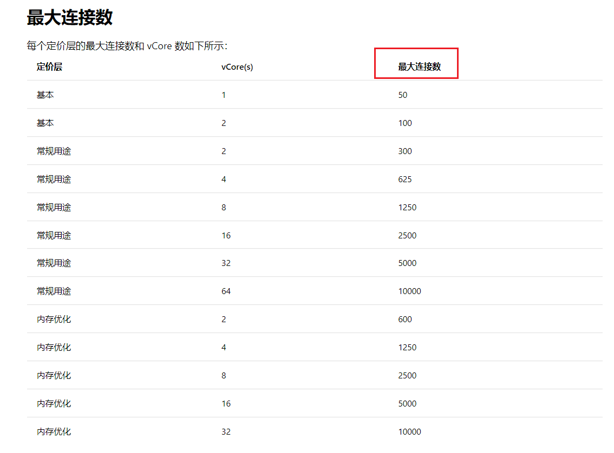

# Azure Database for MySQL 连接问题常见排查方法

Azure Database for MySQL 连接问题是使用 MySQL 数据库的常见问题，本文将会详细介绍 Azure Database for MySQL 连接出现问题时的常见问题及排查方法。具体常见原因及排查思路如下。

## 对连接的驱动版本有要求

Azure Database for MySQL 对于驱动的版本及管理工具的兼容性有要求，如果驱动版本或者管理工具不兼容，会造成连接不了的问题，具体可以参考文档：[与 Azure Database for MySQL 兼容的 MySQL 驱动程序和管理工具](https://docs.azure.cn/zh-cn/mysql/concepts-compatibility)。

## MySQL的存储达到上限值

目前 Azure Database for MySQL 当可用存储量低于 5 GB 或 5% 的预配存储（以较低者为准）时，服务器会标记为只读。当存储满了以后就会导致新的连接连不上。目前可以在 Azure 门户上设置存储超过多少百分比的时候，可以发送邮件。Azure 平台正在设计 Azure Database for MySQL 存储自动扩展功能，该功能上线后可以解决这个问题。

## Timeout 的限制导致连接不上

由于 MySQL Client 在等待服务器端返回时不会有任何操作，所以在查询时间长度超过 4 分钟时，会被 Azure Gateway 终结。针对这种问题首先需要对客户端的 Heartbeat 参数进行设置。在 Windows 端没有默认的 Heartbeat 功能，需要通过参数开启，在修改了 Heartbeat 之后，Windows 需要重启电脑。Linux 端由于默认的 Heartbeat 间隔过长，同样会导致 Azure Gateway 认为客户端无响应，所以需要缩短该参数。具体的配置方法，可以参考文档：[如何对 Azure MySQL 连接进行故障排查](https://docs.azure.cn/zh-cn/articles/azure-operations-guide/mysql/aog-mysql-connections-faq)。

## 防火墙设置不正确

防火墙配置不正确是导致 Azure Database for MySQL 连接不了比较最常见的问题。如果从公网连接可能是没有把公网连接的客户端地址加入防火墙白名单。如果是从 Azure 虚拟机连接，可能是没有配置好虚拟网络服务终节点。同时，也有可能用户本地的防火墙设置规则比较复杂，没有运行 Azure 平台的 Cluster 访问，导致连接不上。具体分析如下：

1. 允许 Azure Cluster IP 访问本地：

    [Azure 平台一些 Cluster 的 IP](https://www.microsoft.com/en-us/download/details.aspx?id=57062)，用于平台上相应服务的访问。如果用户本地有入站规则限制，就需要把使用的 Azure Database for MySQL 所在区域的 IP 加入到入站规则白名单中，如果有本地有出站规则限制，就需要把 IP 加入到出站的白名单中。

2. 设置公网防火墙白名单：

    可以在 Azure Database for MySQL 的防火墙设置钟添加公网防火墙白名单，如果需要从公网访问 Azure SQL 数据库必须配置将访问的客户端的IP地址加入防火墙白名单，如下所示：

    

3.	配置虚拟网络服务终结点

    如果需要从 Azure 虚拟机中访问 Azure Database for MySQL，但是又关闭允许访问 Azure 服务，则需要将 Azure 虚拟机配置到 Azure Database for MySQL 中。
    
    添加现有虚拟网络，然后选择虚拟机所在的虚拟网络进行启用服务终结点，并且添加虚拟网络，具体如下所示：

    

    

## 使用不同方式登录 Azure Database for MySQL 来缩小范围

当遇到 Azure Database for MySQL 连接不上时，有多种方法可以帮助排查缩小范围。

1. 尝试使用不同工具连接：

    遇到当前 Azure Database for MySQL 连接不了的情况，可以尝试使用不同的工具连接。例如，如果使用 MySQL Workbench 登录失败，则可以使用 Navicat 进行登录排查是某个客户端问题造成的。

2. 登录在同一个区域的相同配置的另一个 Azure Database for MySQL：

    通过登录和连接有问题的 Azure Database for MySQL 在同一个区域，且配置相同的 Azure Database for MySQL 来排除是否是订阅下某个区域的所有 Azure Database for MySQL 都存在连接问题。

## 排除是否为网络问题

通过在本地的 CMD 中运行 `psping servername.standardmysql.mysql.database.azure.com:3306` 和 `nslookup mysqlorcas.mysql.database.chinacloudapi.cn` 这两条命令来判断是否存在网络问题。正常没有问题则显示如下：

## 抓包进行排查

如果上述方法都没有排查出问题，也可以在 Azure Database for MySQL 连接不上时，通过抓取网络包或者应用报进行查看，用来分析具体原因。

### 使用 WireShark 抓取网络包

1. 下载 WireShark (下载地址：[Download WireShark](https://www.wireshark.org/download.html))。

2.	开始抓包：

    

3. 调用接口访问数据库，结束后停止抓包，请提供开始调用接口到获取数据的日志（开始时间，获取数据的时间）。

4. 保存抓包文件，对抓包文件中有异常报错的地方进行分析，或者可以对使用的 Azure Database for MySQL 的 IP 地址进行分析。也可以将网络包发给微软技术支持团队进行分析。

### 使用 Fiddler Trace 抓取应用包

1. 若还未安装 Fiddler Trace，从 [Downloading Telerik Fiddler](http://www.telerik.com/download/fiddler/fiddler4) 下载安装。

2. 打开 Fiddler，点击 **Tools** > **Fiddler Options**。

3. 点击 **HTTPS** 标签。

4. 确认设置如下图所示：

    

5. 若 Fiddler 要求你允许它用 root 权限, 点击 **Yes**。

6. 复现 *register Microsoft.PowerBIDedicated* 错误，让 Fiddler 抓取网络包.

7. 当确认 Fiddler 已抓到所需的信息后, 点击 **File**，取消选中 **Capture Traffic** 来取消 Fiddler 抓包。

8.  点击 **File** > **Save** > **All Sessions** 保存文件，对抓包文件中有异常报错的地方进行分析，也可以将网络包发给微软技术支持团队进行分析。

## 其他排查方法

连接池配置内容，查看是否并发连接数达到该定价层的上限值。

可以参考文档中不同定价层的连接数上限：[Azure Database for MySQL 中的限制](https://docs.azure.cn/zh-cn/mysql/concepts-limits)。

