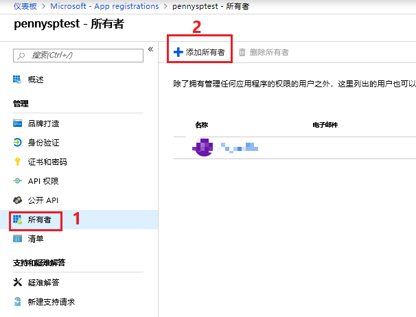
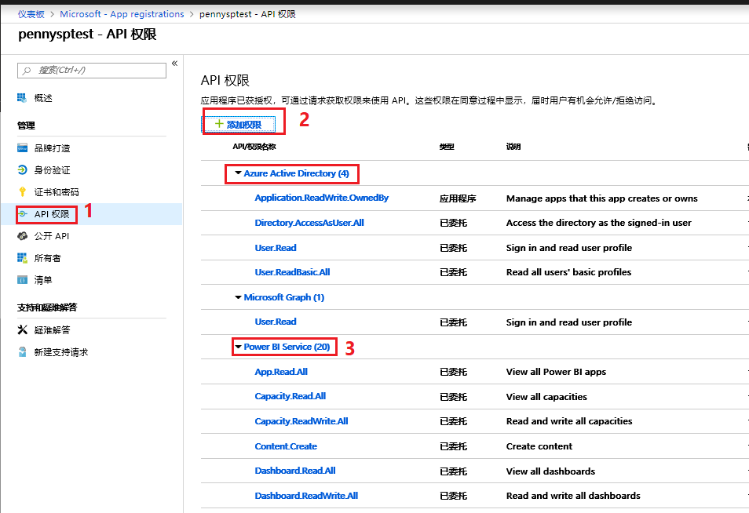

# 服务主体认证方式下应用拥有数据将 Power BI 报表、仪表板或磁贴嵌入应用程序中

在获取 Power BI 资源进行认证时，可以使用主帐户和服务主体这两种认证类型。如果使用服务主体认证类型，则不需要在应用程序代码中嵌入 Power BI 主帐户的用户名和主帐户的密码。本教程演示，针对服务主体认证方式， “应用拥有数据” 的客户使用 “Azure 中的 Power BI Embedded” 时，如何使用 Power BI .NET 将报表集成到应用程序中，因此本教程中将使用主帐户的认证方式进行演示。“应用拥有数据” 的优点是将用户名和密码都嵌入到程序中，使用者在使用的过程当时就无需再输入用户名和密码。

## Azure Active Directory 中注册一个 Web 应用

本教程中将使用服务主体的认证方式进行演示，需要先在 Azure Active Directory 中注册一个 Web 应用，用于获取 Power BI 资源进行认证。

> [!NOTE]
> 需要使用具有 Power BI Pro 的账号（即可以登录需要访问 Power BI Service 网址的账号），登录 [Azure 门户](https://portal.azure.cn)，然后到 Azure Active Directory 中注册一个 Web 应用。

1. 根据如下方式，在 Azure Active Directory 中注册一个 Web 应用，可以选择自己需要的网址进行注册(可以选择 `http://localhost:13526/` 这个网址作为重定向 URI)。
注册完应用以后会自动生成一个服务主体。

    

    添加该登录 Azure 门户的账号为所有者。

    

2. 授予注册的本地应用程序相关 Windows Active Directory 和 Power BI Service 权限，具体如下所示。

    

    本示例中，Power BI Service 需要的权限具体如下，客户可以根据需求，参考[这篇文档](https://docs.microsoft.com/en-us/rest/api/power-bi/reports/getreportingroup)根据需要的 API 进行选择：

    

3. Windows Active Directory 和 Power BI Service 权限添加完成以后，需要点击 “授予权限”，才能完成所有步骤。

    

## 配置服务主体相关权限

1. 在 Azure Active Directory 中新建一个安全组，并将注册应用生成的服务主体加到成员中。

    
    

2. 登录 [Power BI Service 网站](https://app.powerbi.cn)授予相关 admin 权限。

    1. 选择 “管理门户” 进行相关授权，将创建的安全组添加到允许主体服务访问 Power BI API：

        
        

    2. 创建新的 v2 版本的 Power BI Workspace，目前中国区域还需点击 “立即试用” 创建：

        
        

    3. 创建 v2 版本的 Workspace 以后，将服务主体设置为 Workspace 的 admin:

        
        

## 将 PBIX 报表上传到 Power BI Service 网站并选用 Power BI Embedded 容量

用户可以选择使用自己编辑的 pbix 文件，也可以从 GitHub 下载[示例](https://github.com/Microsoft/powerbi-desktop-samples)。

1. 在 Power BI Desktop 中点击发布就可以将 pbix 文件发布到 [Power BI Service 网站](https://app.powerbi.cn)中。

    

2. 在 [Power BI Service 网站](https://app.powerbi.cn)中选中刚才上传的 Workspace，就可以打开 “专用的容量”，并选用已经创建的 Power BI Embedded 容量。

    选中工作区，然后点击编辑工作区：

    

    在编辑工作区中，选择打开专用容量，就可以选择使用 Azure 门户中创建的 Power BI Embedded 容量，如下所示。

    
    

3. 选中需要展示的报表，在如下图的网址中的字段分别代表 workspace id 和 report id。

    

## 使用示例应用程序嵌入内容

本实例演示的是比较简单的样例，并没有对 Power BI 主帐户的用户名和主帐户的密码进行加密，用户可以根据自己的使用情况进行加密。

请按照以下步骤，使用示例应用程序开始嵌入内容。

1. 下载 [Visual Studio](https://www.visualstudio.com/)（2013 版或更高版本）。 请务必下载最新版 [NuGet 包](https://www.nuget.org/profiles/powerbi)。

2. 从 GitHub 下载相应的[示例代码](https://github.com/XupingZhou/ServicePrinciple-App-Owns-Data)。

3. 编辑代码中的 Web.config 中的如下字段。

    

    其中的 `workspaceId` 和 `reportId` 是上文中 Power BI Service 中的一部分。`applicationId` 和 `tenant` 可以在 Azure 门户注册应用的地方找到。

    

4. 在 Visual Studio 中运行程序，运行以后就会跳转到 Web 页面，如下所示:

    

5. 点击 Embedded Report 可以显示如下内容：

    

6. 点击 Embedded Dashboard 可以显示如下内容：

    

7. 点击 Embedded Tile 可以显示如下内容：

    
