# 通过 Azure Active Directory 认证 Azure 自动化服务

关于 Azure 自动化的详细概念请阅读[这篇文章](https://www.azure.cn/home/features/automation/)。

Azure 自动化是通过 Windows PowserShell 工作流（也称为 Runbook）来处理 Azure 的资源和第三方应用的创建、部署、监视和维护工作的。在执行 Runbook 的时候自然需要认证是否拥有合理的身份来执行操作。本文介绍如何通过 Azure Active Directory 来授权。

首先去确认 Azure 订阅的目录名字（本文使用的订阅账户是" 1RMB Trial Offer "），可以在 Azure 门户 **订阅** 服务里找到，如下图：

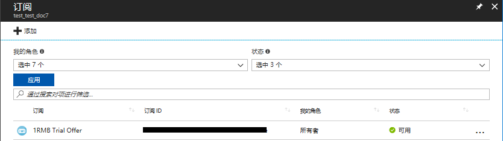

之后去 Azure Active Directory 里找到对应的目录，或者点击切换目录切换到指定目录，如下图：

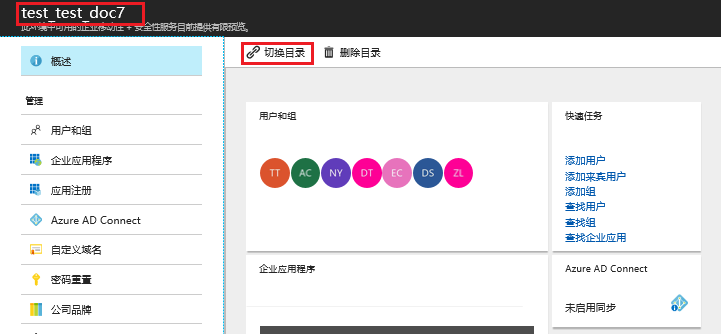

依次点击用户和组 -> 所有用户 -> 添加用户，然后输入要创建的用户名，在配置文件中输入名字、姓氏：

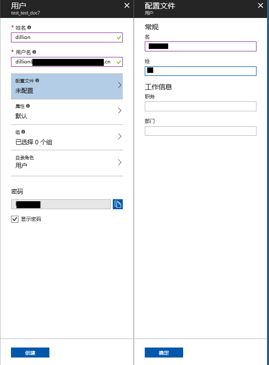

> [!Note]
> 需要勾选显示密码，查看初始密码，如果不勾选的话，只能通过重置密码的方式得到登录密码。

复制初始密码，然后在 Azure 门户登录，第一次登陆需要修改密码。如果使用初始密码作为 Runbook 的凭证可能会导致操作失败。

然后进入订阅，在访问控制(标识和访问管理)中为新添加的用户分配权限：

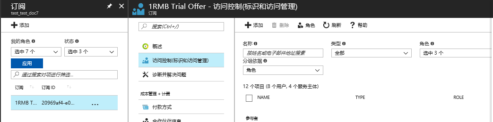

点击添加，设置用户角色为订阅所有者，选中之前添加的新用户：

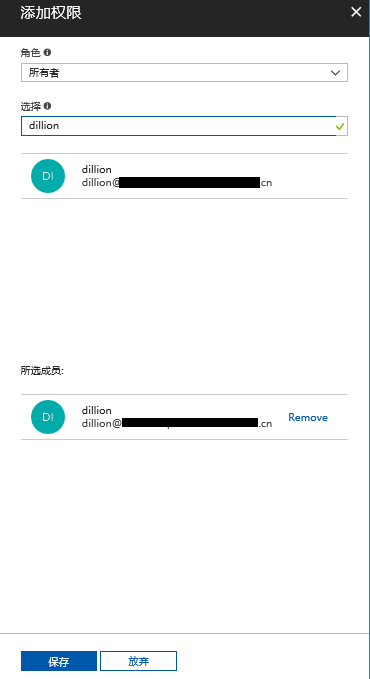

将新用户设置为协同管理员：

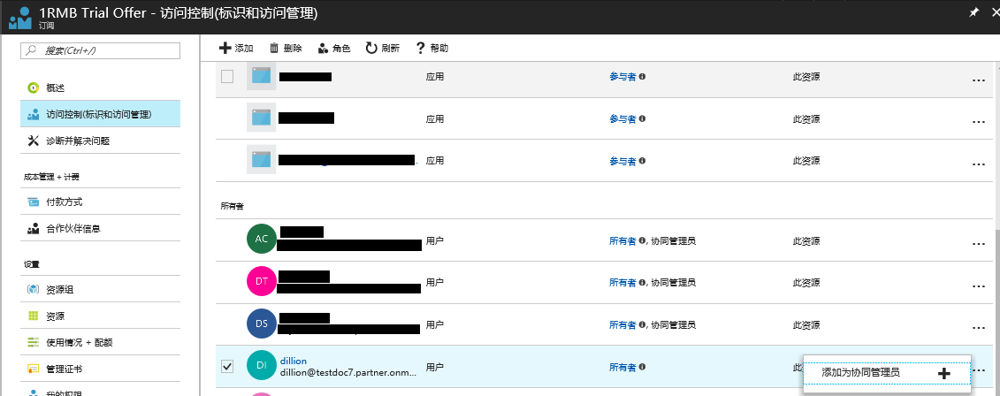

然后进入自动化账户，在共享的资源区域中点击凭据，然后点击添加凭据：

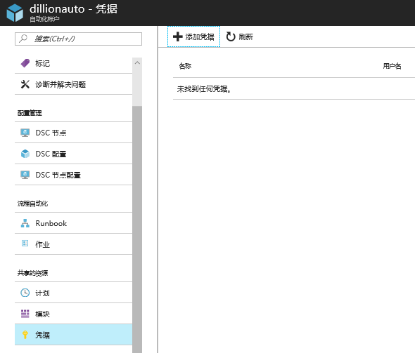

输入凭据名称以及刚才创建的用户名和密码：

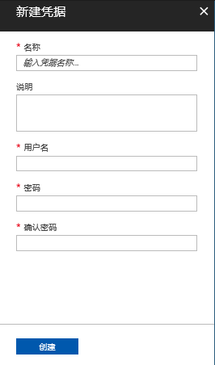

至此 PowerShell 的凭据已经创建完成，下面讨论如何来使用（本文主要是使用自动化服务实现开关虚拟机）。

首先我们进入 Runbook ：

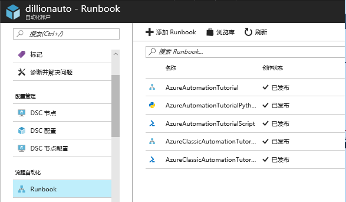

然后点击添加 Runbook :

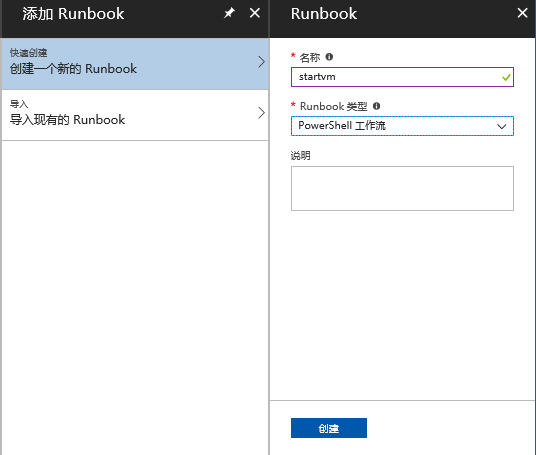

点击编辑按钮编辑 Runbook ：

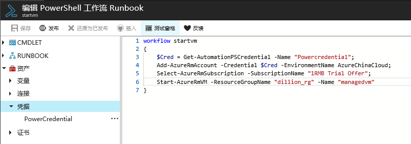

在编辑的过程中使用下面的指令来实现授权，“Powercredential”为在定义凭据时使用的名称。

```
$Cred = Get-AutomationPSCredential -Name "Powercredential"; 
Add-AzureRmAccount -Credential $Cred -EnvironmentName AzureChinaCloud;
Select-AzureRmSubscription -SubscriptionName "<订阅名称>";
```