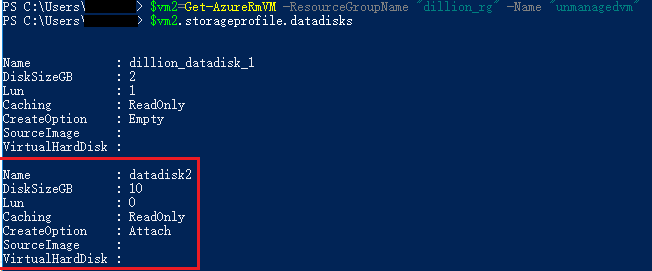

# 如何为虚拟机附加磁盘

关于如何在 Azure 门户上附加磁盘请阅读[这篇文章](https://docs.azure.cn/virtual-machines/windows/attach-managed-disk-portal)

>使用 Powershell 前有关 Azure PowerShell 的安装、配置和连接到订阅请阅读[这篇文章](/powershell-install-configure)

相关 PowerShell 指令：[Add-AzureRmVMDataDisk](https://docs.microsoft.com/powershell/module/azurerm.compute/add-azurermvmdatadisk?view=azurermps-5.1.1)、[Remove-AzureRmVMDataDisk](https://docs.microsoft.com/powershell/module/azurerm.compute/remove-azurermvmdatadisk?view=azurermps-5.1.1)、[Update-AzureRmDisk](https://docs.microsoft.com/powershell/module/azurerm.compute/update-azurermdisk?view=azurermps-5.1.1)、[Get-AzureRmDisk](https://docs.microsoft.com/powershell/module/azurerm.compute/get-azurermdisk?view=azurermps-5.1.1)

## 通过 PowerShell 附加磁盘

本文主要在虚拟机" managedvm " 和 " unmanagedvm "上测试，其中" managedvm " 使用的是托管磁盘，" unmanagedvm "使用的是非托管磁盘 VHD。

### 附加托管磁盘

主要在 "managedvm" 虚拟机上测试，使用以下脚本附加数据磁盘：

```
#获取虚拟机上
$vm= Get-AzureRmVM -ResourceGroupName "dillion_rg" -Name "managedvm"
#查看虚拟机磁盘详细信息
#查看系统磁盘信息
$vm.Storageprofile.OsDisk
#查看数据磁盘信息
$vm.Storageprofile.DataDisks

#配置新添加的数据磁盘
$diskConfig = New-AzureRmDiskConfig -AccountType "StandardLRS" -Location "China North" -CreateOption Empty -DiskSizeGB 128
#根据配置信息新建数据磁盘
$dataDisk1 = New-AzureRmDisk -DiskName "managedvm_DataDisk" -Disk $diskConfig -ResourceGroupName "dillion_rg"

#将新建的数据磁盘附加到虚拟机
$vm= Get-AzureRmVM -ResourceGroupName "dillion_rg" -Name "managedvm"
$vm = Add-AzureRmVMDataDisk -VM $vm -Name "managedvm_DataDisk" -CreateOption Attach -ManagedDiskId $dataDisk1.Id -Lun 1

#更新虚拟机
Update-AzureRmVM -VM $vm -ResourceGroupName "dillion_rg"

#将已经存在的托管数据磁盘附加到虚拟机
#Get-AzureRmDisk 获取可以附加的磁盘信息
#附加磁盘的条件：与虚拟机同一个 Location、同一个资源组下，数据磁盘没有附加在其它虚拟机上
#以下是我测试位于 China North，没有附加于其它虚拟机，且在 dillion_rg 资源组下的托管数据磁盘
#得到现有的托管磁盘：
$dataDisk2 = Get-AzureRmDisk -ResourceGroupName "dillion_rg" -DiskName "managed_datadisk_2"
#查看托管磁盘详细信息
$dataDisk2
#将托管磁盘附加到虚拟机
$vm = Add-AzureRmVMDataDisk -CreateOption Attach -Lun 0 -VM $vm -ManagedDiskId $dataDisk2.Id

#更新虚拟机
Update-AzureRmVM -VM $vm -ResourceGroupName "dillion_rg"
```
### 附加非托管磁盘

在虚拟机 "unmanagedvm" 上做测试，虚拟机使用的是非托管磁盘。使用以下脚本附加非托管磁盘 VHD ：

```
#获取虚拟机上
$vm2= Get-AzureRmVM -ResourceGroupName "dillion_rg" -Name "unmanagedvm"
#查看虚拟机磁盘详细信息
#查看系统磁盘信息
$vm2.Storageprofile.OsDisk
#查看数据磁盘信息
$vm2.Storageprofile.DataDisks

#为虚拟机添加新的数据磁盘
#注意 VhdUri 为新建磁盘 VHD 的存储路径, 请确保该路径在指定存储账户中容器内不存在，否在会在执行 update 时报 Blob 已存在的错误。CreateOption 为 Empty。
Add-AzureRmVMDataDisk -VM $vm2 -Name "dillion_datadisk_1" -VhdUri "https://dillionrgdisks818.blob.core.chinacloudapi.cn/vhds/dillion-datadisk-1.vhd" -LUN 1 -Caching ReadOnly -DiskSizeinGB 2 -CreateOption Empty

#更新虚拟机
Update-AzureRmVM -VM $vm2 -ResourceGroupName "dillion_rg"

#将已经存在的非托管数据磁盘 VHD 附加到虚拟机
#在存储账户中的容器内找到非托管磁盘 VHD ,然后再 Blob 属性中找到的 URL
#将托管磁盘附加到虚拟机
#注意此时 CreateOption 为 Attach 。
Add-AzureRmVMDataDisk -VM $vm2 -Name "datadisk2" -VhdUri "https://dillionrgdisks818.blob.core.chinacloudapi.cn/vhds/unmanagedvm-datadisk.vhd" -LUN 0 -Caching ReadOnly -DiskSizeinGB 2 -CreateOption Attach

#更新虚拟机
Update-AzureRmVM -VM $vm2 -ResourceGroupName "dillion_rg"
```

**注意：**

- 附加磁盘不会引起虚拟机重启，也不需要虚拟机重启。
- 根据虚拟机的尺寸，附加磁盘的个数也不一样。具体尺寸对应的附加磁盘数量请阅读[这篇文章](/virtual-machines/virtual-machines-windows-sizes)。
- 如果磁盘已经被其他虚拟机附加，请首先分离磁盘，然后重新附加。
- 附加磁盘的大小限制为：最小：1GB，最大1TB.

## 如何修改附加磁盘的大小

附加磁盘大小只能在新建虚拟机或者虚拟机资源被释放时才能被修改，所以主要使用以下脚本来修改：

### 修改托管磁盘的大小

```
#测试前 managedvm 虚拟机数据磁盘 "managed_datadisk_2" 的大小为 5G

#获取虚拟机
$vm = Get-AzureRmVM -ResourceGroupName "dillion_rg" -Name "managedvm"
#查看虚拟机数据磁盘信息
$vm.Storageprofile.DataDisks

#停止虚拟机
Stop-AzureRmVM -ResourceGroupName "dillion_rg" -Name "managedvm" -Force
#获取要修改的数据磁盘
$disk = Get-AzureRmDisk -ResourceGroupName 'dillion_rg' -DiskName 'managed_datadisk_2';
#设置磁盘大小
$disk.DiskSizeGB = 10;
#更新数据磁盘
Update-AzureRmDisk -ResourceGroupName 'dillion_rg' -DiskName 'managed_datadisk_2' -Disk $disk;
#重新启动虚拟机
Start-AzureRmVM -ResourceGroupName "dillion_rg" -Name "managedvm"
```

### 修改非托管磁盘的大小

```
#测试前 unmanagedvm 虚拟机数据磁盘 "datadisk2" 的大小为 2G

#获取虚拟机
$vm2 = Get-AzureRmVM -ResourceGroupName "dillion_rg" -Name "unmanagedvm"
#查看虚拟机数据磁盘信息
$vm2.Storageprofile.DataDisks
#停止 unmanagedvm ,释放资源
Stop-AzureRmVM -ResourceGroupName "dillion_rg" -Name "unmanagedvm" -Force

#使用数组索引获取到指定数据磁盘，并调整其大小
$vm2.Storageprofile.DataDisks[1].DiskSizeGB = 10

#更新虚拟机
Update-AzureRmVM -VM $vm2 -ResourceGroupName "dillion_rg"

#启动虚拟机
Start-AzureRmVM -ResourceGroupName "dillion_rg" -Name "unmanagedvm"
```

通过 StorageProfile.DataDisks 查看结果

```
#获取虚拟机
$vm2 = Get-AzureRmVm -ResourceGroupName "dillion_rg" -Name "unmanagedvm"
#查看虚拟机数据磁盘信息
$vm2.Storageprofile.DataDisks	
```

	

**注意：**

- 请在数据磁盘大小限制范围内修改数据磁盘大小，最大 1TB。
- 在修改数据磁盘前，请首先停止虚拟机，使虚拟机处于未分配状态。
- **只可以增加**数据磁盘的大小，不可以减小。数据磁盘都是页 Blob，是按实际使用量来收费的，在设计时可考虑最大化，最大 1TB，这样可避免此操作。

## 如何移除数据磁盘

托管磁盘和非托管磁盘均可使用 Remove-AzureRmVMDataDisk 和 Update-AzureRmVm 指令将数据磁盘从虚拟机上移除：

```
$vm2 = Get-AzureRmVM -ResourceGroupName "dillion_rg" -Name "unmanagedvm"
#查看虚拟机数据磁盘信息
$vm2.Storageprofile.DataDisks
#删除数据磁盘
Remove-AzureRmVMDataDisk -VM $vm2 -Name "dillion_datadisk_1"
#更新虚拟机
Update-AzureRmVM -VM $vm2 -ResourceGroupName "dillion_rg"
```

**注意：**

- 附加磁盘不会引起虚拟机重启，也不需要虚拟机重启。
- 通过 Remove-AzureRMVMDataDisk 操作后 vhd 文件和托管磁盘没有被删除，只是数据磁盘从虚拟机上移除掉。如果磁盘完全没有用处并希望避免不必要的费用，请单独删除。