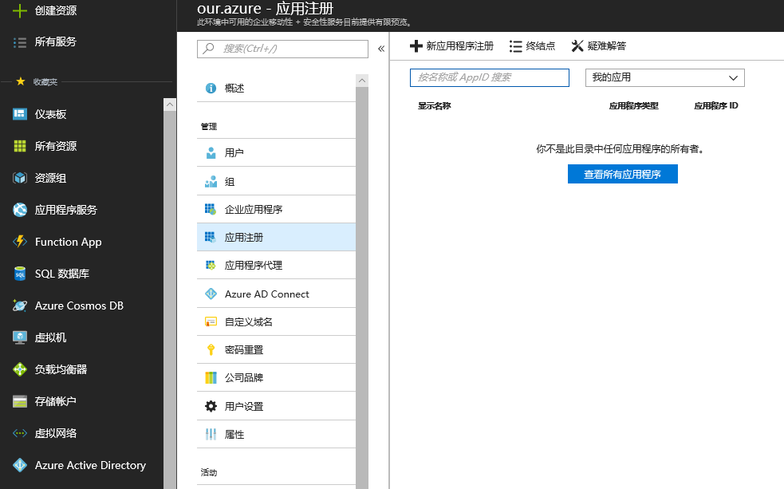
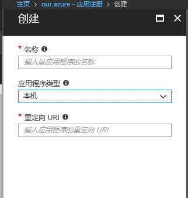
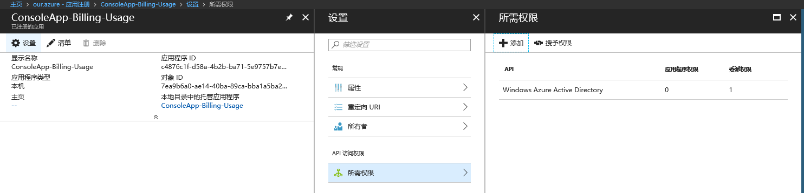
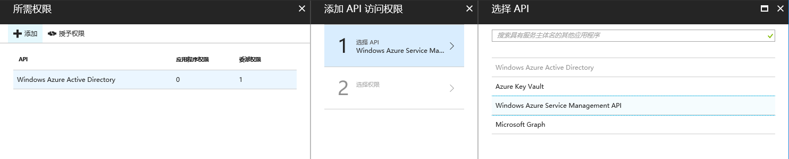
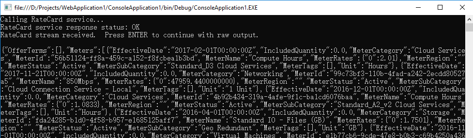

# 如何获取 Azure 订阅中使用的资源的价格和元数据信息

## 问题描述

如何获取 Azure 订阅中使用的资源的价格和元数据信息，以便预测和管理 Azure 费用？

## 解决方法

本文主要使用 .Net 调用 RateCard API 来获取 Azure 订阅中使用的资源价格和元数据信息。具体步骤如下：

### 在 Azure Active Directory (AAD) 租户配置本机客户端应用程序

在通过应用程序访问 RateCard API 之前，需要允许其访问您的 AAD 租户以进行身份验证和授权来访问 RateCard API 。如果已经在 AAD 租户中配置了本机客户端应用程序，则可以跳过这一步。

配置一个新的 AAD 应用程序：

1. 使用全局管理员账户登录到 [Azure 门户](https://portal.azure.cn)，选择 AAD 租户，在应用注册页面点击新应用程序注册添加新应用。



在新应用注册页面输入新应用名称，选择 “本地” 应用程序类型，并提供一个有效的 URL, 例如：“http://localhost/” 。



2. 添加完 AAD 应用程序之后，在应用程序列表中选中该应用，添加访问 RateCard API 的权限。

在新添加的 AAD 应用程序中，依次点击 “设置” ，“所需权限” ，然后 “添加” 访问 Windows Azure Service Management APIs 的权限。





完成本步骤后，可以将重定向 URL 和应用程序 ID 保存在本地方便后续步骤使用。

### 配置 .Net 应用程序

1. 在应用程序中通过 Nuget 添加 Microsoft.IdentityModel.Clients.ActiveDirectory 包，本文使用的是 2.22.302111727 版本。

2. 打开 App.config 文件，添加或修改以下节点：

```
<configuration>
  <appSettings>
    <add key="ADALServiceURL" value="https://login.chinacloudapi.cn"/>              <!--   中国区 AAD Login 端点 -->
    <add key="ADALRedirectURL" value="https://localhost/"/>                         <!--   AAD 应用程序重定向 URL -->
    <add key="ARMBillingServiceURL" value="https://management.chinacloudapi.cn"/>   <!--   中国区 Azure 资源管理器（ARM）端点 -->
    <add key="TenantDomain" value="ENTER.AAD.TENANT.DNS.NAME"/>                     <!--   AAD 租户 DNS 域名，例如：contoso.partner.onmschina.cn -->
    <add key="SubscriptionID" value="00000000-0000-0000-0000-000000000000"/>        <!--   Azure 订阅 ID  -->
    <add key="ClientId" value="00000000-0000-0000-0000-000000000000"/>              <!--   AAD 应用程序 ID -->
  </appSettings>
```

> [!important]
> 以上代码适用于中国区 Azure 。

3. 使用以下代码获取 AAD 令牌并访问 RateCard API ：  

下面的例子显示了“随收随付”提供项查询，其中提供项持久ID = MS-MC-AZR-0033P，用于中国地区，价格用人民币表示，元数据面向美国英语（en-US）地域文化。

```
        static void Main(string[] args)
        {
            //Get the AAD token to get authorized to make the call to the RateCard API
            string token = GetOAuthTokenFromAAD();
            
            // Build up the HttpWebRequest
            string requestURL = String.Format("{0}/{1}/{2}/{3}",
                       ConfigurationManager.AppSettings["ARMBillingServiceURL"],
                       "subscriptions",
                       ConfigurationManager.AppSettings["SubscriptionID"],
                       "providers/Microsoft.Commerce/RateCard?api-version=2016-08-31-preview&$filter=OfferDurableId%20eq%20'MS-MC-AZR-0033P'%20and%20Currency%20eq%20'CNY'%20and%20Locale%20eq%20'en-US'%20and%20RegionInfo%20eq%20'CN'");
            HttpWebRequest request = (HttpWebRequest)WebRequest.Create(requestURL);

            // Add the OAuth Authorization header, and Content Type header
            request.Headers.Add(HttpRequestHeader.Authorization, "Bearer " + token);
            request.ContentType = "application/json";

            // Call the RateCard  API, dump the output to the console window
            try
            {
                // Call the REST endpoint
                Console.WriteLine("Calling RateCard  service...");
                HttpWebResponse response = (HttpWebResponse)request.GetResponse();
                Console.WriteLine(String.Format("RateCard  service response status: {0}", response.StatusDescription));
                Stream receiveStream = response.GetResponseStream();

                // Pipes the stream to a higher level stream reader with the required encoding format. 
                StreamReader readStream = new StreamReader(receiveStream, Encoding.UTF8);
                var rateCardResponse = readStream.ReadToEnd();
                Console.WriteLine("RateCard stream received.  Press ENTER to continue with raw output.");
                Console.ReadLine();
                Console.WriteLine(rateCardResponse);
                
                //You could also convert the Stream to a strongly typed RateCardPayload object.  

                response.Close();
                readStream.Close();
                Console.ReadLine();
            }
            catch (Exception e)
            {
                Console.WriteLine(String.Format("{0} \n\n{1}", e.Message, e.InnerException != null ? e.InnerException.Message : ""));
                Console.ReadLine();
            }
        }

        public static string GetOAuthTokenFromAAD()
        {
            var authenticationContext = new AuthenticationContext(String.Format("{0}/{1}",
                                                                    ConfigurationManager.AppSettings["ADALServiceURL"],
                                                                    ConfigurationManager.AppSettings["TenantDomain"]));

            //Ask the logged in user to authenticate, so that this client app can get a token on his behalf
            var result = authenticationContext.AcquireToken(String.Format("{0}/", ConfigurationManager.AppSettings["ARMBillingServiceURL"]),
                                                            ConfigurationManager.AppSettings["ClientID"],
                                                            new Uri(ConfigurationManager.AppSettings["ADALRedirectURL"]),
                                                            PromptBehavior.Always);

            if (result == null)
            {
                throw new InvalidOperationException("Failed to obtain the JWT token");
            }

            return result.AccessToken;
        }
```

输出如下：



更多详细代码，请参考链接 [billing-dotnet-ratecard-api](https://github.com/Azure-Samples/billing-dotnet-ratecard-api) 。

有关 RateCard API 详细信息，请参阅 [官方 RATE CARE API 定义](https://docs.azure.cn/zh-cn/articles/training/azure-billing-ratecard-api)。