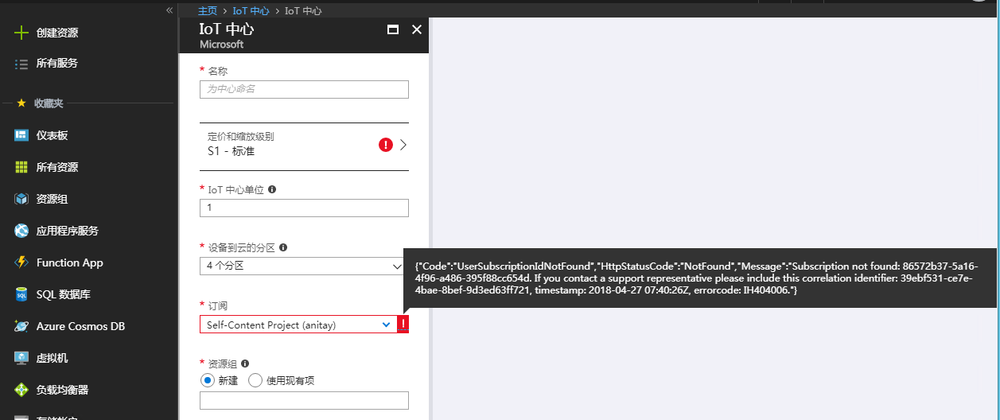

# 如何解决无法创建 IoT Hub 的问题

## 问题描述

用户在通过 [Azure 门户](https://portal.azure.cn) 创建 IoT Hub 时遇到以下问题，导致无法创建 IoT Hub。

## 问题分析

Azure IoT 中心是一项完全托管的服务，可在数百万个 IoT 设备和一个解决方案后端之间实现安全可靠的双向通信，因此在创建使用 Azure IoT Hub 之前，必须要注册 “Microsoft.Devices”。默认情况下，订阅中的 “Microsoft.Devices” 处于未注册状态，需要先注册，然后才能创建 Azure IoT Hub。

## 解决方法

登录 [Azure 门户](https://portal.azure.cn)，在 “所有服务” 中点击 “订阅” ，选中当前订阅，点击 “资源提供程序”，注册 “Microsoft.Devices”。

重新进入 IoT Hub 服务，已经可以创建 IoT Hub。

