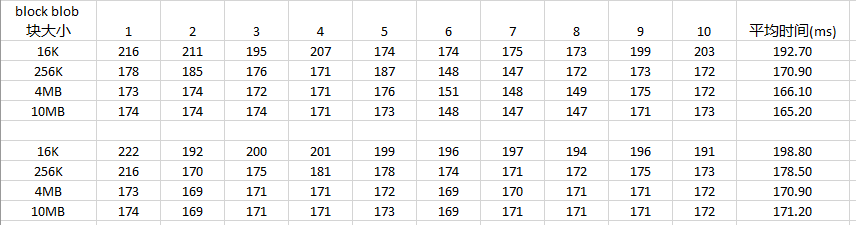

# 如何提高 Block Blob 的读取效率

## 问题描述

使用 Azure Block Blob 存储事件日志文件，在读取文件时速度慢。

## 问题分析

块 Blob 由块组成。每个块可以是不同的大小，最大为 100MB (对于 2016-05-31 之前 REST 版本的请求为 4MB )，块 Blob 最多可以包含 50,000 块。在上传 Blob 时，我们可以设置单个 Block Blob 块的大小，但是如果每个块的大小设置的太小，就会产生大量的 Block Blob 块，在读取时由于需要进行大量的块映射，就会影响 Block Blob 的读取效率。

## 解决方案

1. 选取合适类型的 Blob。对于日志文件，推荐使用 Append Blob。

    Block Blob： 特别适用于存储短的文本或二进制文件，例如文档和媒体文件。

    Append Blob： 类似于块 Blob ，因为它们是由块组成的，但针对追加操作对它们进行了优化，因此它们适用于日志记录方案。

    Page Blob：最大可达 8 TB 大小，并且对于频繁的读/写操作更加高效。 Azure 虚拟机使用页 Blob 作为 OS 和数据磁盘。

2. 调整 Block Blob 块的大小。 

例如：相同大小的文件，上传时分别设置 Block Blob 块的大小为：16K，256K，4MB，10MB。在读取时所消耗的时间如下：

为了达到最佳的写入\读取效果，推荐设置为 4MB. 如果网络不好的话，可以减小这个值。

    